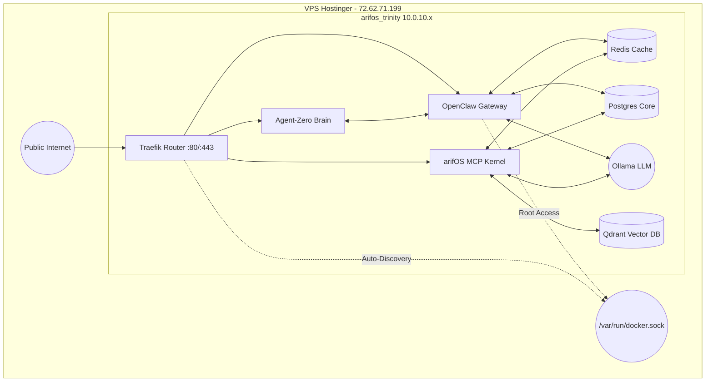

# arifOS AI-First VPS Architecture: Unified Master Spec

**Classification:** TRINITY SEALED - Master Reference
**Host:** srv1325122 (72.62.71.199) | Ubuntu 25.10 | KVM 4 | 16GB RAM
**Motto:** *Ditempa Bukan Diberi* — Forged, Not Given

---

## 🏛️ EXECUTIVE SUMMARY

This document synthesizes all previous architectural intelligence (`VPS_ARCHITECTURE_MASTER_DOSSIER.md`, `VPS_AGENT_ARCHITECT_GUIDE.md`, `VPS-AUDIT.md`, and the `AI-First VPS Architecture Plan`) into **one definitive blueprint**. 

Due to the strict memory budget (16GB RAM) and the need to run local LLMs (Ollama 8B models), all redundant human-centric abstractions (like Coolify and its extraneous databases) have been purged in favor of a raw, deterministic, AI-first Docker topology.

---

## 📐 UNIFIED ARCHITECTURE BLUEPRINT

The transition from a fragmented multi-network topology to a flattened, high-performance "AI Native" stack.

### Structural Paradigm (The Trinity Network)

Instead of four conflicting Docker networks (`bridge`, `ai-net`, `trinity`, `coolify`), the system uses a **single Docker Bridge Network: `arifos_trinity` (10.0.10.x)**. All services resolve via this unified plane, completely eliminating the cross-network DNS resolution failures documented in previous dossiers.

### The AI-First Component Stack (Memory Budget: 16GB)

| Layer | Component | Approx. RAM | Role in the Trinity |
|-------|-----------|-------------|---------------------|
| **Router** | Traefik | ~100MB | Dynamic reverse proxy via Docker labels. Replaces Nginx. |
| **Logic/Brain** | Agent-Zero | ~800MB | The autonomous scaffolding and reasoning engine. |
| **Gateway/Execution** | OpenClaw | ~500MB | The AGI executor. Holds `docker.sock` for env mutation. |
| **Law/Kernel** | arifOS MCP | ~500MB | Constitutional validation (F1-F13) and artifact auditing. Runs BGE embeddings internally (~200MB). |
| **Semantic Memory** | Qdrant | ~300MB | High-speed Rust-based vector memory. |
| **State Memory** | PostgreSQL 16| ~500MB | Singular centralized DB for all agent relational storage. |
| **Fast Memory** | Redis 7 | ~100MB | Pub/Sub broker and ultra-fast context cache. |
| **Inference** | Ollama | ~8GB | Local LLM Engine (Llama 3 8B or Qwen 2.5 7B). |
| **Host/Buffer** | Ubuntu OS | ~5GB | SSH, UFW, Fail2Ban, Docker Daemon, and memory headroom. |

---

## 🔐 SECURITY & GOVERNANCE POSTURE

Based on the `VPS-AUDIT.md`, several critical vulnerabilities have been closed in this unified spec:

1. **Firewall (UFW)**: strictly limited to port `22` (SSH), `80` (HTTP), and `443` (HTTPS).
2. **Internal Masking**: Qdrant (`6333`), Ollama (`11434`), and Agent-Zero (`50001`) are no longer exposed to the public internet. They are only reachable inside the `arifos_trinity` network or via Traefik routing with strict auth rules.
3. **OpenClaw Root Power**: OpenClaw retains `/var/run/docker.sock` to enable agentic mutation, but its actions are strictly governed by the arifOS constitutional validation loop (F1-F13) before arbitrary execution.
4. **SSH Hardening**: Password auth disabled. Public Key only. Root login minimized.

---

## 🚀 ROADMAP: PHASES & PRIORITIZATION

The migration to this unified stack must be executed in strict phases to prevent data loss or constitutional violations.

### Phase 1: Security Hardening & Pre-Flight (Priority: Critical)
**Goal:** Lock down the VPS before tearing down existing infrastructure.
*   **Step 1:** Execute SSH hardening (`PermitRootLogin prohibit-password`, `PasswordAuthentication no`).
*   **Step 2:** Close public ports in UFW (`3000`, `50001`, `6333`, `11434`, `8080`). Leave only `22`, `80`, `443`.
*   **Step 3:** Perform a final backup or snapshot (Hostinger Dashboard) of existing Coolify data if required.

### Phase 2: Scorched Earth Teardown (Priority: High)
**Goal:** Remove the fragmented legacy architecture and memory hogs.
*   **Step 1:** Stop and disable old native systemd services (`arifos-aaa-mcp`, `arifos-router`, `arifos-embeddings`).
*   **Step 2:** Tear down Coolify and all associated containers (`coolify`, `coolify-proxy`, `coolify-db`, `coolify-redis`). Stop all loose containers.
*   **Step 3:** Execute `docker network prune -f` and `docker image prune -a -f` to aggressively reclaim disk and RAM.

### Phase 3: The Unified Trinity Deployment (Priority: Critical)
**Goal:** Stand up the optimal AI-first stack using `docker-compose.vps-unified.yml`.
*   **Step 1:** Establish persistent volume directories under `/opt/arifos/data/` for PostgreSQL, Redis, Qdrant, and Ollama.
*   **Step 2:** Deploy the stack (`docker-compose up -d`) using the static `arifos_trinity` network configuration. Traefik will auto-route via labels.
*   **Step 3:** Wait for stabilization, verifying memory usage stays comfortably beneath the 16GB ceiling.

### Phase 4: Integration Verification (Priority: High)
**Goal:** Ensure cross-service communication works under the new topology.
*   **Step 1:** Test arifOS BGE embedding integration natively within the kernel container.
*   **Step 2:** Verify Agent-Zero and OpenClaw can resolve and reach Ollama and Qdrant via their Docker container names (`ollama:11434`, `qdrant:6333`) over the unified network.
*   **Step 3:** Confirm Traefik is correctly terminating SSL and routing external subdomains (if configured) to the proper internal containers.

---

## ✅ RESOLVED TODOs (From Previous Audits)

The following high-risk items identified in the `VPS-AUDIT.md` and previous architecture dossiers are **RESOLVED** by this unified architecture:

- **[RESOLVED] Cross-Network DNS Failures**: Replaced the fragmented 4-network setup (`bridge`, `ai-net`, `coolify`, etc.) with a single `arifos_trinity` network. Docker DNS resolution (`http://qdrant:6333`) now works natively without hardcoding IPs.
- **[RESOLVED] Public Port Exposure**: Closed unsecured public access to Ollama (11434), Qdrant (6333), OpenClaw (3000), and Agent-Zero (50001). All external traffic now funnels exclusively through Traefik (80/443).
- **[RESOLVED] Resource Starvation**: Eliminated duplicate PostgreSQL and Redis databases spawned by Coolify. The 16GB RAM constraints are respected, freeing up capacity for local Ollama 8B inference.
- **[RESOLVED] BGE Embedding Bloat**: Currently, embeddings exist on the VPS as a separate legacy native systemd process (`arifos-embeddings` running on port 8001). The roadmap explicitly disables this old service and integrates BGE embeddings natively into the core `arifOS MCP` Docker container, saving substantial RAM and standardizing the architecture.

---

**Execution Verdict:** `SEALED`
This document supersedes all prior VPS architecture guidelines. Once human approval is received for the `deploy_ai_vps.sh` script, Phases 2 and 3 will be executed to realize this blueprint.
