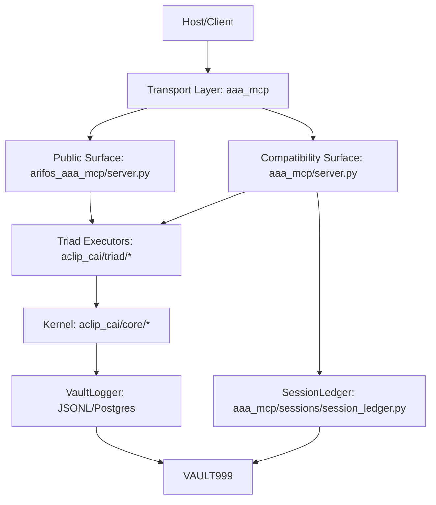

# AAA MCP System Map (Baseline @ 62cffa2)

Derived from runtime code paths, not docs-only claims.

## Architecture Diagram



ASCII view:

```text
Host -> transport (__main__/asgi/rest/streamable_http)
     -> tool surface (arifos_aaa_mcp or aaa_mcp)
     -> triad stages (anchor/reason/.../seal in aclip_cai)
     -> kernel audit + lifecycle + thermo + vault logger
     -> VAULT999 ledger (hash-linked / fallback memory)
```

## Module to Stage Mapping

| Stage | Runtime Tool(s) | Primary Code Path | Notes |
|---|---|---|---|
| 000 INIT | `anchor_session` | `aaa_mcp/server.py` -> `aclip_cai/triad/delta/anchor.py` | session ignition, F12 scan, envelope |
| 222/333/444 (collapsed) | `reason_mind` | `aaa_mcp/server.py` -> `reason()` + `integrate()` + `respond()` | 3-stage collapse inside one callable |
| 555 RECALL | `recall_memory` | `aaa_mcp/server.py` placeholder | stage present, stub payload |
| 555/666 | `simulate_heart` | `aaa_mcp/server.py` -> `validate()` + `align()` | empathy + alignment merge |
| 666 ALIGN | `critique_thought` | `arifos_aaa_mcp/server.py` native logic | model-flag critique; legacy side is stub |
| 777 EUREKA FORGE (target canon) | `eureka_forge` | `aaa_mcp/server.py` placeholder | currently mislabeled as `888_FORGE` in runtime payload |
| 888 APEX Judge Metabolic (target canon) | `apex_judge` | `aaa_mcp/server.py` -> `forge()` + `audit()` | currently emits `777-888`; needs split/rename hardening |
| 999 SEAL | `seal_vault` | `aaa_mcp/server.py` -> `aclip_cai/triad/psi/seal.py` | final seal + vault write |
| Utility (Delta) | `search_reality`, `fetch_content`, `inspect_file`, `audit_rules` | `aaa_mcp/server.py`, `arifos_aaa_mcp/server.py` | evidence, retrieval, fs inspect, governance audit |
| Utility (Omega) | `check_vital` | `arifos_aaa_mcp/server.py` -> `aclip_cai.tools.system_monitor` | health telemetry |

## Core Purity Boundary Audit

Observed from code search:
- `core/` has no detected imports of `fastmcp`, `fastapi`, `starlette`, `uvicorn` at baseline (`grep` on `core/*.py` = none).
- Transport/framework code is concentrated in `aaa_mcp/` (`__main__.py`, `asgi.py`, `rest.py`, `streamable_http_server.py`).
- Governance execution is split across `aclip_cai/core` + `aclip_cai/triad` and wrapped by `aaa_mcp`/`arifos_aaa_mcp`.

Implication: architectural intent (pure core boundary) mostly holds for `core/`, but runtime governance center-of-gravity is partly outside `core/` in `aclip_cai/*`.

## Transport Boundary Rules (as implemented)

- `aaa_mcp/__main__.py` dispatches transport modes: `stdio | sse | http | rest`.
- `aaa_mcp/asgi.py` mounts MCP HTTP app at `/mcp` and health at `/health`.
- `aaa_mcp/rest.py` provides REST bridge endpoints and alias handling.
- `aaa_mcp/streamable_http_server.py` exposes MCP streamable HTTP with alias resolution.
- `arifos_aaa_mcp/server.py` wraps legacy callables and registers custom REST routes via `register_rest_routes`.

## Stage Flow Contracts (Input/Output shape)

Canonical directive override (Arif):
- `777` = **EUREKA FORGE**
- `888` = **APEX Judge Metabolic Layer**

Current runtime divergence at baseline:
- `apex_judge` returns stage `777-888` (collapsed)
- `eureka_forge` returns stage `888_FORGE`

Alignment target:
- `eureka_forge` -> stage `777_EUREKA_FORGE`
- `apex_judge` -> stage `888_APEX_JUDGE`

Canonical envelope pattern (from `aaa_mcp/server.py`):
- Required output keys (common): `verdict`, `stage`, `session_id`
- Additional governance keys: `floors`, `truth`, `next_actions`, optional `sabar_requirements`

Per-stage callable chain (high-level):
1. `anchor_session(query, actor_id, auth_token, ...) -> {verdict, stage="000_INIT", session_id, ...}`
2. `reason_mind(query, session_id, grounding, ...) -> {verdict, stage="111-444", ...}`
3. `simulate_heart(query, session_id, ...) -> {verdict, stage="555-666", ...}`
4. `apex_judge(session_id, query, ...) -> {verdict, stage="777-888", ...}`
5. `seal_vault(session_id, summary, verdict?) -> {verdict, stage="999_VAULT", ...}`

Schema source-of-truth artifacts:
- `aaa_mcp/protocol/schemas.py`
- `arifos_aaa_mcp/contracts.py`

## Receipt Chain and Auditability

Receipt mechanisms in code:
- Stage witness logging in triad modules via `kernel.vault.log_witness(...)`
  - present in `anchor`, `reason`, `integrate`, `audit`, `seal`
- Ledger persistence via `aaa_mcp/sessions/session_ledger.py`
  - `prev_hash` -> `entry_hash` chain
  - Postgres primary + in-memory fallback

Audit chain quality at baseline:
- Positive: explicit stage labels, session IDs, hash chaining support.
- Gap: not all tool paths emit equivalent witness richness (some utility/stub tools minimal).

## Failure and Rollback Semantics

Failure behavior:
- Tool-level catch-all returns structured `{"verdict":"VOID","error":...,"stage":...}`
- Missing session continuity returns F11 block via `_build_floor_block(...)`
- High-risk execution path (`eureka_forge`) currently defaults to `888_HOLD` placeholder.

Rollback behavior:
- No global transaction manager across multi-stage calls.
- Partial-stage effects can exist before downstream failure.
- Vault/session layers implement append-only behavior; Postgres write failures fall back to memory logger in some paths.

Baseline risk callout:
- `aaa_mcp/sessions/session_ledger.py` contains stdout `print(...)` in error paths, which conflicts with strict stdio-noise rules for stdio transport environments.

## Omega0 and Confidence

- Ω0 estimate (architecture map): `0.07`
- Confidence: `0.89`
- Highest uncertainty: exact production path split between `arifos_aaa_mcp` and `aaa_mcp` during mixed-surface operation.
