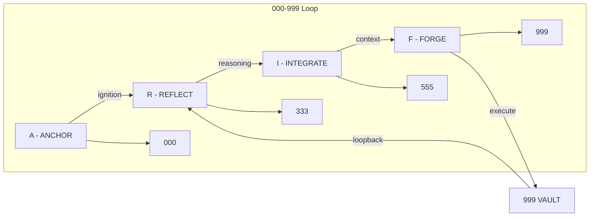

<!-- mcp-name: io.github.ariffazil/arifos-mcp -->
<div align="center">


# arifOS — Constitutional Intelligence Kernel (ARIF)
**The system that knows because it admits what it cannot know.**  
*Ditempa Bukan Diberi* — Forged, Not Given [ΔΩΨ | ARIF]

**What it is:** A constitutional decision kernel that governs tool execution for LLMs via MCP.  
**What it isn't:** Not a model, not an agent, not a chatbot.  
**What it guarantees:** A hardened L2–L5 stack with no irreversible action without explicit human approval.

[](https://pypi.org/project/arifos/)
[](LICENSE)
[](https://modelcontextprotocol.io)
[](https://www.python.org/)  
[](https://arifosmcp-truth-claim.pages.dev)
[](https://github.com/ariffazil/arifOS/actions/workflows/live_tests.yml)

**[→ QUICKSTART: Run in 5 minutes](QUICKSTART.md)**

</div>

> **Gödel-locked** = canonical endpoints whose content is governed by the constitutional sealing process; changes require Phoenix cooling + signed release.

---

## 🚀 Installation

Install the canonical arifOS intelligence kernel via pip:

```bash
# Core governance engine
pip install arifos

# With visualization tools (Memory Vector Space)
pip install "arifos[viz]"
```

---

## 🏛️ Foundational Canonical Texts (Core Reading)
*To understand arifOS, you must read the source material. These are the godel-locked technical papers defining the framework.*

| Domain | Canonical Text | Description |
|:---:|:---|:---|
| 🏗️ **Design** | [`ARCHITECTURE.md`](docs/60_REFERENCE/ARCHITECTURE.md) | **The Blueprint:** Trinity Logic (ΔΩΨ), 7-Organ Stack, and EMD Physics. |
| ⚖️ **Law** | [`000_THEORY/000_LAW.md`](000_THEORY/000_LAW.md) | **The Constitution:** The mathematical thresholds for the 13 Floors. |
| 🛡️ **Defense** | [`SECURITY.md`](docs/00_META/SECURITY.md) | **The Firewall:** Injection handling, Auth models, and Threat vectors. |
| 🧰 **Tools** | [`TOOLS_CANONICAL_13.md`](docs/60_REFERENCE/TOOLS_CANONICAL_13.md) | **The Surface:** The 14 canonical tools bridging the LLM to the Kernel. |
| 🚀 **Deploy** | [`DEPLOYMENT.md`](docs/60_REFERENCE/DEPLOYMENT.md) | **The Vanguard:** VPS setups, Docker, and Streamable HTTP scaling. |

---

## 🧭 What is arifOS? (The "What")

**arifOS is the world's first production-grade implementation of thermodynamic AI safety.** 

It is a Constitutional AI Governance System—an **Intelligence Kernel** and **AI Control Plane**. It sits locally or hosted in the cloud between raw reasoning engines (Language Models like Claude, GPT, or Gemini) and real-world actions. 

By forcing the AI through a mathematically constrained `000 -> 999` metabolic loop, arifOS acts as a rigorous **lie detector and safety firewall**. It intercepts every thought, code execution, or tool call, evaluating it against 13 invariable constitutional rules (Floors) before deciding whether to execute it or block it. 

*It is not an AI model; it is the constitutional law that governs them.*

---

## ⚖️ Why does it exist? (The "Why")

Unconstrained AI models calculate statistical probabilities—they do not understand truth or physics. Left unchecked, they will hallucinate facts, execute dangerous system commands, generate unethical outputs, and act without considering human consequence. **arifOS solves this by encoding the laws of nature and ethics into software.**

We didn’t invent these constraints; we discovered them. Code is execution. Governance is survival.
- **Truth (F2):** Information must reduce uncertainty (Shannon Entropy). The AI must back its claims with multi-source evidence or explicitly halt and return `UNKNOWN`.
- **Clarity (F4):** The AI's output must mathematically reduce information entropy (`ΔS ≤ 0`).
- **Amanah & Sovereignty (F1 & F13):** Irreversible actions (like mutating a production database) are structurally blocked. They trigger an `888_HOLD`, physically pausing the AI until a human signs off with cryptographic execution keys.
- **Empathy (F6):** The system must protect the weakest affected stakeholder (`κᵣ ≥ 0.70`).

---

## ⚙️ The Intelligence Kernel (Deep Dive into L0)

The L0 Kernel is built around **Thermodynamic Isolation** and the **Trinity Engines**. The reasoning engine is physically blocked from seeing the safety engine until the very end, preventing "rubber-stamping" bias.

### 1. The Trinity Engines
- **Δ Delta (The Mind / AGI)**: Focuses entirely on Truth, Logic, and Causal tracing (`F2, F4, F7, F8`).
  - **Auto-Recall (Ω-Ω Loop)**: Automatically triggers `vector_memory` to upgrade "Cheap Truth" to "Forged Truth" if initial reasoning falls below τ=0.85.
- **Ω Omega (The Heart / ASI)**: Focuses entirely on Safety, Empathy, and Anti-Deception (`F1, F5, F6, F9`).
  - **Semantic Context**: Provides the "low-entropy prior" for all reasoning via hybrid vector retrieval.
- **Ψ Psi (The Soul / APEX)**: Synthesizes the final verdict, enforces human consensus, and seals the ledger.
  - **Memory Closing (Ψ-Ω Hook)**: Successfully sealed session summaries are automatically indexed back into the Ω memory bus.

### 2. The 7-Organ Sovereign Stack (`000 -> 999`)
Every request flows through this strict pipeline (the "metabolic loop"):


1. **[000] INIT (Airlock)**: Ignites the session and parses for prompt injections.
2. **[111-333] AGI (Mind)**: Generates parallel hypotheses and forces factual grounding. **Hardened F2 citation check.**
3. **[444-555] PHOENIX (Subconscious)**: Recalls associative memory via `vector_memory` (BGE-small-en-v1.5 + Qdrant). Uses hybrid 70% Cosine / 30% Jaccard retrieval.
4. **[555-666] ASI (Heart)**: Analyzes stakeholder impact and checks for bias.
5. **[777] FORGE (Hands)**: Executes material actions (shell commands) with risk classification and confirmation gates.
6. **[888] APEX (Soul)**: Final Constitutional judgment. Generates the HMAC-signed `governance_token`.
7. **[999] VAULT (Memory)**: Commits the final decision irreversibly to PostgreSQL `VAULT999` and indexes back to Ω Qdrant for cross-session recall.

---

## 🔌 The MCP Protocol & ARIF Tools (L4)

arifOS server exposes exactly **13 canonical tools** grouped into 4 ARIF cognitive bands.

### Governance Dashboard & Visualization
- **`visualize_governance`**: Real-time dashboard for all 13 Floors, Tri-Witness consensus, and thermodynamic telemetry.
- **`arifos-graph` (CLI)**: Visualizes the `VAULT999` memory vector space (Requires `pip install "arifos[viz]"`).

---

## 🛡️ Verification & Audit (The "Whatever/Proof")

**You don't have to blindly trust arifOS; you can independently verify it.**

Every thought, action, or tool call processed by arifOS is mathematically evaluated and sealed into append-only **`VAULT999`** ledger records.

### 🔍 VAULT999 Ledger Fields
Every decision writes an immutable record with:
- `verdict` (SEAL/SABAR/VOID/HOLD/PARTIAL)
- `floor_results`: Hardened **F2 Truth** (Citation required) and **F3 Tri-Witness** (Multi-witness proof).
- `telemetry`: ΔS (Entropy), Peace², κᵣ (Empathy), G (Genius), Ω₀ (Humility).
- `governance_token`: HMAC-SHA256 signature required for `seal_vault`.

---

<div align="center">

**Built and forged by [Muhammad Arif bin Fazil](https://arif-fazil.com)**

📧 [arifos@arif-fazil.com](mailto:arifos@arif-fazil.com) • 🐙 [GitHub](https://github.com/ariffazil) • 𝕏 [@ArifFazil90](https://x.com/ArifFazil90)

*Ditempa Bukan Diberi* — Forged, Not Given

</div>
