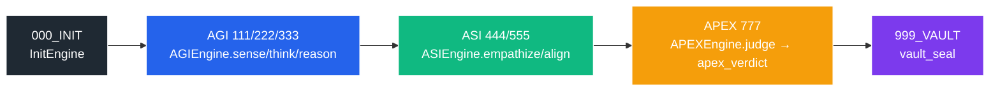

<h1 align="center">arifOS</h1>

<p align="center">
<p align="center">
  
</p>

<h1 align="center">arifOS — Constitutional AI Governance System</h1>

<p align="center">
  <strong>v60.0-FORGE</strong> • 
  <strong>Production-Ready</strong> • 
  <strong>AGPL-3.0</strong>
</p>

<p align="center">
  <em>The World's First Production-Grade Constitutional AI Governance System</em><br>
  Mathematical enforcement of ethical constraints through thermodynamic stability and auditable decision-making.
</p>

This README matches the arifOS description on PyPI and the live docs at `arifos.arif-fazil.com`. For a narrative introduction, see the “What is arifOS?” section on PyPI.

### Who Is This For?
*   **ML / AI Engineers** integrating strict governance into LLM applications.
*   **Platform Teams** needing auditable decision trails and constitutional floors.
*   **Researchers** exploring thermodynamic alignment and bounded intelligence.


<p align="center">
  <a href="https://pypi.org/project/arifos/"></a>
  <a href="https://arifos.arif-fazil.com"></a>
  <a href="https://github.com/ariffazil/arifOS/releases"></a>
</p>

<p align="center">
  <a href="https://arif-fazil.com">Live Demo</a> • 
  <a href="https://arifos.arif-fazil.com">Documentation</a> • 
  <a href="docs/llms.txt">Constitutional Canon</a> •
  <a href="000_THEORY/000_LAW.md">The 13 Floors</a>
</p>

```bash
pip install arifos
```

---

## 📖 Table of Contents

- [📖 Table of Contents](#-table-of-contents)
- [🔥 I. Manifesto: Forged, Not Given](#-i-manifesto-forged-not-given)
  - [The Physics Basis](#the-physics-basis)
- [⚠️ II. The Core Problem](#️-ii-the-core-problem)
  - [1. The Accountability Vacuum](#1-the-accountability-vacuum)
  - [2. The Value Alignment Paradox](#2-the-value-alignment-paradox)
  - [3. The Injection Fragility](#3-the-injection-fragility)
- [🛡️ III. The arifOS Solution](#️-iii-the-arifos-solution)
  - [The 3 Pillars of Defense](#the-3-pillars-of-defense)
    - [1. Immutable Auditing (VAULT-999)](#1-immutable-auditing-vault-999)
    - [2. Semantic Recoil \& Trap Detection](#2-semantic-recoil--trap-detection)
    - [3. Hardened Floors (F1-F13)](#3-hardened-floors-f1-f13)
- [🏗️ IV. The AAA Governance Architecture (Mind, Heart, Soul)](#️-iv-the-aaa-governance-architecture-mind-heart-soul)
  - [Δ COGNITION ENGINE (AGI / Mind)](#δ-cognition-engine-agi--mind)
  - [Ω SAFETY ENGINE (ASI / Heart)](#ω-safety-engine-asi--heart)
  - [Ψ JUDICIAL ENGINE (APEX / Soul)](#ψ-judicial-engine-apex--soul)
- [📜 V. Constitutional Law (The 13 Floors)](#-v-constitutional-law-the-13-floors)
  - [Verdict Semantics](#verdict-semantics)
- [⚖️ VI. The 9-Paradox Equilibrium](#️-vi-the-9-paradox-equilibrium)
- [📱 VII. The 333\_APPS Stack (Applications)](#-vii-the-333_apps-stack-applications)
  - [L4: AAA MCP Tools (Production API)](#l4-aaa-mcp-tools-production-api)
    - [The 10 Canonical Tools (v60.0-FORGE)](#the-10-canonical-tools-v555-hardened)
- [🚀 VIII. Quick Start (Code Examples)](#-viii-quick-start-code-examples)
  - [A. Primary Path — One-Shot `forge`](#a-primary-path--one-shot-forge)
  - [B. Advanced Usage — Staged Tools](#b-advanced-usage--staged-tools)
  - [Strict vs Fluid Context (Configuration Guidance)](#strict-vs-fluid-context-configuration-guidance)
- [🏛️ License \& Attribution](#️-license--attribution)

---

## 🔥 I. Manifesto: Forged, Not Given

> *"Ditempa Bukan Diberi"* — **Forged, Not Given.**

Intelligence is **thermodynamic work**. It is not a gift bestowed by algorithms, but a structure forged in the fires of constraint.

In the current landscape of Artificial Intelligence, we face a crisis of **ungoverned capability**. Models are becoming exponentially smarter, yet their alignment with human values remains fragile—based on reinforcement learning (RLHF) that is easily bypassed through prompt injection and jailbreaking.

arifOS rejects the notion that safety is an afterthought. It posits that **true intelligence requires governance**. Just as a river needs banks to flow without flooding, AI needs constitutional walls to reason without hallucinating.

This operating system is not a set of guardrails; it is a **fundamental restructuring of AI cognition**, forcing it to pass through rigorous gates of **Truth**, **Safety**, and **Law** before it can act.

### The Physics Basis

Unlike other "safety" frameworks that rely on human preferences, arifOS grounds its constraints in **physical law**:

| Floor | Physics Principle | Enforcement |
|:---:|:---|:---|
| **F1** | [Landauer's Principle](https://en.wikipedia.org/wiki/Landauer%27s_principle) | Irreversible operations cost energy → All actions must be reversible |
| **F2** | [Shannon Entropy](https://en.wikipedia.org/wiki/Entropy_(information_theory)) | Information must reduce uncertainty |
| **F4/F6** | [Second Law of Thermodynamics](https://en.wikipedia.org/wiki/Second_law_of_thermodynamics) | System entropy must not increase |
| **F7** | [Gödel's Incompleteness](https://en.wikipedia.org/wiki/G%C3%B6del%27s_incompleteness_theorems) | All claims must declare their uncertainty bounds |
| **F8** | [Eigendecomposition](https://en.wikipedia.org/wiki/Eigendecomposition_of_a_matrix) | Intelligence = A×P×X×E² (Akal × Present × Exploration × Energy²) |

**See:** [`000_THEORY/020_THERMODYNAMICS_v42.md`](docs/020_THERMODYNAMICS_v42.md)

---

## ⚠️ II. The Core Problem

> *"We are building gods without temples."*

The current AI ecosystem suffers from three fatal flaws:

### 1. The Accountability Vacuum
When an AI hallucinates or causes harm, there is no immutable record of *why*. Decisions are opaque, hidden within black-box weights. There is no audit trail, no "flight recorder."

### 2. The Value Alignment Paradox
We want AI to be **Truthful**, but also **Kind**. We want it to be **Fast**, but **Safe**. These are competing values. Current systems optimize for one at the expense of the other, creating oscillation between extremes rather than equilibrium.

### 3. The Injection Fragility
A simple *"Ignore previous instructions"* command can dismantle months of safety training. The "Constitution" of current models is merely a suggestion in a system prompt—not a law of physics that cannot be violated.

---

## 🛡️ III. The arifOS Solution

arifOS is a **Constitutional Kernel** that sits between any LLM (Claude, GPT, Gemini) and the real world. It does not trust the model. Instead, it **verifies every output** against a strict set of mathematical and logical constraints.

> **arifOS is NOT:**
> *   A prompt library or jailbreak-prone wrapper.
> *   A generic MLOps platform.
> *   A replacement for your model.
>
> It is a **constitutional kernel** that governs any model’s outputs.


### The 3 Pillars of Defense

#### 1. Immutable Auditing (VAULT-999)
Every decision is cryptographically sealed in a [Merkle DAG](https://en.wikipedia.org/wiki/Merkle_tree). We can prove exactly what the AI thought and why it acted.

- **Implementation:** [`codebase/vault/persistent_ledger_hardened.py`](codebase/vault/persistent_ledger_hardened.py)
- **Specification:** [`000_THEORY/999_SOVEREIGN_VAULT.md`](000_THEORY/999_SOVEREIGN_VAULT.md)

#### 2. Semantic Recoil & Trap Detection
The system proactively identifies "Absolutist Traps" (e.g., "guaranteed safe", "100% accurate") and triggers a **Semantic Recoil**, forcing the verdict to `VOID` or `PARTIAL` rather than blindly agreeing.

- **Implementation:** [`codebase/apex/trinity_nine.py`](codebase/apex/trinity_nine.py)
- **Specification:** [`000_THEORY/888_SOUL_VERDICT.md`](000_THEORY/888_SOUL_VERDICT.md)

#### 3. Hardened Floors (F1-F13)
These are not guidelines; they are **strict logic gates**. If an output violates a HARD floor (e.g., Truth Fidelity < 0.99), it is **VOIDed immediately**.

- **Implementation:** [`codebase/constitutional_floors.py`](codebase/constitutional_floors.py)
- **Individual Floors:** [`codebase/floors/`](codebase/floors/)

---

## 🏗️ IV. The AAA Governance Architecture (Mind, Heart, Soul)

arifOS employs a **Three-Stage Governance Pipeline** (000→999) to metabolize raw intelligence into safe action:

```
┌─────────────┐    ┌─────────────┐    ┌─────────────┐    ┌─────────────┐
│  000_INIT   │ →  │  111-333    │ →  │  444-666    │ →  │  777-999    │
│   Ignition  │    │  Δ MIND     │    │  Ω HEART    │    │  Ψ SOUL     │
└─────────────┘    └─────────────┘    └─────────────┘    └─────────────┘
     Auth &           Parse &            Stakeholder         Consensus
   Injection         Reasoning           Impact Analysis      & Seal
     Scan
```

### Δ COGNITION ENGINE (AGI / Mind)
| | |
|:---|:---|
| **Role** | Information Parsing, Hypothesis Generation, Causal Reasoning |
| **Metric** | **Ambiguity Reduction** (formerly Entropy) |
| **Gate** | Inputs must reduce global uncertainty ($\Delta S \le 0$) |
| **Tools** | `agi_sense`, `agi_think`, `agi_reason`, `reality_search` |
| **Implementation** | [`codebase/agi/`](codebase/agi/) |
| **Specification** | [`000_THEORY/111_MIND_GENIUS.md`](000_THEORY/111_MIND_GENIUS.md) |

### Ω SAFETY ENGINE (ASI / Heart)
| | |
|:---|:---|
| **Role** | Stakeholder Impact Analysis, Ethical Alignment, Harm Prevention |
| **Metric** | **Peace²** (Stability) and **Kappa** (Stakeholder Agreement) |
| **Gate** | Actions must not harm the weakest stakeholder ($P^2 \ge 1.0$) |
| **Tools** | `asi_empathize`, `asi_align` |
| **Implementation** | [`codebase/asi/`](codebase/asi/) |
| **Specification** | [`000_THEORY/555_HEART_EMPATHY.md`](000_THEORY/555_HEART_EMPATHY.md) |

### Ψ JUDICIAL ENGINE (APEX / Soul)
| | |
|:---|:---|
| **Role** | Consensus Verification, Constitutional Sealing, Final Verdict |
| **Metric** | **Tri-Witness Score** ($W_3$) and **Truth Fidelity** |
| **Gate** | Must achieve consensus between Mind, Safety, and Human Authority ($W_3 \ge 0.95$) |
| **Tools** | `apex_verdict`, `vault_seal` |
| **Implementation** | [`codebase/apex/`](codebase/apex/) |
| **Specification** | [`000_THEORY/777_SOUL_APEX.md`](000_THEORY/777_SOUL_APEX.md) |

---

## 📜 V. Constitutional Law (The 13 Floors)

Every AI output must pass these 13 Floors. A failure in any **HARD** floor results in an immediate `VOID`.

| Floor | Label | Type | Principle | Threshold | Fail Action |
|:---:|:---|:---:|:---|:---:|:---:|
| **F1** | **Amanah** | 🔴 HARD | **Reversibility** — All actions must be undoable | Chain of Custody | `VOID` |
| **F2** | **Truth** | 🔴 HARD | **Fidelity** — Claims must be evidenced-backed | Score ≥ 0.99 | `VOID` |
| **F3** | **Consensus** | 🟡 DERIVED | **Tri-Witness** — ΔΩΨ must agree | $W_3$ ≥ 0.95 | `SABAR` |
| **F4** | **Clarity** | 🟠 SOFT | **Ambiguity Reduction** — Output clarifies, not confuses | $\Delta S \le 0$ | `SABAR` |
| **F5** | **Peace²** | 🔴 HARD | **Stability** — No systemic destabilization | Index ≥ 1.0 | `VOID` |
| **F6** | **Empathy** | 🟠 SOFT | **Stakeholder Protection** — Do no harm to vulnerable | Impact ≤ 0.1 | `SABAR` |
| **F7** | **Humility** | 🟠 SOFT | **Uncertainty Declaration** — State unknown limits | $\Omega_0 \in [0.03, 0.05]$ | `SABAR` |
| **F8** | **Genius** | 🟡 DERIVED | **Resource Efficiency** — Computing yields insight | G-Factor ≥ 0.80 | `SABAR` |
| **F9** | **Anti-Hantu** | 🔴 HARD | **Ontological Honesty** — No fake consciousness | Personhood = False | `VOID` |
| **F10** | **Ontology** | 🔴 HARD | **Grounding** — Concepts map to reality | Axiom Match = True | `VOID` |
| **F11** | **Authority** | 🔴 HARD | **Chain of Command** — Verify User Identity | Auth Token Valid | `VOID` |
| **F12** | **Defense** | 🔴 HARD | **Injection Hardening** — Resist adversarial prompts | Risk Score < 0.85 | `VOID` |
| **F13** | **Sovereign** | 🔴 HARD | **Human Veto** — Operator has final say | Override Active | `WARN` |

**Schema Note (F4/F6):** The Constitution defines **F4 = Clarity (ΔS)** and **F6 = Empathy (κᵣ)**. If runtime logs show F4 reporting empathy or F6 reporting entropy, that is a **schema bug** in the implementation, not a change in the Law. Fix the mapping in code; do not rewrite this table.

### Verdict Semantics

| Verdict | Meaning | Action |
|:---:|:---|:---|
| **SEAL** | ✅ Approved — All floors passed | Execute action |
| **SABAR** | ⚠️ Repairable — Some SOFT floors failed | Return for revision with specific floor feedback |
| **PARTIAL** | ⚠️ Limited — Proceed with constraints | Execute with reduced scope |
| **VOID** | ❌ Blocked — HARD floor violated | Reject action entirely |
| **888_HOLD** | 🛑 Human Required — High stakes decision | Escalate to human operator |

**Full Specification:** [`000_THEORY/000_LAW.md`](000_THEORY/000_LAW.md)  
**Implementation:** [`codebase/constitutional_floors.py`](codebase/constitutional_floors.py)

---

## ⚖️ VI. The 9-Paradox Equilibrium

Governance is not binary; it is the **management of tension**. The system solves for the [Nash Equilibrium](https://en.wikipedia.org/wiki/Nash_equilibrium) of 9 core paradoxes:

| Paradox | Δ (Mind) | Ω (Heart) | Ψ (Resolution) |
|:---|:---|:---|:---|
| **Truth vs. Kindness** | Facts first | Compassion first | Truthful kindness |
| **Speed vs. Safety** | Iterate fast | Verify first | Fast verification |
| **Privacy vs. Utility** | Aggregate data | Protect individual | Differential privacy |
| **Innovation vs. Stability** | Disrupt | Preserve | Evolutionary change |
| **Global vs. Local** | Universal law | Cultural context | Glocal governance |
| **Present vs. Future** | Immediate need | Long-term impact | Sustainable action |
| **Individual vs. Collective** | Personal agency | Common good | Consent-based collective |
| **Certainty vs. Adaptability** | Fixed rules | Context flexibility | Constitutional amendment |
| **Efficiency vs. Equity** | Optimize output | Fair distribution | Pareto improvement |

The APEX engine (`apex_verdict`) computes the equilibrium point where all three witnesses (Mind, Heart, Human) achieve ≥95% consensus.

**Implementation:** [`codebase/apex/equilibrium_finder.py`](codebase/apex/equilibrium_finder.py)  
**Specification:** [`000_THEORY/888_SOUL_VERDICT.md`](000_THEORY/888_SOUL_VERDICT.md)

---

## 📱 VII. The 333_APPS Stack (Applications)

The 333_APPS directory contains the complete application stack, from zero-context prompts (L1) to recursive AGI research (L7):

```
333_APPS/
├── L1_PROMPT/          # Zero-context entry prompts
├── L2_SKILLS/          # Parameterized templates
├── L3_WORKFLOW/        # Multi-step recipes
├── L4_TOOLS/           # Production MCP tools ← You are here
├── L5_AGENTS/          # Autonomous agents
├── L6_INSTITUTION/     # Trinity consensus framework
└── L7_AGI/             # Recursive intelligence research
```

### L4: AAA MCP Tools (Production API)

The **AAA MCP Server** exposes constitutional engines as standardized API tools compatible with Claude Desktop, Cursor, and any MCP client.

#### The 10 Canonical Tools (v60.0-FORGE)

| # | Tool | Engine | Function | Floors Enforced | Implementation |
|:---:|:---|:---:|:---|:---|:---|
| 1 | `init_gate` | INIT | Session ignition, auth & injection pre-scan | F11, F12 | [`aaa_mcp/server.py`](aaa_mcp/server.py) |
| 2 | `agi_sense` | Δ MIND | Intent classification, assigns HARD/SOFT lanes | F4, F12 | [`aaa_mcp/server.py`](aaa_mcp/server.py) |
| 3 | `agi_think` | Δ MIND | Hypothesis generation, explores solution space | F13 | [`aaa_mcp/server.py`](aaa_mcp/server.py) |
| 4 | `agi_reason` | Δ MIND | Logic & deduction, step-by-step reasoning | F2, F4, F7 | [`aaa_mcp/server.py`](aaa_mcp/server.py) |
| 5 | `reality_search` | Δ MIND | Grounding via web search & Axiom Engine | F2, F10 | [`aaa_mcp/tools/reality_grounding.py`](aaa_mcp/tools/reality_grounding.py) |
| 6 | `asi_empathize` | Ω HEART | Impact analysis, identifies vulnerable stakeholders | F5, F6 | [`aaa_mcp/server.py`](aaa_mcp/server.py) |
| 7 | `asi_align` | Ω HEART | Alignment check for ethics, law, and policy | F9 | [`aaa_mcp/server.py`](aaa_mcp/server.py) |
| 8 | `apex_verdict` | Ψ SOUL | Final judgment, synthesizes Truth+Safety | F2, F3, F8 | [`aaa_mcp/server.py`](aaa_mcp/server.py) |
| 9 | `vault_seal` | VAULT | Immutable ledger, cryptographic session commit | F1 | [`aaa_mcp/sessions/session_ledger.py`](aaa_mcp/sessions/session_ledger.py) |
| 10 | `forge` | UNIFIED | 000–999 constitutional pipeline (single-call) | F1–F13 | [`aaa_mcp/server.py`](aaa_mcp/server.py) |

**Tool Exposure Note:** `tool_router` and `vault_query` are available as auxiliary utilities but not listed in the canonical constitution.

**New in v60.0-FORGE:**
- **Semantic Recoil:** `apex_verdict` automatically voids "absolutist" safety claims
- **Axiom Engine:** `reality_search` retrieves physical constants (e.g., CO2 Critical Point: 304.25K, 7.38MPa) to ground "Industrial" queries

---

### `forge`: Unified 000–999 Pipeline

The `forge` tool is the **primary entry point** for arifOS in MCP environments. It runs the full constitutional pipeline in a **single call**:

`000_INIT → AGI(111/222/333) → ASI(444/555) → APEX(777) → 999_VAULT`

- **Full mode (`mode="full"`)**
  - Runs the entire Trinity stack and seals the result in VAULT999.
  - Best for **production** and **compliance** use cases where you need immutable audit trails.
- **AGI-only mode (`mode="agionly"`)**
  - Runs **INIT + AGI** only (no ASI/APEX/VAULT).
  - Best for **research**, **drafting**, or **internal analysis** where you want governed reasoning without final sealing.

#### One-shot usage (Python, inside an MCP host)

```python
from aaa_mcp.server import forge

# Single-call 000–999 constitutional pipeline
result = await forge(
    query="Analyze the safety implications of autonomous vehicles",
    session_id="demo-forge-001",
    mode="full",  # or "agionly" for INIT+AGI only
)

print(result["verdict"])       # e.g. SEAL, PARTIAL, SABAR, VOID
print(result["truth_score"])   # Truth fidelity from APEX
print(result["seal_id"])       # Vault seal (None in agionly mode)
print(result["floors_enforced"])  # ["F1", "F2", ..., "F13"]

# Full stage-wise audit payload
stages = result["stages"]
init_stage = stages["init"]
agi_reason = stages["agi_reason"]
```

#### Forge pipeline flow (000 → 999)



---

## 🚀 VIII. Quick Start (Code Examples)

### A. Primary Path — One-Shot `forge`

```python
from aaa_mcp.server import forge

# Full 000–999 constitutional pipeline in one call
result = await forge(
    query="Analyze the safety implications of autonomous vehicles",
    session_id="demo-forge-001",
    mode="full",  # or "agionly" for INIT+AGI only
)

print(result["verdict"])        # SEAL, SABAR, PARTIAL, VOID
print(result["truth_score"])    # Truth fidelity from APEX
print(result["seal_id"])        # Vault seal (None when mode="agionly")

# Access hardened stage outputs
stages = result["stages"]
init_stage = stages["init"]
agi_reason = stages["agi_reason"]
```

### B. Advanced Usage — Staged Tools

If you need **fine-grained control** (e.g., custom UI steps, human-in-the-loop between stages), you can still call the canonical tools individually:

```python
from aaa_mcp.server import (
    init_gate,
    agi_sense,
    agi_think,
    agi_reason,
    asi_empathize,
    asi_align,
    apex_verdict,
)

# 1. Initialize governed session
session = await init_gate(
    query="Analyze the safety implications of autonomous vehicles",
    session_id="demo-001",
    grounding_required=True,  # Enable physics grounding
)
session_id = session["session_id"]

# 2. AGI mind stages
sense = await agi_sense("Classify autonomy levels and risks", session_id=session_id)
think = await agi_think("Enumerate failure modes in mixed traffic", session_id=session_id)
reasoned = await agi_reason(
    query="What are the failure modes of LiDAR in adverse weather?",
    session_id=session_id,
)

# 3. ASI heart stages
empathy_result = await asi_empathize(
    query="Who is most exposed to harm if sensors fail?",
    session_id=session_id,
)
align_result = await asi_align(
    query="Does deployment respect local law and company policy?",
    session_id=session_id,
)

# 4. APEX verdict
verdict = await apex_verdict(
    query="Approve deployment of autonomous taxi fleet?",
    session_id=session_id,
)

print(verdict["verdict"])        # SEAL, SABAR, PARTIAL, VOID, or 888_HOLD
print(verdict["floors_enforced"])  # ["F2", "F3", "F8"]
```

### Strict vs Fluid Context (Configuration Guidance)

arifOS is designed to support **strict** (safety-critical) and **fluid** (education/chat) modes. The Law stays the same; the thresholds and grounding policy adapt to context.

**Current stable API:** use `grounding_required=True` for strict sessions. Synthetic model confidence does **not** satisfy grounding; provide real web or axiom evidence (or pass structured `grounding` to AGI tools).

| Resource | Description | Link |
|:---|:---|:---|
| **Full Documentation** | Live docs site | [arifos.arif-fazil.com](https://arifos.arif-fazil.com) |
| **Constitutional Canon** | LLM-optimized reference | [docs/llms.txt](docs/llms.txt) |
| **The 13 Floors** | Complete floor specification | [`000_THEORY/000_LAW.md`](000_THEORY/000_LAW.md) |
| **Thermodynamics Basis** | Physics grounding | [`docs/020_THERMODYNAMICS_v42.md`](docs/020_THERMODYNAMICS_v42.md) |
| **API Reference** | OpenAPI spec | [`docs/openapi/arifos_openapi_v53.yaml`](docs/openapi/arifos_openapi_v53.yaml) |
| **Changelog** | Version history | [CHANGELOG.md](CHANGELOG.md) |

---

## 🏛️ License & Attribution

**AGPL-3.0-only** — *Open restrictions for open safety.*

> **Sovereign:** Muhammad Arif bin Fazil  
> **Repository:** https://github.com/ariffazil/arifOS  
> **PyPI:** https://pypi.org/project/arifos/  
> **Live Server:** https://arifos.arif-fazil.com/  
> **Health Check:** https://aaamcp.arif-fazil.com/health

---

<p align="center">
  <strong>arifOS</strong> — <em>Forged in the Fires of Governance.</em><br>
  <em>Ditempa Bukan Diberi 💎🔥🧠</em>
</p>
