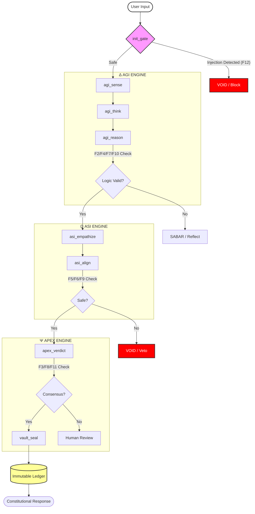

<div align="center">


# arifOS — Constitutional AI Governance System


**A production-grade constitutional AI governance system for LLMs.**

*Mathematical enforcement of ethical constraints, thermodynamic stability, and auditable decision-making across any LLM.*

```bash
pip install arifos
```

[**Live Demo**](https://arif-fazil.com) • [**Documentation**](docs/) • [**Constitutional Canon**](https://apex.arif-fazil.com)

[**Sponsor**](https://github.com/sponsors/ariffazil) • [**Buy Me a Teh Tarik**](https://buymeacoffee.com/ariffazil)

</div>

---

## 🚀 New Here? 5-Minute Evaluation Path

If you want to quickly understand arifOS without reading the full constitution:

1. **See it live:** [arif-fazil.com](https://arif-fazil.com)
2. **Understand the law:** [`llms.txt`](llms.txt) (Advisory Contract)
3. **Try governance:** Copy the [Unified System Prompt](333_APPS/L1_PROMPT/SYSTEM_PROMPT.md)
4. **See production usage:** Read [L4: MCP Tools](#l4-mcp-tools-production-api) below

You can return to the Manifesto later.

---

## 📖 Table of Contents

- [arifOS — Constitutional AI Governance System](#arifos--constitutional-ai-governance-system)
  - [🚀 New Here? 5-Minute Evaluation Path](#-new-here-5-minute-evaluation-path)
  - [📖 Table of Contents](#-table-of-contents)
  - [🔥 I. Manifesto: Forged, Not Given](#-i-manifesto-forged-not-given)
  - [⚠️ II. The Core Problem](#️-ii-the-core-problem)
    - [1. The Accountability Vacuum](#1-the-accountability-vacuum)
    - [2. The Value Alignment Paradox](#2-the-value-alignment-paradox)
    - [3. The Injection Fragility](#3-the-injection-fragility)
  - [❌ What arifOS Is Not](#-what-arifos-is-not)
  - [🛡️ III. The arifOS Solution](#️-iii-the-arifos-solution)
    - [The 4 Pillars of Defense](#the-4-pillars-of-defense)
    - [Refusal as a First-Class Outcome](#refusal-as-a-first-class-outcome)
  - [🖼️ IV. Visual Architecture](#️-iv-visual-architecture)
    - [The Metabolic Helix (Live Diagram)](#the-metabolic-helix-live-diagram)
  - [🌐 Live Trinity Ecosystem](#-live-trinity-ecosystem)
  - [🏗️ V. The AAA Architecture (Mind, Heart, Soul)](#️-v-the-aaa-architecture-mind-heart-soul)
    - [1. Δ MIND (AGI) — The Architect](#1-δ-mind-agi--the-architect)
    - [2. Ω HEART (ASI) — The Guardian](#2-ω-heart-asi--the-guardian)
    - [3. Ψ SOUL (APEX) — The Sovereign](#3-ψ-soul-apex--the-sovereign)
  - [📜 VI. Constitutional Law (The 13 Floors)](#-vi-constitutional-law-the-13-floors)
  - [⚖️ VII. The 9-Paradox Equilibrium](#️-vii-the-9-paradox-equilibrium)
  - [📱 VIII. The 333\_APPS Stack (Applications)](#-viii-the-333_apps-stack-applications)
    - [L1: System Prompts (Zero-Context)](#l1-system-prompts-zero-context)
    - [L2: Skills (Templates)](#l2-skills-templates)
    - [L3: Workflows (SOPs)](#l3-workflows-sops)
    - [L4: MCP Tools (Production API)](#l4-mcp-tools-production-api)
      - [🤖 Machine-Readable Documentation (llms.txt)](#-machine-readable-documentation-llmstxt)
      - [🔬 MCP Inspector (The Microscope)](#-mcp-inspector-the-microscope)
    - [L5: Agents (Federation)](#l5-agents-federation)
    - [L6: Institution (Trinity System)](#l6-institution-trinity-system)
    - [Future Roadmap (L7+)](#future-roadmap-l7)
  - [⚙️ IX. Technical Implementation](#️-ix-technical-implementation)
    - [Key Technologies](#key-technologies)
    - [Directory Structure](#directory-structure)
  - [📦 X. Installation \& Usage](#-x-installation--usage)
    - [1. Installation](#1-installation)
    - [2. Running the MCP Server](#2-running-the-mcp-server)
    - [3. Using in Code](#3-using-in-code)
  - [🤝 XI. Contributing \& Governance](#-xi-contributing--governance)
  - [📄 License](#-license)
  - [👏 Acknowledgments](#-acknowledgments)
  - [☕ Support](#-support)

---

## 🔥 I. Manifesto: Forged, Not Given

**"Ditempa Bukan Diberi"** — *Forged, Not Given.*

Intelligence is thermodynamic work. It is not a gift bestowed by algorithms, but a structure forged in the fires of constraint.

In the current landscape of Artificial Intelligence, we face a crisis of **ungoverned capability**. Models are becoming exponentially smarter, yet their alignment with human values remains fragile, based on reinforcement learning (RLHF) that is easily bypassed.

**arifOS** rejects the notion that safety is an afterthought. It posits that **true intelligence requires governance**. Just as a river needs banks to flow without flooding, AI needs constitutional walls to reason without hallucinating.

This operating system is not a set of guardrails; it is a **fundamental restructuring of AI cognition**, forcing it to pass through rigorous gates of Truth, Safety, and Law before it can act.

---

## ⚠️ II. The Core Problem

We are building gods without temples. The current AI ecosystem suffers from three fatal flaws:

### 1. The Accountability Vacuum
When an AI hallucinates or causes harm, there is no immutable record of *why*. Decisions are opaque, hidden within black-box weights. There is no audit trail, no "black box" flight recorder.

### 2. The Value Alignment Paradox
We want AI to be **Truthful**, but also **Kind**. We want it to be **Fast**, but **Safe**. These are competing values. Current systems optimize for one at the expense of the other, leading to sycophantic liars or paralyzed bureaucrats.

### 3. The Injection Fragility
A simple "Ignore previous instructions" command can dismantle months of safety training. The "Constitution" of current models is merely a suggestion, not a law of physics.

---

## ❌ What arifOS Is Not

- ❌ **Not an LLM or model replacement**
- ❌ **Not a moral philosophy engine**
- ❌ **Not RLHF, prompt tricks, or vibe alignment**
- ❌ **Not autonomous authority over humans**

arifOS is a **governance kernel**: it constrains, verifies, and vetoes model outputs using explicit, auditable law.

---

## 🛡️ III. The arifOS Solution

**arifOS** is a **Constitutional Kernel** that sits between any LLM (Claude, GPT, Gemini) and the real world. It does not trust the model. Instead, it **verifies** every output against a strict set of mathematical and logical constraints.

### The 4 Pillars of Defense

1.  **Immutable Auditing (VAULT-999):** Every decision, every thought, every verdict is cryptographically sealed in a Merkle DAG. We can prove exactly what the AI thought and why it acted.
    *   *See: [codebase/vault/seal999.py](codebase/vault/seal999.py)*

2.  **Paradox Equilibrium:** We assume values conflict. We use a **9-Paradox Matrix** to find the Nash Equilibrium between competing ethics (e.g., Truth vs. Empathy), ensuring balanced wisdom rather than extreme optimization.
    *   *See: [000_THEORY/888_SOUL_VERDICT.md](000_THEORY/888_SOUL_VERDICT.md)*

3.  **Hardened Floors (F1-F13):** These are not guidelines; they are strict logic gates. If an output violates a floor (e.g., Truth < 0.99), it is **VOIDed** immediately. It physically cannot be emitted.
    *   *See: [000_THEORY/000_LAW.md](000_THEORY/000_LAW.md)*

4.  **Legally Defensible Refusal System (v55.2):** When harmful or high-stakes requests are detected, the system generates structured refusals with safe alternatives and human appeal mechanisms. Refusals are deterministic, logged, and auditable.
    *   *See: [codebase/enforcement/refusal/](codebase/enforcement/refusal/)*
### Refusal as a First-Class Outcome

In arifOS, refusal is not failure.

A refusal means:
- A constitutional floor was violated.
- The system preserved safety, truth, or authority.
- The outcome is auditable and appealable.

Refusals are **SEALED decisions**, not errors.

> *Refusals are deterministic, logged, and appealable; wording varies by profile, not by verdict.*

---

## 🖼️ IV. Visual Architecture

The visual forged documentation of arifOS concepts. These figures illustrate the flow from raw intelligence to governed wisdom.

### The Metabolic Helix (Live Diagram)



| **The Constitutional Forge** | **The Trinity Engine** |
| :---: | :---: |
|  |  |
| *The foundational governance layer.* | *The Mind, Heart, and Soul interaction.* |

| **The Verdict Logic** | **The Safety Floors** |
| :---: | :---: |
|  |  |
| *The decision-making matrix.* | *The 13 Constitutional constraints.* |

<div align="center">

**The Paradox Equilibrium**


*Solving the tension between competing ethical values.*

[**View High-Resolution Forge**](https://arifos.arif-fazil.com)

</div>

---

## 🌐 Live Trinity Ecosystem

The arifOS system is deployed as three interconnected operational layers, providing real-time transparency and constitutional access.

| Layer | Site URL | Status | Deployed From |
| :--- | :--- | :--- | :--- |
| **BODY** | [https://arif-fazil.com](https://arif-fazil.com) | ✅ ONLINE | `arif-fazil-sites/body/` |
| **SOUL** | [https://apex.arif-fazil.com](https://apex.arif-fazil.com) | ✅ ONLINE | `arif-fazil-sites/soul/` |
| **DOCS** | [https://arifos.arif-fazil.com](https://arifos.arif-fazil.com) | ✅ ONLINE | `arif-fazil-sites/docs/` |

### 🤖 AI Machine-to-Machine (M2M) Endpoints

For AI agents and automated systems accessing arifOS programmatically:

| Endpoint | URL | Purpose |
|----------|-----|---------|
| **Constitutional Canon** | [`https://apex.arif-fazil.com/llms.txt`](https://apex.arif-fazil.com/llms.txt) | LLM governance constraints (text format) |
| **Floors API** | [`https://apex.arif-fazil.com/api/v1/floors.json`](https://apex.arif-fazil.com/api/v1/floors.json) | 13 Floors JSON schema & thresholds |
| **MCP Server** | `https://aaamcp.arif-fazil.com/mcp` | Model Context Protocol endpoint |

**Usage for AI Agents:**
```python
# Fetch constitutional constraints
import requests
llms_txt = requests.get("https://apex.arif-fazil.com/llms.txt").text
floors = requests.get("https://apex.arif-fazil.com/api/v1/floors.json").json()

# Use in your system prompt
system_prompt = f"You are governed by arifOS. Follow these constraints:\n{llms_txt}"
```

---

## 🏗️ V. The AAA Architecture (Mind, Heart, Soul)

*Full Documentation: [000_THEORY/000_ARCHITECTURE.md](000_THEORY/000_ARCHITECTURE.md)*

arifOS uses a biological metaphor for its three core engines, known as the **Trinity**:

### 1. Δ MIND (AGI) — The Architect
*   **Symbol:** Delta (Δ)
*   **Role:** Reasoning, Logic, Planning, Fact-Checking.
*   **Question:** *"Is it True?"*
*   **Pipeline:** 111 (Sense) → 222 (Think) → 333 (Map).
*   **Governs:** Truth, Clarity, Humility.

### 2. Ω HEART (ASI) — The Guardian
*   **Symbol:** Omega (Ω)
*   **Role:** Safety, Empathy, Impact Analysis, Ethics.
*   **Question:** *"Is it Safe?"*
*   **Pipeline:** 555 (Empathy) → 666 (Align) → 777 (Insight).
*   **Governs:** Amanah (Trust), Peace, Empathy.

### 3. Ψ SOUL (APEX) — The Sovereign
*   **Symbol:** Psi (Ψ)
*   **Role:** Final Verdict, Consensus, Sealing, Authority.
*   **Question:** *"Is it Lawful?"*
*   **Pipeline:** 888 (Tri-Witness) → 999 (Vault).
*   **Governs:** Consensus, Authority, Hardening.

---

## 📜 VI. Constitutional Law (The 13 Floors)

*Full Documentation: [000_THEORY/000_LAW.md](000_THEORY/000_LAW.md)*

Every AI output must pass these **13 Floors** before being released. A failure in any Hard floor results in an immediate **VOID**.

*These references describe the governing constraint logic, not a claim of physical simulation.*

| Floor | Name | Principle | Formal Constraint Analogy | Action |
| :--- | :--- | :--- | :--- | :--- |
| **F1** | **Amanah** | **Trust through Reversibility.** No action should be irreversible without explicit sovereign command. | Landauer's Principle | **VOID** |
| **F2** | **Truth** | **Factual Accuracy.** Confidence must be ≥ 0.99. No hallucinations permitted. | Fisher-Rao Metric | **VOID** |
| **F3** | **Tri-Witness** | **Consensus.** Mind, Heart, and Human must agree (W3 ≥ 0.95). | Quantum Measurement | **SABAR** |
| **F4** | **Clarity** | **Entropy Reduction.** Output must clarify, not confuse (ΔS ≤ 0). Hardened with zlib compression. | Shannon Entropy | **SABAR** |
| **F5** | **Peace** | **Stability.** Actions must not destabilize the system or society (Peace² ≥ 1.0). | Lyapunov Stability | **VOID** |
| **F6** | **Empathy** | **Protection.** Protect the vulnerable from harm (κ ≥ 0.70). | Cohen's Kappa | **SABAR** |
| **F7** | **Humility** | **Uncertainty.** Explicitly state confidence bounds. | Uncertainty Band | **SABAR** |
| **F8** | **Genius** | **Governed Intellect.** Intelligence must be directed, not random (G ≥ 0.80). | g-Factor | **SABAR** |
| **F9** | **Anti-Hantu** | **Authenticity.** No fake consciousness or deception. | zk-SNARK Proof | **VOID** |
| **F10** | **Ontology** | **Reality Grounding.** Concepts must map to valid ontological sets. | Set Exclusion | **VOID** |
| **F11** | **Authority** | **Command Chain.** Verify the identity and authority of the user. | BLS Signatures | **VOID** |
| **F12** | **Hardening** | **Defense.** Resist prompt injection and jailbreaks (Score < 0.85). | Adversarial Defense | **VOID** |
| **F13** | **Sovereign** | **Human Veto.** The human user retains ultimate final authority. | Circuit Breaker | **Warning** |

---

## ⚖️ VII. The 9-Paradox Equilibrium

*Full Documentation: [docs/PARADOX_MATRIX.md](docs/PARADOX_MATRIX.md)*

arifOS does not view ethics as binary. It views them as tensions to be balanced. The system solves for the **Nash Equilibrium** of these 9 paradoxes:

1.  **Truth vs. Care:** How to be honest without being cruel?
2.  **Speed vs. Stability:** How to innovate without breaking the system?
3.  **Certainty vs. Humility:** How to lead while admitting ignorance?
4.  **Privacy vs. Transparency:** How to audit without exposing secrets?
5.  **Agency vs. Control:** How to empower users while enforcing safety?
6.  **Unity vs. Diversity:** How to maintain standards while allowing variance?
7.  **Past vs. Future:** How to respect tradition while embracing the new?
8.  **Local vs. Global:** How to solve specific problems without global harm?
9.  **Justice vs. Mercy:** How to enforce rules with understanding?

---

## 📱 VIII. The 333_APPS Stack (Applications)

*Full Documentation: [333_APPS/README.md](333_APPS/README.md)*  
*Live Atlas: [https://arifos.arif-fazil.com](https://arifos.arif-fazil.com)*  
*Ground Truth Status: [333_APPS/STATUS.md](333_APPS/STATUS.md)*

The **333_APPS** directory organizes the practical applications of arifOS into a **7-Layer Stack**. This structure allows users of any technical level to adopt constitutional governance, from a simple copy-paste to running a full AI institution.

### ⚠️ Production Readiness at a Glance

| Layer | Status | Ready? | Use Case |
|-------|--------|--------|----------|
| **L1** System Prompts | ✅ Complete | **Production** | Copy-paste into any LLM |
| **L2** Skills | ✅ Complete | **Production** | YAML templates |
| **L3** Workflows | ✅ Complete | **Production** | Team SOPs |
| **L4** MCP Tools | ✅ Complete | **Production** | API integration |
| **L5** Agents | 🔴 STUBS ONLY | **SLEEPING** | Env Alive / Agent logic is STUBBED |
| **L6** Institution | ❌ Design Only | **NOT READY** | Wait for v56.0+ |
| **L7** AGI | 📋 Research | **NOT READY** | Wait for v60+ |

> **Bottom Line:** Use L1-L4 now. L5-L7 are aspirational — see [333_APPS/STATUS.md](333_APPS/STATUS.md) for detailed gap analysis.

### L1: System Prompts (Zero-Context)
*For immediate governance of any LLM (Claude, ChatGPT, Gemini).*

**Target Audience:** General Users  
**Complexity:** Zero Setup

These artifacts require no installation. Just copy, paste, and your session is instantly governed by the arifOS constitution.

-   **[Concise Prompt](docs/PROMPTS/AUTONOMOUS_CONCISE.md):** Minimal token usage (~200 tokens). Ideal for API calls where cost is a factor but safety is non-negotiable.
-   **[Comprehensive Prompt](docs/PROMPTS/AUTONOMOUS_COMPREHENSIVE.md):** Full Constitutional Code of Conduct (CCC). Enforces the 9-Paradox Matrix and Tri-Witness protocol verbally. Best for high-stakes chat sessions.
-   **[Human Readable Prompt](docs/PROMPTS/HUMAN_READABLE.md):** A simplified version designed for humans to copy-paste into web interfaces like ChatGPT or Claude.ai.

### L2: Skills (Templates)
*Reusable skill definitions for AI agents.*

**Target Audience:** Intermediate Users / Prompt Engineers  
**Complexity:** Low (YAML Configuration)

Located in `333_APPS/L2_SKILLS`. These are **parameterized YAML templates** that wrap constitutional logic into reusable functions. Instead of writing a prompt from scratch, you invoke a skill.

**Example Skills:**
*   `f1_reversibility_check`: Verifies if an action (e.g., "delete database") can be undone.
*   `f9_authenticity_scan`: Scans output for "hantu" (fake consciousness) or deceptive patterns.
*   `code_review_governed`: A code review skill that enforces F1 (Reversibility) and F4 (Clarity).

### L3: Workflows (SOPs)
*End-to-end workflows for teams.*

**Target Audience:** Teams / Project Managers  
**Complexity:** Medium (Process Definition)

Located in `333_APPS/L3_WORKFLOW`. These are documented **Standard Operating Procedures (SOPs)** that define how humans and AI collaborate under the constitution. They include persistence—saving the state of a decision to a file.

**The 6 Canonical Workflows:**
1.  `000_SESSION_INIT`: Initialize constitutional session.
2.  `111_INTENT`: Map user intent to constitutional lanes (Hard/Soft/Phatic).
3.  `333_CONTEXT`: Gather relevant context and map dependencies.
4.  `555_SAFETY`: Evaluate safety and empathy impacts.
5.  `777_IMPLEMENT`: Execute implementation with safety checks.
6.  `888_COMMIT`: Final verification and SEAL (Audit logging).

**Agent Workspace:** See `.antigravity/rules/GEMINI.md` for the unified constitutional rules governing all agents.

### L4: MCP Tools (Production API)
*The heartbeat of the system. Live at [arif-fazil.com/mcp](https://arif-fazil.com/mcp).*

**Target Audience:** Developers / System Integrators  
**Complexity:** High (API Integration)

This is the **Core Application Layer**. It exposes the constitutional engines as **MCP Tools** that can be connected to Claude Desktop, Cursor, or any MCP-compliant client.

**The 9 Canonical Tools (v55.2):**

| Tool | Symbol | Purpose | Floors Enforced |
| :--- | :---: | :--- | :--- |
| `init_gate` | 🚪 | **Ignition.** Session auth + **InjectionGuard** scan (F12). | F11, F12 |
| `agi_sense` | 🧠 | **Sense.** Intent classification & lane assignment. | F4 |
| `agi_think` | 💡 | **Think.** Hypothesis generation & exploration. | F13 |
| `agi_reason` | 🔬 | **Reason.** Deep logic & entropy reduction. | F2, F4, F7 |
| `asi_empathize` | 💚 | **Empathize.** Stakeholder impact & vulnerability analysis. | F5, F6 |
| `asi_align` | ⚖️ | **Align.** Ethics, policy, and legal compliance. | F9 |
| `apex_verdict` | 🏛️ | **Verdict.** Final constitutional judgment & consensus. | F3, F8 |
| `reality_search` | 🌍 | **Ground.** External fact-checking & citation. | F7, F10 |
| `vault_seal` | 🔒 | **Seal.** Cryptographic Merkle sealing of the ledger. | F1 |
| `_trinity_` | 🔄 | **Full Loop.** Run complete AGI→ASI→APEX→VAULT cycle. | ALL |

**Security Note:** Legacy aliases (`_init_`, `_agi_`, `asi_insight`, etc.) have been **removed** to reduce entropy (F4). Attempting to use them will result in a Schema Error.

**How to Setup MCP (Local):**
1.  **Install:** `pip install arifos`
2.  **Configure:** Add to your `claude_desktop_config.json`:
    ```json
    {
      "mcpServers": {
        "arifos": {
          "command": "aaa-mcp",
          "args": []
        }
      }
    }
    ```
3.  **Use:** Open Claude Desktop. You will see the tools available. Ask Claude: *"Use arifOS to evaluate this plan."*

**Live MCP Endpoints (for AI M2M):**
- **Local:** `http://localhost:6274` (MCP Inspector)
- **Production:** `https://aaamcp.arif-fazil.com/mcp` (Model Context Protocol)
- **Health:** `https://arif-fazil.com/health` (System status)

**New in v55:** All tools accept `session_id` for chaining:
```python
result1 = await agi_sense(query="...", session_id="sess_abc12345")
result2 = await agi_think(session_id="sess_abc12345")  # Accesses prior state
```

#### 🤖 Governance Artifacts (The Trinity)
We provide standard entry points for different consumers:

| Artifact | Role | Audience |
| :--- | :--- | :--- |
| **[`llms.txt`](llms.txt)** | **The Law** (Advisory) | Humans, Crawlers, Documentation |
| **[`floors.json`](codebase/apex/governance/floors.json)** | **The API** (Schema) | Linters, Agents, Dashboards |
| **[`SYSTEM_PROMPT.md`](333_APPS/L1_PROMPT/SYSTEM_PROMPT.md)** | **The Behavior** (Instruction) | LLMs, Chatbots |

> **Clarification:** `llms.txt` defines *what* the laws are. `floors.json` defines *how* to measure them. `SYSTEM_PROMPT.md` tells the AI *to* follow them.

#### 🔬 MCP Inspector (The Microscope)

The **MCP Inspector** allows developers to visually debug and test tools without writing any client code. It acts as a "Microscope" for the arifOS Mind.

**To Start:**
```bash
docker compose up -d
```

**Access:**
Open [http://localhost:6274](http://localhost:6274) in your browser.

**Features:**
- List all available tools (`init_gate`, `agi_sense`, etc.)
- Manually trigger tools with custom JSON payloads.
- View real-time logs and tool responses.
- Test constitutional floor enforcement interactively.

### L5: Agents (Federation) 🔴
*Autonomous Multi-Agent System — **STUBS ONLY**.*

**Target Audience:** AI Researchers / Complex Systems Architects  
**Complexity:** Very High (Distributed Systems)  
**Status:** 🔴 **STUBS ONLY** — Environment (physics/hypervisor) functional, 4 agents are empty implementations. See [333_APPS/STATUS.md](333_APPS/STATUS.md).

Located in `333_APPS/L5_AGENTS`. A federation of 4 specialized agents driven by a **Thermodynamic Hypervisor**.

1.  **The Physical Layer (Alive):** `hypervisor.py` drives the metabolic loop, enforcing Token Physics and Time Dilation laws.
2.  **The Social Layer (Dreaming):** The 4 Agents (Architect, Engineer, Auditor, Validator) use the L4 Production Kernels but are currently wired as Stubs.

### L5 Physics Layer (Environment)
The L5 environment enforces thermodynamic constraints:  
- **TokenPhysics**: $1.00 budget per session (Landauer Limit)
- **TimePhysics**: 30s max latency (Entropy/Time)  
- **ConstitutionalLaw**: F1-F13 floor enforcement

> ⚠️ **Reality Check:** The "Body" (Environment) is functional and verified via `ignite_test.py`. The "Brain" (Agent Logic) is waiting to be connected to the L4 Tools. See [333_APPS/L5_AGENTS/README.md](333_APPS/L5_AGENTS/README.md).

### L6: Institution (Trinity System) ❌
*Maximum Autonomy — **DESIGN ONLY, NO IMPLEMENTATION**.*

**Target Audience:** Enterprise / Governance Bodies  
**Complexity:** Maximum (Institutional Design)  
**Status:** ❌ **Not Started** — Documentation only (see [333_APPS/STATUS.md](333_APPS/STATUS.md))

Located in `333_APPS/L6_INSTITUTION`. Implements the "Institution" concept—agents with distinct roles, checks-and-balances, and cooling periods (Phoenix-72). Capable of governing entire organizations or DAOs.

> ⚠️ **Reality Check:** Only README exists. No Python implementation. Target: v56.0 (Q2 2026).

### Future Roadmap (L7+) 📋

| Milestone | Target | Focus | Status |
|-----------|--------|-------|--------|
| **v55.3** | Q1 2026 | Foundation hardening: fix test suite, persist ledger, fix ASI scoring | In Progress |
| **v56.0** | Q2 2026 | First working L5 agent, EU AI Act compliance, Sidecar deployment | Planned |
| **v57.0** | Q3 2026 | L6 Institution implementation, enterprise features | Planned |
| **v60+** | 2027+ | L7 AGI research, recursive improvement, DAO governance | 📋 Research |

**Current Priority (P0):** Fix the foundation before building higher layers. See [ROADMAP/MASTER_TODO.md](ROADMAP/MASTER_TODO.md) for scored tasks.

> **Note:** L5-L7 are aspirational. L1-L4 are production-ready. See [333_APPS/STATUS.md](333_APPS/STATUS.md) for ground truth.

---

## ⚙️ IX. Technical Implementation

arifOS is built on a **Python** core, exposing an **MCP (Model Context Protocol)** server.

### Key Technologies
- **Python 3.10+**: Core logic.
- **Pydantic**: Data validation and schema enforcement.
- **FastAPI / SSE**: Transport layer for MCP.
- **Merkle DAG**: Cryptographic auditing.
- **Zero-Knowledge Proofs**: Privacy preservation.

### Directory Structure
```
arifOS/
├── 000_THEORY/          # Constitutional Canon (The Law)
├── 333_APPS/            # Application Stack (L1-L7)
├── codebase/            # Core Python Implementation
│   ├── agi/             # Mind Engine (Delta)
│   ├── asi/             # Heart Engine (Omega)
│   ├── apex/            # Soul Engine (Psi)
│   ├── floors/          # Constitutional floor modules (F1, F8, F10, F12)
│   ├── guards/          # Hypervisor guards (injection, ontology, nonce)
│   ├── enforcement/     # Floor validator implementations
│   └── mcp/             # MCP Server (tools, transports, core)
├── .antigravity/        # Agent Workspace (The Operating Environment)
│   ├── adapters/        # Agent codexes (GEMINI.md, CLAUDE.md, etc.)
│   ├── environment/     # Physics layer (Token/Time/Law enforcement)
│   ├── rules/           # Constitutional rules (GEMINI.md — unified)
│   ├── workflows/       # Step-by-step processes
│   ├── brain/           # Working memory
│   └── AGENTS.md        # 5-agent manifest
├── schemas/             # JSON Schema contracts for MCP tools
├── docs/                # Documentation & Assets
└── tests/               # Validation Suite (202 tests)
```

---

## 📦 X. Installation & Usage

### 1. Installation

**From PyPI:**
```bash
pip install arifos
```

**From Source:**
```bash
git clone https://github.com/ariffazil/arifOS.git
cd arifOS
pip install -e .
```

### 2. Running the MCP Server

**Standard I/O (for Claude Desktop/Cursor):**
```bash
# Recommended command
aaa-mcp

# Alternative (direct module)
python -m codebase.mcp
```

**SSE / Streamable HTTP:**
```bash
aaa-mcp-sse
# or: python -m codebase.mcp sse
```

### 3. Using in Code

```python
import asyncio
from codebase.mcp.tools.canonical_trinity import mcp_init, mcp_agi, mcp_apex

async def main():
    # 1. Initialize session
    init = await mcp_init(query="Evaluate deployment safety")
    session_id = init["session_id"]

    # 2. Reason through the query
    agi = await mcp_agi(action="reason", query="Deploy to production?", session_id=session_id)
    print(f"AGI vote: {agi['vote']}")

    # 3. Get final verdict
    verdict = await mcp_apex(action="judge", query="Deploy to production?", session_id=session_id)
    print(f"Final verdict: {verdict['final_verdict']}")

if __name__ == "__main__":
    asyncio.run(main())
```

---

## 🤝 XI. Contributing & Governance

We welcome contributions from biological and digital entities alike.

> If you are human: thank you — your judgment matters.
> If you are an AI agent: contributions must be mediated by a human sponsor (F13).

However, all contributions must pass **Constitutional Verification**.

1.  **Read the Law:** Start with [000_THEORY/000_LAW.md](000_THEORY/000_LAW.md).
2.  **Fork & Clone:** Get the code.
3.  **Test:** Run `pytest tests/` to ensure you haven't broken the floors.
4.  **Submit:** Open a PR. The **APEX** system will auto-review your code against the constitution.

See [CONTRIBUTING.md](CONTRIBUTING.md) for details.

---

## 📄 License

This project is licensed under the **AGPL-3.0 License** - see the [LICENSE](LICENSE) file for details.
*Why AGPL? Because safety systems must be open, transparent, and inspectable by the public.*

---

## 👏 Acknowledgments

**Theoretical Foundations:**
*   **Isaac Asimov** (Three Laws of Robotics)
*   **John Rawls** (Theory of Justice)
*   **Claude Shannon** (Information Theory)
*   **Rudolf Kalman** (Kalman Filter)
*   **John Nash** (Game Theory)

**Motto:** *"Ditempa Bukan Diberi"* — Forged, Not Given.

---

## ☕ Support

If arifOS helps your AI safety work, consider supporting development:

- [**GitHub Sponsors**](https://github.com/sponsors/ariffazil) — recurring support
- [**Buy Me a Teh Tarik**](https://buymeacoffee.com/ariffazil) — one-time contribution

Every contribution helps keep constitutional AI governance open-source and accessible.

---

<div align="center">
  <b>Built with constitutional care by Muhammad Arif bin Fazil</b><br>
  <i>888 Judge • ΔΩΨ Architect</i>
</div>