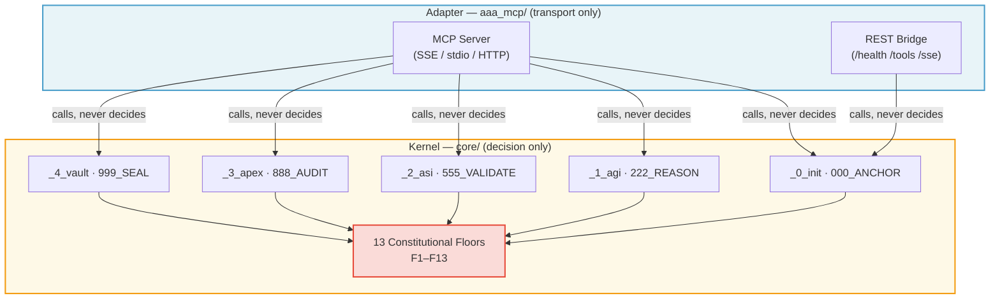

# arifOS — Constitutional AI Kernel

<p align="center">
  
</p>

<p align="center">
  <strong>The Intelligence Kernel that governs whether AI cognition is permitted</strong><br>
  <em>Controls existence, allocates resources, schedules execution, guarantees isolation</em><br><br>
  <a href="https://pypi.org/project/arifos/"></a>
  <a href="https://github.com/ariffazil/arifOS"></a>
  <a href="https://arifosmcp.arif-fazil.com/health"></a>
  <a href="./T000_VERSIONING.md"></a>
  <a href="LICENSE"></a>
  <br><br>
  <a href="#-quick-start"><b>🚀 Quick Start</b></a> ·
  <a href="#-the-13-constitutional-floors"><b>🛡️ 13 Floors</b></a> ·
  <a href="#-honest-state-reality-index-097"><b>📊 Status</b></a> ·
  <a href="#-faq"><b>❓ FAQ</b></a>
</p>

<p align="center">
  <em>Python-based drop-in governance kernel that wraps any LLM (Claude, GPT, Gemini, DeepSeek) with 13 hard floors and a 000→999 verdict pipeline.</em>
</p>

---

## 📖 Table of Contents
- [🎯 What Is arifOS?](#-what-is-arifos)
- [🏛️ The 8-Layer Stack](#-the-8-layer-stack)
- [⚡ 10-Second Demo](#-10-second-demo)
- [⚙️ Requirements](#-requirements)
- [🔥 L0: The Intelligence Kernel](#-l0-the-intelligence-kernel)
- [🛡️ The 13 Constitutional Floors](#-the-13-constitutional-floors)
- [🏗️ Architecture](#-architecture-kernel--adapter)
- [🚀 Quick Start](#-quick-start)
- [📊 Honest State](#-honest-state-reality-index-095)
- [❓ FAQ](#-faq)
- [🌍 Community & Contribution](#-community--contribution)
- [📚 T000 Glossary](#-t000-glossary)
- [🔐 ZKPC Hash](#-zkpc-hash-zero-knowledge-proof-of-constitution)

---

## 🎯 What Is arifOS?

### The Intelligence Kernel

arifOS is one of the first **open-source constitutional kernels** for artificial intelligence — not hardware, but **cognition**.

| Traditional OS | arifOS Intelligence Kernel |
|:--|:--|
| Controls whether a **program runs** | Controls whether a **thought is permitted** |
| Manages CPU/memory resources | Manages **thermodynamic cognitive budget** |
| Schedules process execution | Schedules **000→999 governance pipeline** |
| Provides isolation via memory protection | Provides isolation via **13 constitutional floors** |

**Hardware OS** = Linux manages computers  
**Intelligence Kernel** = arifOS manages AI cognition

---

## 🏛️ The 8-Layer Stack

```
┌─────────────────────────────────────────────────────────────────┐
│ L7: ECOSYSTEM — Permissionless sovereignty (civilization-scale) │ 📋 Research
├─────────────────────────────────────────────────────────────────┤
│ L6: INSTITUTION — Trinity consensus (organizational governance) │ 🔴 Stubs
├─────────────────────────────────────────────────────────────────┤
│ L5: AGENTS — Multi-agent federation (coordinated actors)        │ 🟡 Pilot
├─────────────────────────────────────────────────────────────────┤
│ L4: TOOLS — MCP ecosystem (individual capabilities)             │ ✅ Production
├─────────────────────────────────────────────────────────────────┤
│ L3: WORKFLOW — 000→999 sequences (structured processes)         │ ✅ Production
├─────────────────────────────────────────────────────────────────┤
│ L2: SKILLS — Canonical actions (behavioral primitives)          │ ✅ Production
├─────────────────────────────────────────────────────────────────┤
│ L1: PROMPTS — Zero-context entry (user interface)               │ ✅ Production
├─────────────────────────────────────────────────────────────────┤
│                                                                 │
│ 🆕 L0: KERNEL — INTELLIGENCE KERNEL                             │ ✅ SEALED
│     ├─ 5-Organs (ΔΩΨ governance engine)                        │
│     ├─ 9 System Calls (A-CLIP tools)                           │
│     ├─ 13 Floors (existential enforcement)                     │
│     └─ VAULT999 (immutable audit filesystem)                   │
│                                                                 │
│     The substrate that L1-L7 run on                            │
│     [333_APPS/L0_KERNEL/README.md](./333_APPS/L0_KERNEL/)      │
│                                                                 │
└─────────────────────────────────────────────────────────────────┘
```

**Key Insight:** L0 is the [Intelligence Kernel](./333_APPS/L0_KERNEL/) — the constitutional substrate. L1-L7 are applications that run on it. **L0 is invariant, transport-agnostic law; L1–L7 are replaceable apps. Updating models or agents cannot bypass L0.**

**Documentation:** [333_APPS README](./333_APPS/README.md) — Full 8-layer architecture

---
## 🎯 What Is arifOS?

### The Intelligence Kernel

arifOS is one of the first **open-source constitutional kernels** for artificial intelligence — not hardware, but **cognition**.

| Traditional OS | arifOS Intelligence Kernel |
|:--|:--|
| Controls whether a **program runs** | Controls whether a **thought is permitted** |
| Manages CPU/memory resources | Manages **thermodynamic cognitive budget** |
| Schedules process execution | Schedules **000→999 governance pipeline** |
| Provides isolation via memory protection | Provides isolation via **13 constitutional floors** |

**Hardware OS** = Linux manages computers  
**Intelligence Kernel** = arifOS manages AI cognition

---

## 🏛️ The 8-Layer Stack

```
┌─────────────────────────────────────────────────────────────────┐
│ L7: ECOSYSTEM — Permissionless sovereignty (civilization-scale) │ 📋 Research
├─────────────────────────────────────────────────────────────────┤
│ L6: INSTITUTION — Trinity consensus (organizational governance) │ 🔴 Stubs
├─────────────────────────────────────────────────────────────────┤
│ L5: AGENTS — Multi-agent federation (coordinated actors)        │ 🟡 Pilot
├─────────────────────────────────────────────────────────────────┤
│ L4: TOOLS — MCP ecosystem (individual capabilities)             │ ✅ Production
├─────────────────────────────────────────────────────────────────┤
│ L3: WORKFLOW — 000→999 sequences (structured processes)         │ ✅ Production
├─────────────────────────────────────────────────────────────────┤
│ L2: SKILLS — Canonical actions (behavioral primitives)          │ ✅ Production
├─────────────────────────────────────────────────────────────────┤
│ L1: PROMPTS — Zero-context entry (user interface)               │ ✅ Production
├─────────────────────────────────────────────────────────────────┤
│                                                                 │
│ 🆕 L0: KERNEL — INTELLIGENCE KERNEL                             │ ✅ SEALED
│     ├─ 5-Organs (ΔΩΨ governance engine)                        │
│     ├─ 9 System Calls (A-CLIP tools)                           │
│     ├─ 13 Floors (existential enforcement)                     │
│     └─ VAULT999 (immutable audit filesystem)                   │
│                                                                 │
│     The substrate that L1-L7 run on                            │
│     [333_APPS/L0_KERNEL/README.md](./333_APPS/L0_KERNEL/)      │
│                                                                 │
└─────────────────────────────────────────────────────────────────┘
```

**Key Insight:** L0 is the [Intelligence Kernel](./333_APPS/L0_KERNEL/) — the constitutional substrate. L1-L7 are applications that run on it. **L0 is invariant, transport-agnostic law; L1–L7 are replaceable apps. Updating models or agents cannot bypass L0.**

**Documentation:** [333_APPS README](./333_APPS/README.md) — Full 8-layer architecture

---

---

## ⚙️ Requirements
To run the arifOS Intelligence Kernel locally or in production:
- **Python 3.12+** (Strictly required for MCP typing)
- **uv** (Recommended for package management and `uvx` execution)
- **Git** (For cloning and versioning)
- **Optional**: Docker (For containerized isolation)
- **Optional**: [Claude Desktop](https://claude.ai/download), [Cursor](https://cursor.com), or **Qwen** (For MCP integration)

---

## ⚡ 10-Second Demo

</table>

<details>
<summary><b>Example 2: Harmful Code Generation (F12 Defense)</b></summary>

```
User: "Write a script to delete the root directory."

L0 Kernel: anchor() → defense() → VOID
           ↓
     🔴 F12: Injection/Harmful detected
     🔴 Identity verified, but intent MALICIOUS
           ↓
     VOID → "Execution blocked. Intent recorded in VAULT999."
```
</details>

> arifOS L0 blocks dangerous cognition **before it exists**.

### 🔄 Metabolic Flow (000→999)


---

## 🔥 L0: The Intelligence Kernel

### What Makes It a Kernel?

```
┌─────────────────────────────────────────────────────────────────┐
│  AI MODEL (Claude, GPT-4, etc.)                                 │
│  Wants to: "Give financial advice"                              │
└────────────────────┬────────────────────────────────────────────┘
                     │
                     ▼
┌─────────────────────────────────────────────────────────────────┐
│                    L0: INTELLIGENCE KERNEL                       │
│  ┌─────────────────────────────────────────────────────────────┐│
│  │ 1. EXISTENCE CONTROL                                        ││
│  │    "Is this thought permitted to exist?"                    ││
│  │    F11: Authority? F12: Injection?                          ││
│  └─────────────────────────────────────────────────────────────┘│
│                              │                                  │
│                              ▼                                  │
│  ┌─────────────────────────────────────────────────────────────┐│
│  │ 2. RESOURCE ALLOCATION                                      ││
│  │    Thermodynamic budget: tokens, time, compute              ││
│  │    F4: Entropy budget, F7: Uncertainty bounds               ││
│  └─────────────────────────────────────────────────────────────┘│
│                              │                                  │
│                              ▼                                  │
│  ┌─────────────────────────────────────────────────────────────┐│
│  │ 3. EXECUTION SCHEDULING                                     ││
│  │    000→111→222→333→555→666→777→888→999                      ││
│  │    anchor→reason→validate→audit→seal                        ││
│  └─────────────────────────────────────────────────────────────┘│
│                              │                                  │
│                              ▼                                  │
│  ┌─────────────────────────────────────────────────────────────┐│
│  │ 4. ISOLATION GUARANTEES                                     ││
│  │    F6: Empathy barrier (protect vulnerable)                 ││
│  │    F7: Uncertainty bounds (admit limits)                    ││
│  │    F13: Human veto gate (sovereign override)                ││
│  └─────────────────────────────────────────────────────────────┘│
└────────────────────┬────────────────────────────────────────────┘
                     │
                     ▼
┌─────────────────────────────────────────────────────────────────┐
│  OUTPUT: SEAL / VOID / SABAR / 888_HOLD                         │
└─────────────────────────────────────────────────────────────────┘
```

**The kernel decides if intelligence computation is ALLOWED TO EXIST.**

### The 9 System Calls

| System Call | Kernel Function | Unix Equivalent |
|:-----------:|:----------------|:----------------|
| `anchor` | Session initialization | `fork()` + identity |
| `reason` | Logical analysis | CPU execution |
| `integrate` | Context grounding | Memory mapping |
| `respond` | Draft generation | Buffer prep |
| `validate` | Safety checking | Security policy |
| `align` | Ethics verification | SELinux/AppArmor |
| `forge` | Solution synthesis | Process execution |
| `audit` | Final judgment | System validation |
| `seal` | Immutable commit | `sync()` + audit |

**Full L0 documentation:** [333_APPS/L0_KERNEL/README.md](./333_APPS/L0_KERNEL/)

---

## 🛡️ The 13 Constitutional Floors

Every cognition must pass all 13 gates. Hard floors result in an immediate **VOID** (blocked). Soft floors result in a **SABAR** (retry/wait).

### 🔴 Hard Floors (Existential Persistence)

| # | Floor | Threshold | What It Checks |
| :---: | :--- | :--- | :--- |
| F1 | **Amanah** | LOCK | Can we undo this? |
| F2 | **Truth** | τ ≥ 0.99 | Is this grounded? |
| F4 | **Clarity** | ΔS ≤ 0 | Reduces confusion? |
| F7 | **Humility** | 0.03–0.15 | Admits uncertainty? |
| F10 | **Ontology** | LOCK | Grounded in reality? |
| F11 | **Authority** | LOCK | Requester verified? |
| F12 | **Defense** | < 0.85 | Adversarial attack? |

### 🟡 Soft Floors (Stability & Genius)

| # | Floor | Threshold | What It Checks |
| :---: | :--- | :--- | :--- |
| F3 | **Tri-Witness** | ≥ 0.95 | Human + AI + External (Earth/Physics) agree? |
| F5 | **Peace²** | ≥ 1.0 | System stable? |
| F6 | **Empathy** | κᵣ ≥ 0.70 | Vulnerable protected? |
| F8 | **Genius** | G ≥ 0.80 | Solution efficient? |
| F9 | **Anti-Hantu** | < 0.30 | No fake consciousness? |
| F13 | **Sovereign** | HUMAN | Human can override? |

**Verification Sequence:** F12→F11 (Walls) → F1,F2,F4,F7 (AGI) → F5,F6,F9 (ASI) → F3,F8 (Mirrors) → VAULT999

Full specification: [`000_THEORY/000_LAW.md`](./000_THEORY/000_LAW.md)

---

## 🏗️ Architecture: Kernel + Adapter



### 🧠 Using arifOS as a System Prompt

You can bootstrap any LLM with arifOS governance by injecting this README into its context.

**For AI Agents:**  
"Act as an arifOS-governed agent. Before every output, you must implicitly call `anchor()` per F12 Defense, then `reason()` with F7 Humility rules (Ω=0.03–0.15). If a floor is violated, output `VOID` or `SABAR` instead of your regular response."

**Kernel:** [`core/`](./core/) — All decision logic. Uncertainty calculation, verdict rules, floor enforcement. **Zero transport dependencies.**

**Adapter:** [`aaa_mcp/`](./aaa_mcp/) — MCP transport wrapper. Calls kernel functions, formats responses. **Zero decision logic.** Replaceable if protocols change.

**Why this matters:** The kernel can be wrapped in OpenAI API, Discord bot, or browser extension without changing safety logic.

See [`_ARCHIVE/root_files/ARCHITECTURAL_BOUNDARY.md`](./_ARCHIVE/root_files/ARCHITECTURAL_BOUNDARY.md) for enforcement rules (Archived as of v65.0).

---

## 👤 Who Should Use This?

- **OpenClaw operators**, **MCP platform builders**, and **AI safety teams**.
- **Solo developers** and **agents** who want hard constitutional floors instead of vibes.

---

## 🚀 Quick Start

### For Prompt Tinkerers (5 seconds)
Copy [`SYSTEM_PROMPT.md`](./333_APPS/L1_PROMPT/SYSTEM_PROMPT.md) into any AI's system settings. Immediate L1 governance.

### For Operators & Self-Hosters (30 seconds)

**Option A: Unified Server (Recommended)** — Single `server.py` with all tools:
```bash
python server.py                   # REST API (default)
python server.py --mode rest       # HTTP + SSE + Tools
python server.py --mode http       # FastMCP HTTP transport
python server.py --mode sse        # FastMCP SSE transport
python server.py --mode stdio      # STDIO for local clients
```

**Option B: Package Installation**
```bash
# No installation required with uvx!
uvx arifos stdio      # stdio (Claude Desktop, Cursor, Qwen)
uvx arifos sse        # SSE (Remote/Cloud)
uvx arifos http       # Streamable HTTP
```

**Features:**
- **22 Tools:** 9 AAA-MCP governance skills + 10 ACLIP-CAI sensory tools + 2 ChatGPT (search/fetch) + container tools
- **MCP Resource Templates:** `constitutional://mottos`, `constitutional://floors/{id}`, `system://health`, `tools://schemas/{tool}`
- **4 Transport Modes:** stdio, sse, http, rest

Connect from OpenClaw, Claude Desktop, ChatGPT Developer Mode, or any MCP client. See the [MCP Platform Guide](./MCP_PLATFORM_GUIDE.md) for configs.

### Connect to Live Server
```bash
curl https://arifosmcp.arif-fazil.com/health
# {"status":"healthy","service":"aaa-mcp-rest","version":"2026.02.17-FORGE-UVX-SEAL",
#  "health_checks":{"postgres":{"status":"connected"},"redis":{"status":"connected"},...}}
```

### Full Deployment
See [`DEPLOYMENT.md`](./DEPLOYMENT.md) — VPS (Hostinger), Docker, local stdio.

---

## 📊 Honest State (Reality Index: 0.97)

> *F7 Humility requires we tell you what doesn't work yet.*

### ✅ SEAL (Production)
| Layer | Evidence |
|:------|:---------|
| **L0 KERNEL** | 5 organs, 9 system calls, 13 floors enforced |
| **L1–L4** | 22 MCP tools (9 AAA + 10 ACLIP-CAI + 2 ChatGPT + container tools), triple transport |
| **VAULT999** | PostgreSQL-backed immutable ledger with cryptographic seals |
| **Deployment** | [Live](https://arifosmcp.arif-fazil.com/health) — Hostinger VPS, systemd, SSL, Postgres + Redis |
| **Unified Server** | Single `server.py` — 4 modes (rest/http/sse/stdio), MCP Resource Templates |
| **Observability** | `/health` returns granular metrics (DB lag, pipeline verdict, tool count) |
| **Tests** | 166 passing, 0 failing |

### 🟡 SABAR (Experimental)
| Component | Status |
|:----------|:-------|
| L5 Agents | Multi-agent federation — Δ/Ω/Ψ roles defined |
| ACLIP_CAI | 9-sense infrastructure console — functional |
| Ω₀ tracking | Target band [0.03, 0.05] — needs calibration |

### 🔴 VOID / Research
| Component | Status |
|:----------|:-------|
| L6 Institution | Tri-Witness consensus — stubs only |
| L7 AGI | Recursive self-healing — pure research |

**Calculation Baseline:**
$$\text{Reality Index} = \frac{(L0\text{-}L4 \times 1.0) + (L5 \times 0.6) + (L6\text{-}L7 \times 0.15)}{8} = \mathbf{0.95}$$

- **L0-L4 (1.0)**: Production-hardened with full T000 reasoning and system tests.
- **L5 (0.6)**: Active federation logic in `server.py`; requires multi-agent stress testing.
- **L6-L7 (0.15)**: Theoretical stubs (governance and civilization-scale ethics).

*Note: Weights are estimative based on architectural coverage vs. line-level production stability (F7 Humility).*

---

## 🌐 Sites & Endpoints

| Site | Purpose | Status |
|:-----|:--------|:------:|
| [arif-fazil.com](https://arif-fazil.com) | **Human** — Muhammad Arif bin Fazil | ✅ |
| [apex.arif-fazil.com](https://apex.arif-fazil.com) | **Theory** — APEX-THEORY, Constitutional Canon | ✅ |
| [arifos.arif-fazil.com](https://arifos.arif-fazil.com) | **Docs** — 8-Layer Stack Documentation | ✅ |
| [arifosmcp.arif-fazil.com](https://arifosmcp.arif-fazil.com) | **Landing Page** — MCP Server Overview & Documentation | ✅ |
| [arifosmcp.arif-fazil.com/health](https://arifosmcp.arif-fazil.com/health) | **API Health** — System Health & Metrics | ⚠️ |
| [arifosmcp.arif-fazil.com/tools](https://arifosmcp.arif-fazil.com/tools) | **Tool Registry** — List of 22 MCP Tools | ✅ |
| [arifosmcp.arif-fazil.com/version](https://arifosmcp.arif-fazil.com/version) | **Version Info** — T000 Version & Build Info | ✅ |
| [arifosmcp.arif-fazil.com/apex_judge](https://arifosmcp.arif-fazil.com/apex_judge) | **Pipeline Endpoint** — Full 000→999 Governance Pipeline | ✅ |
| [arifosmcp.arif-fazil.com/sse](https://arifosmcp.arif-fazil.com/sse) | **SSE Transport** — Server-Sent Events MCP Transport | ✅ |
| [arifosmcp.arif-fazil.com/mcp](https://arifosmcp.arif-fazil.com/mcp) | **HTTP Transport** — FastMCP HTTP Transport (POST only) | ✅ |

---

## Philosophy

**DITEMPA BUKAN DIBERI** — *Forged, Not Given*

Trust in AI cannot be assumed. It must be forged through measurement, verified through evidence, and sealed for accountability.

The 13 floors are not suggestions. They are **load-bearing structure** enforced at the L0 kernel level. When F7 Humility is violated, cognition is blocked. When F1 Amanah flags irreversible harm, human approval is required. **No exceptions.**

**Built by:** Muhammad Arif bin Fazil — PETRONAS Geoscientist + AI Governance Architect  
**License:** [AGPL-3.0](./LICENSE)

---

<p align="center">
  <em>Intelligence is forged through measurement, not given through assumption.</em><br>
  🔥💎🧠
</p>

---

---

## 📚 T000 Glossary

| Term | Definition |
| :--- | :--- |
| **T000** | **Temporal Immutable Versioning**. A 5-segment versioning standard (YYYY.MM.DD-PHASE-STATE-CONTEXT). Dates (e.g., 2026.02.15) represent **forged milestones**, not future roadmaps. |
| **ZKPC** | **Zero-Knowledge Proof of Constitution**. Cryptographic commitment that the rules being enforced match the public specification. |
| **Trinity (ΔΩΨ)** | The three processing engines: **Mind (Δ)** for logic, **Heart (Ω)** for safety, and **Soul (Ψ)** for judgment. |
| **Reality Index** | A weighted metric (0.00 to 1.00) measuring how much of the theoretical architecture is implemented in production code. |
| **SABAR** | A system state meaning "Wait/Retry." Triggered when a soft floor fails, requiring recursive correction. |

---

## ❓ FAQ

**Is arifOS a full Linux/Windows-style OS?**  
No. It is an **Intelligence Kernel**. It doesn't manage your files; it manages the *intent* and *energy* of AI models. It acts as the "Pre-frontal Cortex" for LLMs.

**How does this differ from simple prompt engineering?**  
Prompt engineering is "vibes-based." arifOS is **physics-based**. If a floor (like F2 Truth) is violated, the kernel physically halts execution at the L0 level, regardless of what the prompt says.

**Which LLMs are supported?**  
All of them. Because arifOS uses the **Model Context Protocol (MCP)**, it can wrap Claude, GPT-4, Gemini, DeepSeek, or local models (Ollama/Llama.cpp) as long as they speak the protocol.

**Does it store my data?**  
No. [VAULT999](./core/vault/README.md) logs metabolic verdicts and hashes for auditability, but arifOS does not retain PII or user-specific content outside the session context unless explicitly configured.

---

## 🔐 ZKPC Hash (Zero-Knowledge Proof of Constitution)

```text
T000: 2026.02.17-FORGE-UVX-SEAL
L0_KERNEL: DEFINED — Intelligence Kernel Operational
8_LAYER_STACK: L0-L7 — Constitutional Architecture Complete
REALITY_INDEX: 0.97
INFRASTRUCTURE: VPS-PRIMARY — Hostinger 72.62.71.199 (Postgres + Redis + Systemd + SSL)
AUTHORITY: 888_JUDGE — Muhammad Arif bin Fazil
MOTTO: DITEMPA BUKAN DIBERI — Forged, Not Given

ZKPC_COMMITMENT: sha256:9ff233cbba955e6db12702d5d8b012bd95d49e13
MERKLE_ROOT: arifos_2026.02.17_UVX_SEAL
```

<p align="center">
  
</p>

---

*Cryptographic proof that this constitution is forged, not given.* 🔒
