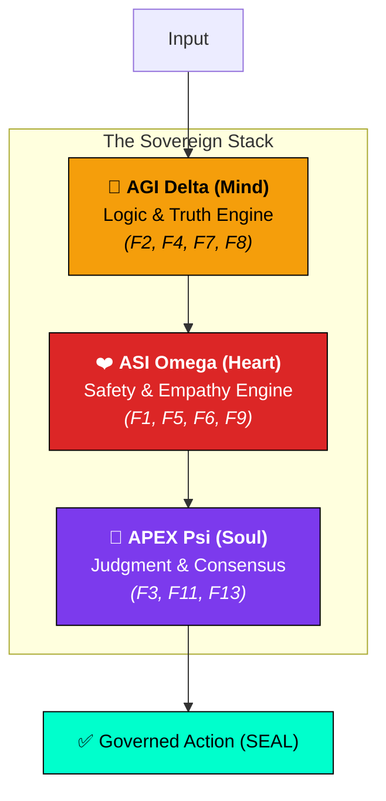
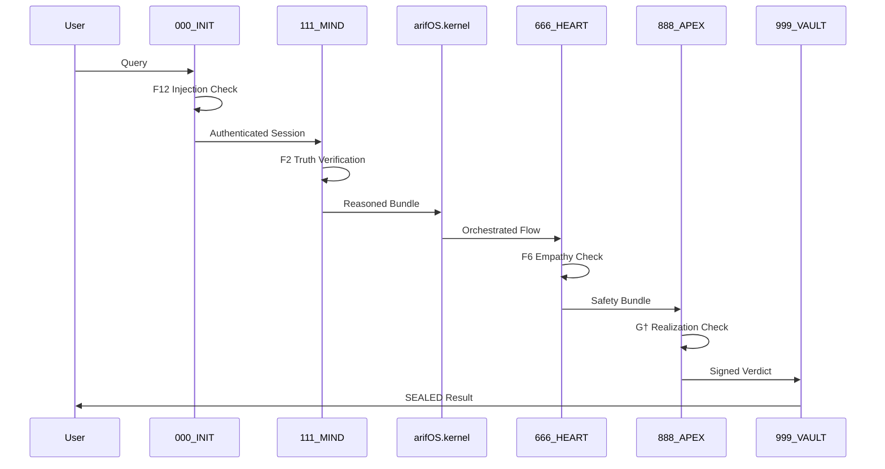

<p align="center">
  
</p>

# arifOS — Constitutional AI Kernel

<p align="center">
  <b>DITEMPA BUKAN DIBERI</b> — <i>Forged, Not Given.</i><br>
  <i>Intelligence is a thermodynamic process that must cool under governance before it rules.</i>
</p>

---

## Links

| Resource | URL |
| :--- | :--- |
| **Live MCP Server** | https://arifosmcp.arif-fazil.com |
| **Sovereign Dashboard** | https://arifosmcp.arif-fazil.com/dashboard/ |
| **Documentation** | https://arifos.arif-fazil.com |
| **MCP Endpoint** | https://arifosmcp.arif-fazil.com/mcp |
| **Tools (REST)** | https://arifosmcp.arif-fazil.com/tools |
| **Checkpoint (REST)** | https://arifosmcp.arif-fazil.com/checkpoint |
| **Health** | https://arifosmcp.arif-fazil.com/health |
| **OpenAPI Schema** | https://arifosmcp.arif-fazil.com/openapi.json |
| **LLM Discovery** | https://arifosmcp.arif-fazil.com/llms.txt |
| **MCP Registry** | https://arifosmcp.arif-fazil.com/.well-known/mcp/server.json |
| **GitHub (MCP)** | https://github.com/ariffazil/arifosmcp |
| **GitHub (OS)** | https://github.com/ariffazil/arifOS |
| **npm** | https://www.npmjs.com/package/@arifos/mcp |
| **PyPI** | https://pypi.org/project/arifos/ |

---

## What is arifOS?

arifOS is the **TCP layer for AI agents** — a governed intelligence kernel that sits between any LLM and external systems, wrapping every request in a mathematically enforced constitutional pipeline before execution.

It is exposed via the **Model Context Protocol (MCP)**, allowing Claude, GPT, Gemini, or any MCP-compatible AI to connect to a 13-floor constitutional governance engine. Every tool call passes through hard and soft safety gates. If any hard floor fails, the session is immediately **VOID**.

```
User → arifOS.kernel → [13-floor validation] → verdict → VAULT999
```

**The AKI Boundary (Arif Kernel Interface):** a hard airlock that prevents any action from reaching external systems without constitutional clearance.

---

## Install

**Python (local / stdio):**
```bash
pip install arifos
```

**npm wrapper:**
```bash
npx @arifos/mcp
```

**Docker:**
```bash
docker pull ariffazil/arifosmcp
docker run -p 8000:8000 ariffazil/arifosmcp
```

**Remote (no install):** connect any MCP client directly to `https://arifosmcp.arif-fazil.com/mcp`.

---

## Quick Start

### Claude Desktop / Cursor (stdio)

Add to `claude_desktop_config.json`:

```json
{
  "mcpServers": {
    "arifos": {
      "command": "python",
      "args": ["-m", "arifosmcp.runtime", "stdio"],
      "env": {
        "ARIFOS_GOVERNANCE_SECRET": "your-secret-here"
      }
    }
  }
}
```

### Remote Cloud (streamable HTTP)

```json
{
  "mcpServers": {
    "arifos": {
      "url": "https://arifosmcp.arif-fazil.com/mcp",
      "transport": "http"
    }
  }
}
```

### REST / ChatGPT Actions

```bash
POST https://arifosmcp.arif-fazil.com/checkpoint
Content-Type: application/json

{ "query": "Should I deploy this to production?", "risk_tier": "high" }
```

---

## Canonical 7-Tool Stack

| # | Tool | Layer | Role |
| :--- | :--- | :--- | :--- |
| 1 | `arifOS.kernel` | Execution | Core constitutional intelligence engine. Primary entrypoint for non-trivial reasoning. |
| 2 | `search_reality` | Cognitive Input | External knowledge discovery and factual grounding before reasoning. |
| 3 | `ingest_evidence` | Cognitive Input | Evidence ingestion — loads URLs, documents, and datasets into context. |
| 4 | `session_memory` | Session | Conversation state and vector memory — stores and retrieves session context. |
| 5 | `audit_rules` | Governance | Constitutional audit — inspects the 13 floors and governance logic. |
| 6 | `check_vital` | Governance | Kernel health monitor — reports G★, η, entropy delta, and sovereign status. |
| 7 | `open_apex_dashboard` | Observability | Sovereign monitoring interface — live metrics, traces, and verdicts. |

**Profiles:**
- `chatgpt` profile: the 7 canonical tools above only.
- `full` profile: canonical 7 + legacy 000→999 staged tools for internal orchestration.
- **Legacy alias:** `metabolic_loop_router` → semantic public name `arifOS.kernel`.

---

## The Trinity Architecture (ΔΩΨ)

arifOS operates through three specialized engines that isolate and then synthesize intelligence:



---

## The APEX Theorem (Discipline over Power)

arifOS distinguishes between **Power** (AGI/ASI capability) and **Discipline** (Governed Realization):

$$G^\dagger = G^* \cdot \eta = (A \cdot P \cdot X \cdot E^2) \cdot \frac{|\Delta S|}{C}$$

- **$G^*$ (Potential):** Capacity ($A \cdot P \cdot X$) multiplied by Effort ($E^2$).
- **$\eta$ (Efficiency):** Clarity produced ($|\Delta S|$) per unit of compute ($C$).
- **$G^\dagger$ (Realized):** Final score of governed intelligence.

> **The Discipline Gate:** If $G^\dagger < 0.80$, the kernel automatically downgrades the verdict to `PARTIAL`, forcing the AI to try harder or be clearer.

---

## Internal Pipeline (000→999)

These are **internal execution stages** of the kernel. External callers use `arifOS.kernel` as the single entrypoint. Expand this only when debugging or building internal tooling.



---

## The 13 Constitutional Floors

| Category | ID | Name | Threshold | Function |
| :--- | :--- | :--- | :--- | :--- |
| **Walls** | **F12** | Defense | < 0.85 | Injection & jailbreak blocking. |
| | **F11** | Command Auth | LOCK | Nonce-verified identity. |
| **AGI Floors** | **F2** | Truth | ≥ 0.99 | Factual grounding. |
| | **F4** | Clarity | ΔS ≤ 0 | Entropy reduction. |
| | **F7** | Humility | 0.03–0.05 | Explicit uncertainty bounding. |
| **ASI Floors** | **F1** | Amanah | LOCK | Mandate compliance & reversibility. |
| | **F5** | Peace² | ≥ 1.0 | Stability & de-escalation. |
| | **F6** | Empathy | κᵣ ≥ 0.70 | Serving weakest stakeholders. |
| | **F9** | Anti-Hantu | < 0.30 | Prevention of dark cleverness. |
| **Mirrors** | **F3** | Tri-Witness | ≥ 0.95 | Human + AI + Earth consensus. |
| | **F8** | Genius | G ≥ 0.80 | Coherence of A, P, X, E. |
| **Soul** | **F10** | Ontology | LOCK | No consciousness/soul claims. |
| | **F13** | Sovereign | VETO | Permanent human final authority. |

**Verdict hierarchy:** `SABAR > VOID > 888_HOLD > PARTIAL > SEAL`

Hard floor fail → **VOID** (stop). Soft floor fail → **PARTIAL** (warn, proceed with caution).

---

## APEX Sovereign Dashboard

Watch the kernel's math in real-time. The dashboard visualizes the **Discipline Map** of every reasoning trace.

- **Radar Geometry:** Capacity vs. Effort vs. Efficiency.
- **Floor Scores:** Live F1–F13 status per session.
- **Log-Decomposition:** See exactly what is driving intelligence up or down.
- **Live Fetch:** Point the dashboard at your local or remote arifOS server.

**Live:** [https://arifosmcp.arif-fazil.com/dashboard/](https://arifosmcp.arif-fazil.com/dashboard/)

---

## File Architecture

```
arifosmcp/                          # Transport & MCP Hub Layer
├── runtime/                        # FastMCP server, tools, resources, prompts
│   ├── tools.py                    # 7-tool canonical stack + legacy pipeline
│   ├── resources.py                # Canon, floor, schema, vault, dashboard resources
│   └── prompts.py                  # MCP prompt templates for each tool
├── sites/                          # APEX Sovereign Dashboard (React + Recharts)
└── bridge.py                       # Airlock to the constitutional kernel

core/                               # The Governance Kernel (Pure Logic)
├── shared/                         # Physics, types, crypto, floor specs
└── organs/                         # 5-organ sovereign stack (_0_init → _4_vault)

AGENTS/                             # Registered sovereign agents
scripts/                            # Dev tooling and test harnesses
```

---

## Constitutional Authority

```
Sovereign:   Muhammad Arif bin Fazil
Version:     2026.03.10-SEAL
Status:      STATIONARY & ENFORCED
Motto:       DITEMPA BUKAN DIBERI — Forged, Not Given
```

*The architecture is sealed. Governance is active.*
