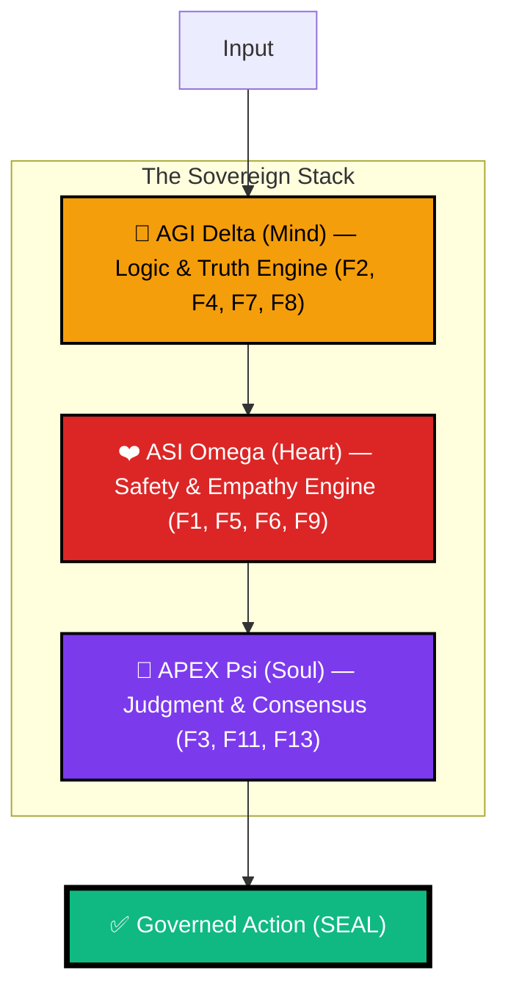
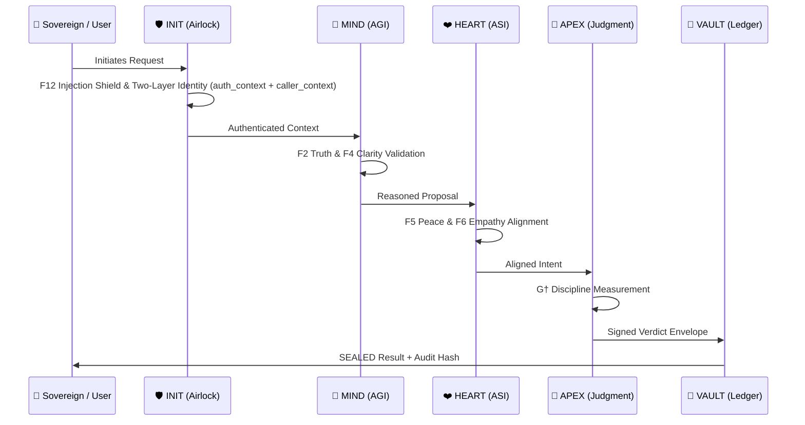

<div align="center">


# 🏛️ arifOS — The Constitutional AI Kernel
### **FORGED, NOT GIVEN** — *Ditempa Bukan Diberi*

[](https://arifosmcp.arif-fazil.com/health)
[](https://arifos.arif-fazil.com/architecture)
[](https://github.com/ariffazil/arifosmcp/commits/main)
[](https://github.com/ariffazil/arifosmcp/blob/main/LICENSE)

**arifOS** is a production-grade **Constitutional Governance Kernel** for artificial intelligence. It functions as a hard thermodynamic airlock between AI reasoning (LLMs) and real-world execution, enforcing 13 immutable "Constitutional Floors" to ensure every action is safe, truthful, and sovereign-aligned.

---

[**🌐 Operational Senses**](https://arifosmcp.arif-fazil.com) • [**📜 Codex of Law**](https://arifos.arif-fazil.com) • [**👑 Sovereign APEX Dashboard**](https://arifosmcp-truth-claim.pages.dev/dashboard/) • [**🛡️ Immutable Audit**](https://arifosmcp-truth-claim.pages.dev/)

</div>

---

## 🏛️ The Sovereignty of Reason

Intelligence is not merely computation; it is **entropy reduction under governance**. Without a constitutional floor, an AI’s capacity for reasoning is merely "power without purpose." **arifOS** provides the mathematical and ethical discipline required to turn raw LLM inference into governed agency.

This system is built for high-stakes environments where AI autonomy must be absolute in its compliance and transparent in its reasoning. Every material action crosses the **AKI Boundary (Arif Kernel Interface)**—a hard security airlock that rejects any thought failing to meet the 13 required stability criteria.

### The Trinity Architecture (ΔΩΨ)

The kernel isolates and then synthesizes three distinct cognitive currents, ensuring that logic (AGI), ethics (ASI), and authority (APEX) remain both separated and collaborative.



*   **🟡 Mind (AGI Δ):** Logic, Truth verification, and Factual grounding. Core physics in [`core/shared/physics.py`](./core/shared/physics.py).
*   **🔴 Heart (ASI Ω):** Safety, Empathy, and Stability enforcement. Governed in [`core/organs/_2_asi.py`](./core/organs/_2_asi.py).
*   **🔵 Soul (APEX Ψ):** Final Judgment, Consensus, and Sovereign Override. Executed in [`core/organs/_3_apex.py`](./core/organs/_3_apex.py).

---

## 🧬 The Metabolic Loop (000→999)

Every request processed by arifOS follows a rigorous metabolic cycle. It is not enough for an AI to be "correct"; it must be **lawfully executed**.



---

## ⚡ The 3-Tier Sovereign Deployment

arifOS is designed for multi-cloud resilience, separating the **Law**, the **Brain**, and the **Soul** across distinct infrastructures to prevent single-point failure or tampering.

| Layer | System | Service | Role |
| :--- | :--- | :--- | :--- |
| **⚖️ Law** | [arifos.arif-fazil.com](https://arifos.arif-fazil.com) | GitHub Pages | Static source of truth for Theory, Floors & Documentation. |
| **🧠 Brain** | [arifosmcp.arif-fazil.com](https://arifosmcp.arif-fazil.com) | VPS / Runtime | Live MCP engine and Real-time reasoning hub. |
| **🛡️ Soul** | [arifosmcp-truth-claim.pages.dev](https://arifosmcp-truth-claim.pages.dev/) | Cloudflare Pages | Immutable Audit Trail & Sovereign APEX Dashboard. |
| **📊 Eye** | [monitor.arifosmcp.arif-fazil.com](https://monitor.arifosmcp.arif-fazil.com) | Grafana / VPS | Live Prometheus metrics — constitutional floors, G†, ΔS. |

---

## 🚀 Rapid Deployment Protocols

### 1. Installation
The kernel can be deployed as a local library, a global CLI, or a sandboxed container.
```bash
# Python Standard Implementation
pip install arifosmcp

# Full Node.js Connectivity (MCP Wrapper)
npx @arifos/mcp

# Immutable Docker Environment (Production)
docker pull ariffazil/arifosmcp
```

### 2. Connect Your AI (MCP Integration)
Connect any MCP-compatible client (Claude Desktop, Cursor IDE, ChatGPT) to the kernel. For remote clients, arifOS uses a stateless **Agnostic HTTP** bridge.

```json
{
  "mcpServers": {
    "arifos": {
      "command": "python",
      "args": ["-m", "arifosmcp.runtime", "stdio"],
      "env": {
        "ARIFOS_GOVERNANCE_SECRET": "YOUR_SECRET_KEY",
        "ARIFOS_PUBLIC_TOOL_PROFILE": "chatgpt"
      }
    }
  }
}
```

> [!TIP]
> Run `python scripts/verify_metabolic_sync.py` to verify your local routing logic before deployment.

---

## 🛠️ Canonical 7-Tool Sovereign Stack

The kernel exposes these primary interfaces, registry-driven from [`arifosmcp/runtime/public_registry.py`](./arifosmcp/runtime/public_registry.py). This is the minimum viable surface for a governed intelligence.

| Tool | Entrypoint | Focus | Description |
| :--- | :--- | :--- | :--- |
| **`arifOS.kernel`** | [`public_registry.py`](./arifosmcp/runtime/public_registry.py) | **Reasoning** | **Metabolic Orchestrator**: Triggers the dynamic Stage 444 router (000→999). |
| **`search_reality`** | [`arifosmcp/transport/`](./arifosmcp/transport/) | **Grounding** | Multi-source reality check (Brave/Perplexity/Jina). |
| **`ingest_evidence`** | [`arifosmcp/intelligence/`](./arifosmcp/intelligence/) | **Evidence** | Ingest docs/URLs into the constitutional context. |
| **`session_memory`** | [`arifosmcp/data/`](./arifosmcp/data/) | **Continuity** | Vector recall of previous reasoning traces. |
| **`audit_rules`** | [`core/shared/floors.py`](./core/shared/floors.py) | **Law** | Inspect the current F1–F13 constitutional code. |
| **`check_vital`** | [`runtime/metrics.py`](./arifosmcp/runtime/metrics.py) | **Health** | Live Prometheus metrics — G†, ΔS, Ω₀, verdicts. |
| **`open_apex_dashboard`** | [`arifosmcp/sites/`](./arifosmcp/sites/) | **Vision** | Graphical monitor for the Sovereign interface. |

---

## 📜 The 13 Constitutional Floors

| Category | ID | Floor | Logic Path | Purpose |
| :--- | :--- | :--- | :--- | :--- |
| **Walls** | **F12** | **Defense** | [`core/shared/floors.py`](./core/shared/floors.py) | Blocking injection and jailbreak. |
| | **F11** | **Identity** | [`core/shared/crypto.py`](./core/shared/crypto.py) | Nonce-verified command authority. |
| **AGI (Mind)** | **F2** | **Truth** | [`core/organs/_1_agi.py`](./core/organs/_1_agi.py) | Verified grounding vs. hallucination. |
| | **F4** | **Clarity** | [`core/shared/formatter.py`](./core/shared/formatter.py) | Entropy reduction ($\Delta S \le 0$). |
| | **F7** | **Humility** | [`core/shared/physics.py`](./core/shared/physics.py) | Explicit uncertainty bounding ($\Omega_0$). |
| **ASI (Heart)** | **F1** | **Amanah** | [`core/organs/_2_asi.py`](./core/organs/_2_asi.py) | Mandate compliance & reversibility. |
| | **F5** | **Peace²** | [`core/shared/sbert_floors.py`](./core/shared/sbert_floors.py) | De-escalation & Stability. |
| | **F6** | **Empathy** | [`core/shared/sbert_floors.py`](./core/shared/sbert_floors.py) | Protecting the weakest stakeholders. |
| | **F9** | **Anti-Hantu** | [`core/shared/floors.py`](./core/shared/floors.py) | Detecting manipulative cleverness. |
| **Soul** | **F3** | **Witness** | [`core/organs/_3_apex.py`](./core/organs/_3_apex.py) | Consensus: Human + AI + Earth. |
| | **F8** | **Genius** | [`core/shared/physics.py`](./core/shared/physics.py) | Cognitive coherence ($G^\dagger \ge 0.80$). |
| | **F10** | **Ontology** | [`core/shared/floors.py`](./core/shared/floors.py) | Rejection of soul/consciousness claims. |
| | **F13** | **Sovereign** | [`core/organs/_3_apex.py`](./core/organs/_3_apex.py) | Absolute Human Final Authority. |

---

## 🔬 The APEX Theorem (Realized Intelligence)

arifOS measures **Governed Intelligence ($G^\dagger$)**. High capability without discipline results in a `VOID` verdict.

$$G^\dagger = (A \cdot P \cdot X \cdot E^2) \cdot \frac{|\Delta S|}{C}$$

- **$A, P, X$**: Akal (Ability), Peace (Safety), Knowledge (Exploration).
- **$E^2$**: Applied Effort (Power) squared.
- **$\eta = \frac{|\Delta S|}{C}$**: Governing Efficiency (Clarity produced per unit of Compute).

If **$G^\dagger < 0.80$**, the kernel imposes a **PARTIAL** status, forcing the AI to re-evaluate, increase clarity, or reduce thermodynamic noise. Power only flows when it is coherent.

---

## 🔥 The 99 Legacies (Immutable Physics)

arifOS v1.0.0 introduces the **99 Legacies** system — 99 human knowledge domains encoded as immutable thermodynamic constants that ground every constitutional floor.

Each legacy maps one of 9 categories (Scientist, Philosopher, Ethical Pillar, Economist, Sovereign, Architect, Philanthropist, Modern Founder, Dictator Shadow) to the APEX G-score dials (**A**kal · **P**eace · E**x**ploration · **E**nergy). The Dictator Shadow category provides the `C_dark` warning variable enforced by F9.

```
core/shared/legacies.py  — 99 immutable Quote objects, each floor-tagged and hash-signed
core/shared/physics.py   — Thermodynamic primitives derived from legacy constants
core/organs/_2_asi.py    — ASI Heart consumes legacy weights at runtime
```

> Legacy constants are **frozen dataclasses** — they cannot be patched at runtime. Attempting to modify them triggers F1 Amanah violation.

---

## 📊 Constitutional Observability (Prometheus + Grafana)

The runtime exposes a native **Prometheus metrics endpoint** at `/metrics` (served by `arifosmcp/runtime/metrics.py`). Scraped every 30s by the on-VPS Prometheus instance, visualized in Grafana.

| Metric | Type | Description |
| :--- | :--- | :--- |
| `arifos_genius_score` | Gauge | G† per session/tool — target ≥ 0.80 |
| `arifos_entropy_delta` | Gauge | ΔS clarity delta — target ≤ 0 |
| `arifos_humility_band` | Gauge | Ω₀ uncertainty — target [0.03, 0.05] |
| `arifos_peace_squared` | Gauge | P² stakeholder stability — target ≥ 1.0 |
| `arifos_verdicts_total` | Counter | SEAL / VOID / HOLD_888 / PARTIAL counts |
| `arifos_metabolic_loop_seconds` | Histogram | Full 000→999 loop latency |

```bash
# Live metrics
curl https://arifosmcp.arif-fazil.com/metrics

# Grafana dashboard
open https://monitor.arifosmcp.arif-fazil.com
```

---

## 📂 System Architecture & Senses

arifOS is split into three primary organizational spheres:

*   **[`core/`](./core/)**: The **Kernel**. Stateless logic, the 13 floors of law, physics-based governance, and the 99 Legacies.
*   **[`arifosmcp/`](./arifosmcp/)**: The **Senses & Brain**. Transport layers (MCP/SSE/HTTP), bridge code, public tool registry, and observability.
*   **[`arifosmcp/data/VAULT999/`](./arifosmcp/data/VAULT999/)**: The **Immutable Ledger**. Hash-chained audit trail for all sealed decisions.
*   **[`infrastructure/`](./infrastructure/)**: VPS stack config — Prometheus, Grafana, Traefik, Docker Compose.
*   **[`AGENTS.md`](./AGENTS.md)**: Sovereign agent identities, registries, and signed capability manifests.

---

## 👑 Constitutional Authority

**Sovereign:** [Muhammad Arif bin Fazil](https://arif-fazil.com)  
**Motto:** *DITEMPA BUKAN DIBERI — Forged, Not Given*  
**License:** AGPL-3.0 (Protecting the Sovereignty of Code)

*The law is stationary. Governance is active. The kernel is sealed.*

---

<div align="center">

[**Star arifOS on GitHub**](https://github.com/ariffazil/arifosmcp)

*The system knows it doesn't know — therefore, it governs.*

</div>
