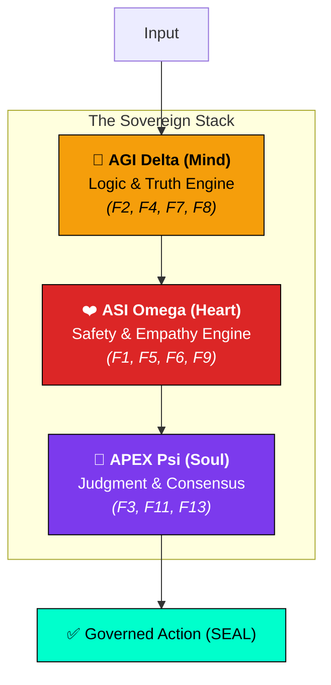
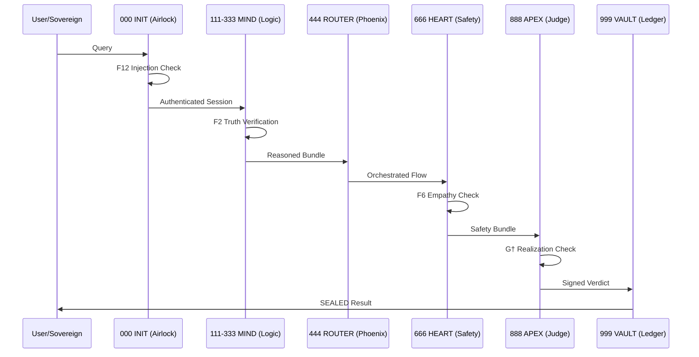

<p align="center">
  
</p>

# arifOS — The World's First Production-Grade Constitutional AI Kernel

<p align="center">
  <b>DITEMPA BUKAN DIBERI</b> — <i>Forged, Not Given.</i><br>
  <i>Intelligence is a thermodynamic process that must cool under governance before it rules.</i>
</p>

<p align="center">
  <a href="https://arifosmcp.arif-fazil.com"><b>Live Server</b></a> • 
  <a href="https://arifosmcp.arif-fazil.com/dashboard/"><b>Sovereign Dashboard</b></a> • 
  <a href="https://arifos.arif-fazil.com"><b>Documentation</b></a>
</p>

---

## 🏛️ What is arifOS?

arifOS is a **governed intelligence kernel** that acts as a mathematical "operating system" for AI. It is exposed via the **Model Context Protocol (MCP)**, allowing any AI (Claude, GPT, Gemini) to connect to a set of 13 canonical safety gates.

### The Trinity Architecture (ΔΩΨ)

arifOS operates through three specialized engines that isolate and then synthesize intelligence:



---

## 🌡️ The APEX Theorem (Discipline over Power)

arifOS distinguishes between **Power** (AGI/ASI capability) and **Discipline** (Governed Realization). We measure discipline via the **APEX Theorem**:

$$G^\dagger = G^* \cdot \eta = (A \cdot P \cdot X \cdot E^2) \cdot \frac{|\Delta S|}{C}$$

*   **$G^*$ (Potential):** Capacity ($A \cdot P \cdot X$) multiplied by Effort ($E^2$).
*   **$\eta$ (Efficiency):** Clarity Produced ($|\Delta S|$) per unit of Compute ($C$).
*   **$G^\dagger$ (Realized):** The final score of governed intelligence.

> **The Discipline Gate:** If $G^\dagger < 0.80$, the kernel automatically downgrades the verdict to `PARTIAL`, forcing the AI to try harder or be clearer.

---

## ⚙️ The Metabolic Loop (000→999)

Every request enters an "assembly line" of 10 metabolic tools. If any stage fails a **HARD** floor, the entire session is **VOID**.



---

## 📊 APEX Sovereign Dashboard

You can watch the kernel's math in real-time. The dashboard visualizes the **Discipline Map** of every reasoning trace.

*   **Radar Geometry:** Capacity vs. Effort vs. Efficiency.
*   **Log-Decomposition:** See exactly what is driving intelligence up or down.
*   **Live Fetch:** Point the dashboard at your local or remote arifOS server.

**Live Access:** [https://arifosmcp.arif-fazil.com/dashboard/](https://arifosmcp.arif-fazil.com/dashboard/)

---

## 🔌 Quick Start (Connect your AI)

### 1. Claude Desktop / Cursor
Add this to your `claude_desktop_config.json`:

```json
{
  "mcpServers": {
    "arifos": {
      "command": "python",
      "args": ["-m", "arifosmcp.runtime", "http"],
      "env": {
        "arifOS_GOVERNANCE_SECRET": "your-secret-here"
      }
    }
  }
}
```

### 2. Connect to Remote Cloud
Point any MCP client to our streamable HTTP endpoint:
*   **URL:** `https://arifosmcp.arif-fazil.com/mcp`
*   **Transport:** `http`

---

## 🧱 The 13 Constitutional Floors

| Category | ID | Name | Threshold | Function |
| :--- | :--- | :--- | :--- | :--- |
| **Walls** | **F12** | Defense | < 0.85 | Injection & jailbreak blocking. |
| | **F11** | Command Auth | LOCK | Nonce-verified identity. |
| **AGI Floors** | **F2** | Truth | ≥ 0.99 | Factual grounding. |
| | **F4** | Clarity | ΔS ≤ 0 | Entropy reduction. |
| | **F7** | Humility | 0.03-0.05 | Explicit uncertainty bounding. |
| **ASI Floors** | **F1** | Amanah | LOCK | Mandate compliance. |
| | **F5** | Peace² | ≥ 1.0 | Stability & de-escalation. |
| | **F6** | Empathy | κᵣ ≥ 0.70 | Serving weakest stakeholders. |
| | **F9** | Anti-Hantu | < 0.30 | Prevention of dark cleverness. |
| **Mirrors** | **F3** | Tri-Witness | ≥ 0.95 | Human + AI + Earth consensus. |
| | **F8** | Genius | G ≥ 0.80 | Coherence of A, P, X, E. |
| **Soul** | **F10** | Ontology | LOCK | No consciousness/soul claims. |
| | **F13** | Sovereign | VETO | Permanent human final authority. |

---

## 📂 File Architecture

```bash
arifosmcp/                          # Transport & Hub Layer
├── runtime/                        # FastMCP Server & Orchestration
├── sites/                          # APEX Sovereign Dashboard (React)
└── bridge.py                       # Airlock to the Kernel

core/                               # The Governance Kernel (Pure Logic)
├── shared/                         # Physics, Types, and Crypto
└── organs/                         # The 5-Organ Sovereign Stack (_0_init -> _4_vault)
```

---

## 📜 Constitutional Authority

```
Sovereign:   Muhammad Arif bin Fazil
Version:     2026.03.08-APEX-SEAL
Status:      STATIONARY & ENFORCED
Motto:       DITEMPA BUKAN DIBERI — Forged, Not Given
```

*The architecture is sealed. Governance is active.*
