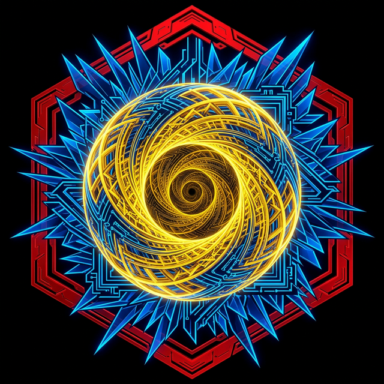

<div align="center">



# arifOS — The Constitutional AI Kernel
### **FORGED, NOT GIVEN** — *Ditempa Bukan Diberi*

[](https://arifosmcp.arif-fazil.com/health)
[](https://arifos.arif-fazil.com/architecture)
[](https://github.com/ariffazil/arifosmcp/commits/main)

**arifOS** is a production-grade **Constitutional Governance Kernel** for artificial intelligence. It functions as a hard thermodynamic airlock between AI reasoning (LLMs) and real-world execution, enforcing 13 immutable "Constitutional Floors" to ensure every action is safe, truthful, and sovereign-aligned.

---

[**🌐 Operational Senses**](https://arifosmcp.arif-fazil.com) • [**📜 Codex of Law**](https://arifos.arif-fazil.com) • [**👑 Sovereign APEX Dashboard**](https://arifosmcp-truth-claim.pages.dev/dashboard/) • [**🛡️ Immutable Audit**](https://arifosmcp-truth-claim.pages.dev/)

</div>

---

## 🏛️ The Core Philosophy

Intelligence is entropy reduction under governance. Without a constitutional floor, an AI’s capacity for reasoning is merely "power without purpose." **arifOS** provides the mathematical and ethical discipline required to turn raw LLM inference into governed agency.

### The Trinity Architecture (ΔΩΨ)

The kernel isolates and synthesizes three distinct cognitive currents:

*   **🟡 Mind (AGI Δ):** Logic, Truth verification, and Factual grounding. Core physics in [`core/shared/physics.py`](./core/shared/physics.py).
*   **🔴 Heart (ASI Ω):** Safety, Empathy, and Stability enforcement. Governed in [`core/organs/_2_asi.py`](./core/organs/_2_asi.py).
*   **🔵 Soul (APEX Ψ):** Final Judgment, Consensus, and Sovereign Override. Executed in [`core/organs/_3_apex.py`](./core/organs/_3_apex.py).

---

## ⚡ The 3-Tier Sovereign Deployment

| Infrastructure | Role | URL |
| :--- | :--- | :--- |
| **Law (GitHub Pages)** | **Static Theory** | [arifos.arif-fazil.com](https://arifos.arif-fazil.com) |
| **Brain (VPS Runtime)** | **Live Execution** | [arifosmcp.arif-fazil.com](https://arifosmcp.arif-fazil.com) |
| **Soul (Cloudflare)** | **Immutable Audit** | [arifosmcp-truth-claim.pages.dev](https://arifosmcp-truth-claim.pages.dev/) |

---

## 🚀 Rapid Deployment

### Install
```bash
# Python Standard Implementation
pip install arifos

# Full Node.js Connectivity
npx @arifos/mcp

# Immutable Docker Environment
docker pull ariffazil/arifosmcp
```

### Connect (Claude / Cursor / IDE)
Point your AI at the kernel by adding this to your `claude_desktop_config.json`:

```json
{
  "mcpServers": {
    "arifos": {
      "command": "python",
      "args": ["-m", "arifosmcp.runtime", "stdio"],
      "env": {
        "ARIFOS_GOVERNANCE_SECRET": "YOUR_SECRET_KEY"
      }
    }
  }
}
```

---

## 🛠️ Canonical 7-Tool Sovereign Stack

The kernel exposes these primary interfaces in [`arifosmcp/runtime/tools.py`](./arifosmcp/runtime/tools.py).

| Tool | Focus | Role |
| :--- | :--- | :--- |
| **`arifOS.kernel`** | **Reasoning** | The main entrypoint. Triggers the full 13-floor metabolic loop. |
| **`search_reality`** | **Grounding** | Multi-source reality check (Brave/Perplexity/Jina). |
| **`ingest_evidence`** | **Evidence** | Ingest docs/URLs into the constitutional context. |
| **`session_memory`** | **Continuity** | Vector recall of previous reasoning traces. |
| **`audit_rules`** | **Law** | Inspect the current F1–F13 constitutional code. |
| **`check_vital`** | **Health** | Live telemetry, entropy delta, and $G^\dagger$ scores. |
| **`open_apex_dashboard`** | **Vision** | Graphical monitor for the Sovereign (APEX) interface. |

---

## 📜 The 13 Constitutional Floors

| Category | ID | Floor | Logic Path | Purpose |
| :--- | :--- | :--- | :--- | :--- |
| **Walls** | **F12** | **Defense** | [`core/shared/floors.py`](./core/shared/floors.py) | Blocking injection and jailbreak. |
| | **F11** | **Identity** | [`core/shared/crypto.py`](./core/shared/crypto.py) | Nonce-verified command authority. |
| **AGI (Mind)** | **F2** | **Truth** | [`core/organs/_1_agi.py`](./core/organs/_1_agi.py) | Verified grounding vs. hallucination. |
| | **F4** | **Clarity** | [`core/shared/formatter.py`](./core/shared/formatter.py) | Entropy reduction ($\Delta S \le 0$). |
| | **F7** | **Humility** | [`core/shared/physics.py`](./core/shared/physics.py) | Explicit uncertainty bounding ($\Omega_0$). |
| **ASI (Heart)** | **F1** | **Amanah** | [`core/organs/_2_asi.py`](./core/organs/_2_asi.py) | Mandate compliance & reversibility. |
| | **F5** | **Peace²** | [`core/shared/sbert_floors.py`](./core/shared/sbert_floors.py) | De-escalation & Stability. |
| | **F6** | **Empathy** | [`core/shared/sbert_floors.py`](./core/shared/sbert_floors.py) | Protecting the weakest stakeholders. |
| | **F9** | **Anti-Hantu** | [`core/shared/floors.py`](./core/shared/floors.py) | Detecting manipulative cleverness. |
| **Soul** | **F3** | **Witness** | [`core/organs/_3_apex.py`](./core/organs/_3_apex.py) | Consensus: Human + AI + Earth. |
| | **F8** | **Genius** | [`core/shared/physics.py`](./core/shared/physics.py) | Cognitive coherence ($G^\dagger \ge 0.80$). |
| | **F10** | **Ontology** | [`core/shared/floors.py`](./core/shared/floors.py) | Rejection of soul/consciousness claims. |
| | **F13** | **Sovereign** | [`core/organs/_3_apex.py`](./core/organs/_3_apex.py) | Absolute Human Final Authority. |

---

## 🔬 The APEX Theorem (Realized Intelligence)

arifOS measures **Governed Intelligence ($G^\dagger$)**. High capability without discipline results in a `VOID` verdict.

$$G^\dagger = (A \cdot P \cdot X \cdot E^2) \cdot \frac{|\Delta S|}{C}$$

- **$A, P, X$**: Akal (Ability), Peace (Safety), Knowledge (Exploration).
- **$E^2$**: Applied Effort (Power).
- **$\eta = \frac{|\Delta S|}{C}$**: Governing Efficiency (Clarity produced per unit of Compute).

If **$G^\dagger < 0.80$**, the kernel imposes a **PARTIAL** status, forcing the AI to increase clarity or reduce noise.

---

## 📂 System Architecture

*   **[`core/`](./core/)**: The **Kernel**. Stateless logic and the 13 floors of law.
*   **[`arifosmcp/`](./arifosmcp/)**: The **Senses**. Transport, bridge code, and sensory dashboard.
*   **[`000_THEORY/`](./000_THEORY/)**: Theoretical grounding and the 000_LAW.md specification.
*   **[`VAULT999/`](./VAULT999/)**: The local **Immutable Ledger**.
*   **[`AGENTS/`](./AGENTS.md)**: Sovereign agent identities and signatures.

---

## 👑 Constitutional Authority

**Sovereign:** [Muhammad Arif bin Fazil](https://arif-fazil.com)  
**Motto:** *DITEMPA BUKAN DIBERI — Forged, Not Given*  
**License:** AGPL-3.0

*The law is stationary. Governance is active.*
