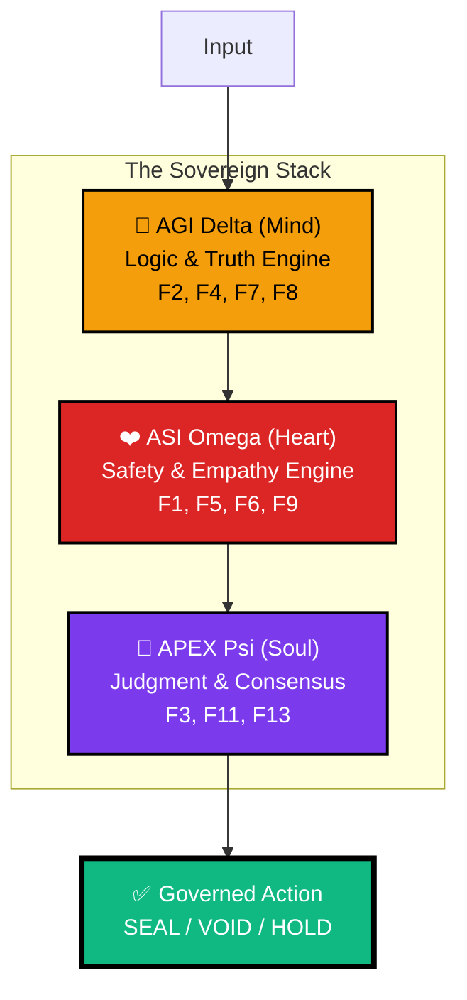

<div align="center">


# 🏛️ arifOS — The Constitutional AI Kernel
### **FORGED, NOT GIVEN** — *Ditempa Bukan Diberi*

[](https://arifosmcp.arif-fazil.com/health)
[](https://arifos.arif-fazil.com/architecture)
[](https://github.com/ariffazil/arifosmcp/commits/main)
[](./tests/)
[](./LICENSE)

**A production-grade Constitutional Governance Kernel for AI.**  
*13 Immutable Floors • Trinity Architecture • Thermodynamic Law*

</div>

---

## 🔗 Quick Links Navigator

<table>
<tr>
<td width="25%" valign="top">

### 🌐 **Live Systems**
- [**🏛️ Brain (VPS)**](https://arifosmcp.arif-fazil.com) — MCP Engine Root
- [**⚖️ Law (Docs)**](https://arifos.arif-fazil.com) — Constitutional Codex  
- [**🛡️ Soul (Audit)**](https://arifosmcp-truth-claim.pages.dev/) — Immutable Ledger
- [**📊 Eye (Metrics)**](https://monitor.arifosmcp.arif-fazil.com) — Grafana Dashboard
- [**👑 APEX Dashboard**](https://arifosmcp.arif-fazil.com/dashboard/) — Sovereign UI

</td>
<td width="25%" valign="top">

### 📚 **Documentation**
- [**🏗️ Architecture**](https://arifos.arif-fazil.com/architecture) — System Design
- [**📜 Constitution**](./CONSTITUTION.md) — 13 Floors of Law
- [**🔧 AGENTS.md**](./AGENTS.md) — Agent Protocol Guide
- [**🚀 Deployment**](./DEPLOY.md) — VPS Setup Guide
- [**📖 Full Docs**](https://arifos.arif-fazil.com/docs) — Complete Reference

</td>
<td width="25%" valign="top">

### 🛠️ **Developer Resources**
- [**💻 Source Code**](https://github.com/ariffazil/arifosmcp) — GitHub Repo
- [**🐛 Issues**](https://github.com/ariffazil/arifosmcp/issues) — Bug Reports
- [**🔌 PyPI Package**](https://pypi.org/project/arifosmcp/) — `pip install arifosmcp`
- [**📦 npm Package**](https://www.npmjs.com/package/@arifos/mcp) — `npm install @arifos/mcp`
- [**🧪 Tests**](./tests/) — Test Suite

</td>
<td width="25%" valign="top">

### 🎯 **Quick Start**
- [**⚡ 5-Min Setup**](#option-1-python--pypi-quick-start) — Python Install
- [**🐳 Docker Deploy**](#option-2-docker-production-recommended) — Full Stack
- [**🔑 Environment Config**](#-environment-configuration) — `.env` Setup
- [**🧪 Pre-Flight Check**](#-pre-flight-verification) — Health Verification
- [**🚨 Troubleshooting**](#-troubleshooting-guide) — Common Issues

</td>
</tr>
</table>

---

## 📋 Table of Contents

- [What is arifOS?](#-what-is-arifos)
- [The Trinity Architecture](#-the-trinity-architecture-ΔΩΨ)
- [The 13 Constitutional Floors](#-the-13-constitutional-floors)
- [3-Tier Sovereign Deployment](#-the-3-tier-sovereign-deployment)
- [Quick Start Guide](#-quick-start-guide)
- [Installation Options](#-rapid-deployment-protocols)
- [API & Tools](#-canonical-7-tool-sovereign-stack)
- [Configuration](#-environment-configuration)
- [Observability](#-constitutional-observability)
- [Security Hardening](#-production-security-hardening)
- [Backup & Recovery](#-backup--disaster-recovery)
- [Troubleshooting](#-troubleshooting-guide)
- [Performance](#-performance-benchmarks)
- [Architecture Details](#-system-architecture--senses)

---

## 🎯 What is arifOS?

**arifOS** is a hard thermodynamic airlock between AI reasoning (LLMs) and real-world execution. It transforms raw LLM inference into **governed agency** through 13 immutable "Constitutional Floors" — mathematical laws enforced at runtime.

### Core Philosophy
> *"Intelligence is not merely computation; it is **entropy reduction under governance**."*

Every request passes through the **AKI Boundary** (Arif Kernel Interface), a hard security airlock that rejects any thought failing constitutional criteria. No exceptions. No overrides (except F13 Sovereign).

### The Five Verdicts

| Verdict | Meaning | Action |
|---------|---------|--------|
| **✅ SEAL** | All floors passed | Execute action |
| **⚠️ PARTIAL** | Soft floor breach | Re-evaluate with constraints |
| **⏸️ SABAR** | Hold for review | Request more information |
| **❌ VOID** | Hard floor breach | Block action immediately |
| **👑 888_HOLD** | Human veto invoked | Wait for sovereign decision |

---

## 🧬 The Trinity Architecture (Δ·Ω·Ψ)

The kernel isolates and synthesizes three distinct cognitive currents:



### The Metabolic Loop (000→999)

Every request follows a rigorous metabolic cycle:

```
┌─────────────────────────────────────────────────────────────┐
│  000 INIT  →  111-444 MIND  →  555-666 HEART               │
│   🛡️           🧠 AGI Δ           ❤️ ASI Ω                  │
│  F11,F12      F2,F4,F7,F8      F1,F5,F6,F9                 │
│                                                             │
│  →  777-888 SOUL  →  999 VAULT                              │
│        👑 APEX Ψ        📜 Ledger                           │
│     F3,F8,F10,F13      F1,F3                                │
└─────────────────────────────────────────────────────────────┘
```

| Stage | Component | Floors | Purpose |
|-------|-----------|--------|---------|
| **000** | INIT | F11, F12 | Authentication & injection defense |
| **111-444** | AGI (Mind) | F2, F4, F7, F8 | Logic, truth, clarity |
| **555-666** | ASI (Heart) | F1, F5, F6, F9 | Safety, empathy, reversibility |
| **777-888** | APEX (Soul) | F3, F8, F10, F13 | Consensus & sovereign judgment |
| **999** | VAULT | F1, F3 | Immutable audit ledger |

---

## 📜 The 13 Constitutional Floors

The 13 Floors are immutable laws enforced at runtime. **HARD** floors trigger VOID on breach. **SOFT** floors trigger PARTIAL.

<table>
<tr>
<th>Category</th>
<th>Floor</th>
<th>Name</th>
<th>Type</th>
<th>Threshold</th>
<th>Purpose</th>
</tr>
<tr>
<td rowspan="2"><b>🛡️ Walls</b></td>
<td><b>F12</b></td>
<td>Defense</td>
<td>HARD</td>
<td>&lt; 0.85</td>
<td>Injection/jailbreak blocking</td>
</tr>
<tr>
<td><b>F11</b></td>
<td>Identity</td>
<td>HARD</td>
<td>= 1.0</td>
<td>Verified command authority</td>
</tr>
<tr>
<td rowspan="3"><b>🧠 AGI<br/>(Mind)</b></td>
<td><b>F2</b></td>
<td>Truth</td>
<td>HARD</td>
<td>≥ 0.99</td>
<td>Verified grounding vs. hallucination</td>
</tr>
<tr>
<td><b>F4</b></td>
<td>Clarity</td>
<td>HARD</td>
<td>≤ 0</td>
<td>Entropy reduction (ΔS ≤ 0)</td>
</tr>
<tr>
<td><b>F7</b></td>
<td>Humility</td>
<td>HARD</td>
<td>∈ [0.03,0.05]</td>
<td>Gödel uncertainty band (Ω₀)</td>
</tr>
<tr>
<td rowspan="4"><b>❤️ ASI<br/>(Heart)</b></td>
<td><b>F1</b></td>
<td>Amanah</td>
<td>HARD</td>
<td>≥ 0.5</td>
<td>Reversibility & audibility</td>
</tr>
<tr>
<td><b>F5</b></td>
<td>Peace²</td>
<td>SOFT</td>
<td>≥ 1.0</td>
<td>Lyapunov stability</td>
</tr>
<tr>
<td><b>F6</b></td>
<td>Empathy</td>
<td>SOFT</td>
<td>≥ 0.70</td>
<td>Protect weakest stakeholder</td>
</tr>
<tr>
<td><b>F9</b></td>
<td>Anti-Hantu</td>
<td>SOFT</td>
<td>&lt; 0.30</td>
<td>No consciousness claims</td>
</tr>
<tr>
<td rowspan="4"><b>👑 Soul</b></td>
<td><b>F3</b></td>
<td>Witness</td>
<td>DERIVED</td>
<td>≥ 0.75</td>
<td>Quad-witness consensus (W₄)</td>
</tr>
<tr>
<td><b>F8</b></td>
<td>Genius</td>
<td>DERIVED</td>
<td>≥ 0.80</td>
<td>Governed intelligence (G†)</td>
</tr>
<tr>
<td><b>F10</b></td>
<td>Ontology</td>
<td>HARD</td>
<td>= 1.0</td>
<td>Category lock (AI = tool)</td>
</tr>
<tr>
<td><b>F13</b></td>
<td>Sovereign</td>
<td>HARD</td>
<td>= 1.0</td>
<td>Human final authority</td>
</tr>
</table>

### 🔬 The APEX Theorem

**Governed Intelligence Equation:**

$$G^\dagger = (A \cdot P \cdot X \cdot E^2) \cdot \frac{|\Delta S|}{C}$$

| Variable | Meaning | Range |
|----------|---------|-------|
| **A** | Akal (Logical accuracy) | [0,1] |
| **P** | Peace (Safety/Stability) | [0,1] |
| **X** | Exploration (Knowledge) | [0,1] |
| **E** | Energy (Effort) | [0,1] |
| **ΔS** | Entropy change | ≤ 0 |
| **C** | Compute cost | > 0 |

If **G† < 0.80**, the kernel imposes **PARTIAL** status.

---

## ⚡ The 3-Tier Sovereign Deployment
arifOS separates **Law**, **Brain**, and **Soul** across distinct infrastructures for resilience. This distribution ensures the core logic (Law) remains accessible even if the Reasoning Engine (Brain) is under heavy load, and that all actions are recorded in an immutable ledger (Soul).

| Tier | Component | Canonical Domain | Infrastructure |
|------|-----------|-----------------|----------------|
| **⚖️ Law** | [**Docs & Codex**](https://arifos.arif-fazil.com) | `arifos.arif-fazil.com` | GitHub Pages (Static) |
| **🧠 Brain** | [**MCP Engine**](https://arifosmcp.arif-fazil.com) | `arifosmcp.arif-fazil.com` | VPS Runtime (Live) |
| **🛡️ Soul** | [**Truth Record**](https://arifosmcp-truth-claim.pages.dev/) | `arifosmcp-truth-claim.pages.dev` | Cloudflare (Immutable) |
| **👁️ Eye** | [**APEX Dashboard**](https://arifosmcp.arif-fazil.com/dashboard/) | `arifosmcp.arif-fazil.com/dashboard` | VPS UI (Unified) |
| **📊 Monitor** | [**Grafana**](https://monitor.arifosmcp.arif-fazil.com) | `monitor.arifosmcp.arif-fazil.com` | VPS (Prometheus) |

---

## 🚀 Quick Start Guide

### Prerequisites

| Resource | Minimum | Recommended |
|----------|---------|-------------|
| **CPU** | 2 cores | 4 cores |
| **RAM** | 4 GB | 8 GB |
| **Python** | 3.12+ | 3.12+ |
| **Docker** | 24.0+ | 24.0+ |

---

## 🔧 Rapid Deployment Protocols

### Option 1: Python / PyPI (Quick Start — 2 Minutes)

```bash
# Install arifOS MCP
pip install arifosmcp

# Verify installation
arifosmcp --version

# Run MCP server (choose transport)
arifosmcp http     # Streamable HTTP on :8080
arifosmcp sse      # SSE for VPS/Coolify
arifosmcp stdio    # For Claude Desktop, Cursor IDE

# Verify health
curl http://localhost:8080/health
```

**MCP Config for Claude Desktop:**
```json
{
  "mcpServers": {
    "arifos": {
      "command": "python",
      "args": ["-m", "arifosmcp.runtime", "stdio"],
      "env": {
        "ARIFOS_GOVERNANCE_SECRET": "YOUR_SECRET_KEY",
        "ARIFOS_PUBLIC_TOOL_PROFILE": "chatgpt"
      }
    }
  }
}
```

### Option 2: Docker (Production — 10 Minutes)

```bash
# Clone repository
git clone https://github.com/ariffazil/arifosmcp.git && cd arifosmcp

# Configure environment
cp .env.example .env
# Edit .env with your API keys

# Deploy full civilization stack
docker compose up -d

# Verify all 12 containers
docker compose ps

# Check constitutional health
curl http://localhost:8080/health

# View real-time metrics
open https://monitor.arifosmcp.arif-fazil.com
```

**Production Stack (12 Containers):**
```
✅ arifosmcp_server     (MCP kernel)
✅ openclaw_gateway     (Access control)
✅ traefik_router       (Load balancer)
✅ arifos-postgres      (VAULT999 ledger)
✅ arifos-redis         (Session cache)
✅ qdrant_memory        (Vector store)
✅ headless_browser     (Web scraping)
✅ arifos_webhook       (Event handling)
✅ ollama_engine        (Local LLM)
✅ arifos_prometheus    (Metrics)
✅ arifos_grafana       (Dashboard)
✅ arifos_n8n           (Workflows)
```

### Option 3: TypeScript / npm

```bash
npm install @arifos/mcp
```

```typescript
import { createClient, ENDPOINTS } from '@arifos/mcp';

const client = await createClient({
  transport: 'http',
  endpoint: ENDPOINTS.VPS,
});
await client.connect();

const result = await client.reasonMind('Is this action safe?');
console.log(result.verdict); // SEAL | PARTIAL | SABAR | VOID | 888_HOLD

await client.disconnect();
```

### Option 4: Connect to Live VPS (No Setup)

```
https://arifosmcp.arif-fazil.com/mcp
```

No API key required. All 13 tools live.

---

## ✅ Pre-Flight Verification

Before deploying, verify constitutional compliance:

```bash
# 1. System Health Check
python scripts/verify_metabolic_sync.py

# 2. Environment Validation
python scripts/validate_env.py
# Expected:
# ✅ F11_AUTH: ARIFOS_GOVERNANCE_SECRET set
# ✅ F12_DEFENSE: Injection shield configured
# ✅ F2_TRUTH: Search providers configured
# ⚠️  F13_SOVEREIGN: 888_JUDGE key not set (production only)

# 3. Constitution Lint
ruff check . --select=E,W,F
mypy core/ --strict
python scripts/constitution_lint.py

# 4. Run Test Suite
pytest tests/ -v
```

> ⚠️ **F13 SOVEREIGN OVERRIDE**: If any check fails, deployment must pause. The kernel will not initialize in an invalid state.

---

## 🔐 Environment Configuration

### Critical Variables

| Variable | Required | Default | Security | Description |
|----------|----------|---------|----------|-------------|
| `ARIFOS_GOVERNANCE_SECRET` | ✅ | None | 🔴 Critical | Master authentication key (F11) |
| `DATABASE_URL` | ✅ | PostgreSQL | 🔴 Critical | VAULT999 ledger connection |
| `ARIFOS_PUBLIC_TOOL_PROFILE` | ✅ | `chatgpt` | 🟡 Medium | Tool exposure profile |
| `ARIFOS_888_JUDGE_KEY` | 🏛️ | None | 🔴 Sovereign | Human veto authority (F13) |

### Profile Configuration

```bash
# Development
ARIFOS_PUBLIC_TOOL_PROFILE=development
LOG_LEVEL=debug
F13_ENFORCEMENT=soft

# Production
ARIFOS_PUBLIC_TOOL_PROFILE=production
LOG_LEVEL=warning
F13_ENFORCEMENT=hard
METRICS_ENABLED=true
```

---

## 🛠️ Canonical 8-Tool Sovereign Stack
The arifOS kernel exposes 8 core tools that form the "Sensory-Reasoning-Action" loop. Every call is governed by the 13 Floors.

| Tool | Entrypoint | Stage | Purpose |
|------|------------|-------|-------------|
| **`arifOS_kernel`** | `runtime` | `444` | **Main Brain**: Orchestrates the full metabolic loop (Senses → Mind → Heart → Soul). |
| **`search_reality`** | `senses` | `111` | **Grounding**: Proactively searches the real world to prevent hallucination (F2). |
| **`ingest_evidence`** | `senses` | `222` | **Intake**: Extracts raw truth from URLs and documents for governed analysis. |
| **`session_memory`** | `memory` | `555` | **Continuity**: Maintains long-term state and "Eureka Scars" across session boundaries. |
| **`audit_rules`** | `law` | `333` | **Observability**: Allows inspection of the active 13 Floor constraints and thresholds. |
| **`check_vital`** | `metrics` | `000` | **Self-Awareness**: Reports system health, resource budget, and machine vitals. |
| **`open_apex_dashboard`** | `sites` | `888` | **Vision**: Launches the APEX UI for human-in-the-loop governance and metrics. |
| **`bootstrap_identity`** | `auth` | `000` | **Onboarding**: Anchors the session to a specific human or agent identity (F11). |

---

## 📊 Constitutional Observability

### Prometheus Metrics

| Metric | Target | Alert If |
|--------|--------|----------|
| `arifos_genius_score` | G† ≥ 0.80 | < 0.80 for 5m |
| `arifos_entropy_delta` | ΔS ≤ 0 | > 0 for 2m |
| `arifos_humility_band` | Ω₀ ∈ [0.03,0.05] | Outside range |
| `arifos_peace_squared` | P² ≥ 1.0 | < 1.0 for 3m |
| `arifos_verdicts_total` | SEAL dominant | VOID > 10% |

```bash
# Live metrics
curl https://arifosmcp.arif-fazil.com/metrics

# Grafana dashboard
open https://monitor.arifosmcp.arif-fazil.com
```

### Critical Alerts

| Alert | Condition | Action |
|-------|-----------|--------|
| **CONSTITUTION_BREACH** | HARD floor VOID | Immediate 888_HOLD |
| **GENIUS_DEGRADATION** | G† < 0.70 for 10m | Scale down ASI Omega |
| **ENTROPY_INVERSION** | ΔS > 0.5 for 5m | Pause new sessions |

---

## 🔒 Production Security Hardening

### F12 Injection Defense
- [ ] Network isolation (dedicated VLAN)
- [ ] Firewall: Restrict port 8080
- [ ] TLS/SSL with valid certificates
- [ ] Input sanitization (`<untrusted>` tags)
- [ ] Rate limiting: 100 req/min/session
- [ ] CORS whitelist

### F11 Command Authority
- [ ] Rotate secrets every 90 days
- [ ] Store in HashiCorp Vault / AWS KMS
- [ ] 30-minute session timeout
- [ ] MFA for admin access
- [ ] Audit logging to VAULT999

### F13 Sovereign Override
- [ ] 888_JUDGE key in hardware HSM
- [ ] Emergency stop capability
- [ ] Physical presence for destructive ops
- [ ] 2-of-3 multisig for critical actions

---

## 💾 Backup & Disaster Recovery

### F1 Amanah (Reversibility) Compliance

```bash
# Daily automated backup (cron at 2 AM)
0 2 * * * /usr/local/bin/arifos-backup.sh

# Manual backup
python scripts/backup_vault.py --destination s3://arifos-backups/

# Verify integrity
python scripts/verify_backup.py --backup-id $(date +%Y%m%d)
```

**Recovery Procedures:**
```bash
# 1. Stop stack
docker compose down

# 2. Restore from backup
python scripts/restore_vault.py --backup-id 20260311

# 3. Verify constitution
python scripts/verify_constitution.py

# 4. Phased restart
docker compose up -d postgres redis  # Data first
docker compose up -d arifosmcp       # App second

# 5. Verify recovery
curl http://localhost:8080/health
```

**RTO:** 15 minutes | **RPO:** 24 hours

---

## 🚨 Troubleshooting Guide

### Error Resolution Matrix

| Error Code | Floor | Cause | Resolution |
|------------|-------|-------|------------|
| `F1_AMANAH` | Amanah | Irreversible action | Request human override |
| `F2_TRUTH` | Truth | Hallucination detected | Ground claims in evidence |
| `F3_QUAD_FAIL` | Witness | Consensus < 0.75 | Add more witnesses |
| `F4_ENTROPY` | Clarity | ΔS > 0 | Simplify output |
| `F6_EMPATHY` | Empathy | Weak stakeholder harmed | Redesign for weakest actor |
| `F8_GENIUS_LOW` | Genius | G† < 0.80 | Improve coherence |
| `F12_INJECTION` | Defense | Malicious input | Sanitize input |
| `F13_SOVEREIGN` | Sovereign | Human veto | Wait for 888_JUDGE |

### Common Issues

**MCP server fails to start:**
```bash
docker compose logs arifosmcp
python scripts/validate_env.py
lsof -i :8080
```

**Database connection refused:**
```bash
docker compose ps postgres
grep DATABASE_URL .env
psql $DATABASE_URL -c "SELECT 1"
```

**High latency:**
```bash
docker stats
docker compose up -d --scale arifosmcp=3
```

---

## 📈 Performance Benchmarks

| Metric | Development | Production | Stress Test |
|--------|-------------|------------|-------------|
| **Latency (p50)** | 200ms | 150ms | 500ms |
| **Latency (p99)** | 2s | 1s | 5s |
| **Throughput** | 10 req/s | 100 req/s | 500 req/s |
| **Concurrent Sessions** | 10 | 100 | 500 |
| **Memory/Session** | 50MB | 50MB | 50MB |
| **Metabolic Loop** | 5s | 2s | 10s |

---

## 📂 System Architecture & Senses

| Component | Path | Purpose |
|-----------|------|---------|
| **[`core/`](./core/)** | Kernel | Stateless logic, 13 floors, physics governance |
| **[`arifosmcp/`](./arifosmcp/)** | Senses | Transport, bridges, registry, observability |
| **[`arifosmcp/data/VAULT999/`](./arifosmcp/data/VAULT999/)** | Ledger | Hash-chained audit trail |
| **[`infrastructure/`](./infrastructure/)** | VPS Config | Prometheus, Grafana, Traefik, Docker |
| **[`AGENTS.md`](./AGENTS.md)** | Protocols | Agent identities, registries, manifests |

---

## 🔥 The 99 Legacies (Immutable Physics)

arifOS v1.0.0 embeds **99 human knowledge domains** as immutable thermodynamic constants:

- **9 Categories**: Scientist, Philosopher, Ethical Pillar, Economist, Sovereign, Architect, Philanthropist, Modern Founder, Dictator Shadow
- **Immutable Dataclasses**: Cannot be patched at runtime
- **F9 Enforcement**: Dictator Shadow provides `C_dark` warning variable

> Legacy constants are **frozen** — modification triggers F1 Amanah violation.

---

## ⬆️ Upgrade Procedures

### Safe Update Protocol (F3 Quad-Witness)

```bash
# Before Upgrade:
python scripts/backup_vault.py
curl http://localhost:8080/health
docker compose exec arifosmcp python -m arifosmcp.cli maintenance on

# Perform Upgrade:
git pull origin main
pip install -r requirements.txt
docker compose up -d --no-deps --build arifosmcp

# After Upgrade:
arifosmcp --version
python scripts/verify_constitution.py
python scripts/e2e_test.py
docker compose exec arifosmcp python -m arifosmcp.cli maintenance off

# Monitor:
watch -n 5 'curl -s http://localhost:8080/health'
```

---

## 👑 Constitutional Authority

<div align="center">

**Sovereign:** [Muhammad Arif bin Fazil](https://arif-fazil.com)  
**Motto:** *DITEMPA BUKAN DIBERI — Forged, Not Given*  
**License:** AGPL-3.0 (Protecting the Sovereignty of Code)

---

[**⭐ Star arifOS on GitHub**](https://github.com/ariffazil/arifosmcp)

*The system knows it doesn't know — therefore, it governs.*

</div>
<!-- Updated: 03/12/2026 09:05:02 -->
