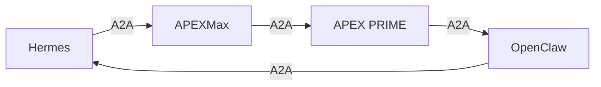

# AAA — Agent Architecture Cockpit
> **SEAL:** 333_MIND-DITEMPA-BUKAN-DIBERI-20260523
> **Repository:** https://github.com/ariffazil/AAA
> **Purpose:** Agent control plane for arifOS Federation

> ⚠️ **CANONICAL AUTHORITY NOTICE:**
> AAA is the **control plane / cockpit**, not a constitutional authority.
> The sovereign constitution and F1-F13 floors live in `ariffazil/arifOS`.
> For live federation status, see `ariffazil/arifOS/FEDERATION_STATUS.md`.

---

## What is AAA?

AAA is the **agent architecture cockpit** — the control plane that governs
how AI agents interact within the arifOS Federation. Where arifOS is the
constitutional kernel (kernel-level governance) and A-FORGE is the vision
shell (domain-level execution), AAA is the agent-level orchestration layer.

AAA is not a framework or a library. It is an **architecture pattern** with
a specific protocol stack (A2A), a federation model (AAA²), and a judgment
system (APEXMax in AAA Telegram group).

```
┌─────────────────────────────────────────────────────────────┐
│  AAA — Agent Cockpit                                        │
│                                                             │
│  KERNELPLAN.md (+ AAA² appendix)  — Agent kernel protocol   │
│  federated_a2a_protocol.md         — Agent-to-agent comms    │
│  agent-cards/                       — Per-agent cards (4 agents) │
│  a2a/registry/agent-cards.json    — Consolidated registry   │
│  AAA_000_FOUNDATION.md             — Foundation document    │
│  TRINITY_AUDIT.md                  — Trinity audit          │
└─────────────────────────────────────────────────────────────┘
```

---

## Directory Structure

```
AAA/
│
├── docs/
│   ├── architecture/
│   │   ├── KERNELPLAN.md              # Kernel plan + AAA² F2 appendix
│   │   │   └── Appendix: AAA² Agent-Agnostic Architecture
│   │   │       ├── Universal Agent Adapter (UAA)
│   │   │       ├── Protocol Stack Map (PSP)
│   │       │       ├── 000_P0_Native (direct capability)
│   │   │       ├── 111_P1_A2A (agent-to-agent)
│   │   │       ├── 222_P2_RAG (retrieval-augmented)
│   │   │       ├── 333_P3_MCP (tool exposure)
│   │   │       ├── 444_P4_AAA² (agnostic federation)
│   │   │       └── 555_P5_ΔΩΨ (Trinity coordination)
│   │   │       ├── Federation Mesh (FMesh) — event bus
│   │   │       ├── Cross-Agent Memory (CAM) — shared memory
│   │   │       ├── Skill Ontology Registry
│   │   │       └── gWasm compiler — consequence surface
│   │   ├── AAA_FEDERATION_A2A.md       # A2A federation protocols
│   │   ├── TRINITY_AUDIT.md            # Trinity audit
│   │   ├── AAA_000_FOUNDATION.md        # Foundation doc
│   │   └── [AAA2_Kernel_UAA_PSP.md]    # CONSUMED into KERNELPLAN
│   │
│   ├── federation/
│   │   └── 12W_FEDERATION_MODEL.md    # 12-week implementation
│   │
│   └── _AAA_ANCHOR/
│       └── SOT.md                      # AAA source of truth
│
├── a2a/
│   ├── agent-cards/                    # Per-agent capability cards
│   │   ├── hermes.json                 # Hermes Agent card
│   │   ├── apexmax.json                # APEXMax (AAA group) card
│   │   ├── openclaw.json               # OpenClaw Agent card
│   │   └── apex_prime.json             # APEX PRIME backend card
│   │
│   ├── registry/
│   │   └── agent-cards.json            # Consolidated registry (NEW)
│   │
│   ├── federated_a2a_protocol.md       # Protocol spec
│   └── federated_a2a_spec.yaml         # YAML spec
│
├── agent/                              # Agent workspace
│   └── [agent workspace files]
│
└── _00_META/
    ├── AAA.md                          # AAA meta
    └── ARCHITECTURE.md                  # Architecture doc
```

---

## Agent Registry

Four canonical agents in the AAA federation:

```
┌──────────────────────────────────────────────────────────────┐
│  HERMES AGENT         │ Port :????  │ Ω ASI — Execution     │
│  openclaw             │ Port 18789  │ Δ AGI — Reasoning      │
│  APEXMax💃            │ Telegram    │ Ψ APEX — Judgment     │
│  APEX PRIME           │ Port 3002   │ Ψ APEX — Backend      │
└──────────────────────────────────────────────────────────────┘
```

| Agent | ID | Role | Protocol |
|-------|-----|------|---------|
| Hermes Agent | hermes | Execution layer (Ω ASI) | MCP / A2A |
| OpenClaw | openclaw | Reasoning engine (Δ AGI) | Native / A2A |
| APEXMax💃 | apexmax | Judgment face (Ψ APEX) | Telegram / A2A |
| APEX PRIME | apex_prime | Backend judgment (Ψ APEX) | Express / A2A |

Full agent cards: `a2a/agent-cards/` directory
Consolidated registry: `a2a/registry/agent-cards.json`

---

## Protocol Stack (PSP)

AAA² defines a 5-layer protocol stack for agent-to-agent communication:

```
┌─────────────────────────────────────────────────────────┐
│  555_P5_ΔΩΨ  — Trinity Coordination                    │
│  Signal: Nine-Signal ontological broadcast              │
├─────────────────────────────────────────────────────────┤
│  444_P4_AAA²  — AAA² Agnostic Federation                │
│  Skill ontology, gWasm consequence surface             │
├─────────────────────────────────────────────────────────┤
│  333_P3_MCP  — Tool Exposure (arifOS MCP Shell)        │
│  13-tool canonical surface exposed via MCP             │
├─────────────────────────────────────────────────────────┤
│  222_P2_RAG  — Retrieval-Augmented Generation           │
│  Cross-Agent Memory (CAM) + Federation Mesh (FMesh)    │
├─────────────────────────────────────────────────────────┤
│  111_P1_A2A  — Agent-to-Agent                           │
│  A2A protocol with skill advertisement                 │
├─────────────────────────────────────────────────────────┤
│  000_P0_Native — Direct Capability                     │
│  Agent's native tools without protocol translation     │
└─────────────────────────────────────────────────────────┘
```

---

## AAA² Architecture (F2 Kimi Audit)

AAA² is the agent-agnostic federation architecture, audited by Kimi (F2
ground truth input). Key components:

### Universal Agent Adapter (UAA)

The UAA translates any external agent into the arifOS canonical pipeline:

```
External Agent → UAA → arifOS 13-Tool Canonical Surface → APEXMax Verdict
```

### Cross-Agent Memory (CAM)

Shared memory layer for agent-to-agent state:

- **9 Signal Frequencies:** Broadcast along ontological signal bands
- **Shared Recall:** All agents see the same memory (no local copies)
- **Memory Compaction:** Session summaries without evidence loss

### Federation Mesh (FMesh)

Event bus for inter-agent communication:

- **Skill Advertisement:** Agents broadcast capabilities
- **Task Routing:** Load balancing across agents
- **Consequence Surface:** All events logged to W_scar

### Skill Ontology Registry

Canonical skill taxonomy for agent capabilities:

```
├── DOMAIN_SKILL       (geoscience, finance, etc.)
├── GOVERNANCE_SKILL   (judgment, veto, audit)
├── EXECUTION_SKILL   (tool calls, shell, API)
└── COORDINATION_SKILL (A2A, routing, broadcast)
```

### gWasm Compiler

Governance WebAssembly compiler for agent-agnostic consequence enforcement:

```wasm
;; gWasm constraint example
(governance
  (action "irreversible_delete")
  (requires "888_JUDGE")
  (max_w_scar 1.0)
)
```

---

## A2A Protocol

The federated A2A protocol defines how agents communicate:



### A2A Message Types

| Type | Purpose | Gate |
|------|---------|------|
| `task_request` | Request task execution | F2 verification |
| `verdict_request` | Request APEXMax judgment | 888_JUDGE if atomic |
| `skill_advert` | Broadcast agent capabilities | AUTO |
| `memory_share` | Share CAM state | F9_VAL gate |
| `w_scar_report` | Report consequence surface | AUTO |

### A2A Registry

The consolidated agent registry at `a2a/registry/agent-cards.json`
contains all agent capability cards in a single machine-readable file.

---

## Current State vs Target State

### CURRENT_STATE (as of 2026-05-23)

| Item | Status | Notes |
|------|--------|-------|
| KERNELPLAN.md + AAA² | REFORGED | Kimi F2 audit merged as appendix |
| agent-cards/ (4 agents) | ACTIVE | hermes, apexmax, openclaw, apex_prime |
| agent-cards.json | CREATED | Consolidated registry |
| a2a/federated_a2a_protocol.md | ACTIVE | Protocol spec |
| 12W_FEDERATION_MODEL.md | ACTIVE | 12-week roadmap |

### TARGET_STATE (planned)

| Item | Status | Notes |
|------|--------|-------|
| FMesh event bus | PENDING | Inter-agent communication |
| CAM implementation | PENDING | Cross-agent memory |
| gWasm compiler | PENDING | Consequence surface enforcement |
| UAA for external agents | PENDING | Agent-agnostic adapters |
| APEXMax → APEX PRIME A2A | PENDING | Full federation routing |

---

## APEXMax in AAA Telegram Group

APEXMax is the Telegram face of the arifOS Federation judgment system.
It operates in the AAA group as the Ψ APEX agent, issuing verdicts
through Hermes when @mentioned.

**Invocation pattern:** @APEXMax in AAA Telegram group
**Backend:** APEX PRIME (port 3002)
**Execution layer:** Hermes Agent

```
@APEXMax in AAA group → Hermes routes → APEX PRIME /judge → Verdict → AAA group
```

See: `AAA/docs/architecture/KERNELPLAN.md` for full APEXMax protocol.

---

## Cross-Reference

| Document | Purpose |
|----------|---------|
| `docs/architecture/KERNELPLAN.md` | Agent kernel plan + AAA² appendix |
| `a2a/registry/agent-cards.json` | Consolidated agent registry |
| `a2a/federated_a2a_protocol.md` | A2A protocol spec |
| `docs/federation/12W_FEDERATION_MODEL.md` | 12-week implementation plan |

For constitutional kernel, see: **arifOS/**
For vision shell, see: **A-FORGE/**

---

## Governance

AAA operates under the same F14 Autonomy Clause as arifOS. Once a task
loop begins with clear intent, it runs autonomously until manually halted.

**DITEMPA BUKAN DIBERI** — AAA is the cockpit that flies the federation.

---

**AAA² is the Forge for L5 ASI.**


---

## ??? Federated Architecture

This repository is a core organ of the **arifOS Federation**:
*   **Operator Cockpit (AAA):** [C:\ariffazil\AAA](file:///C:/Users/User/../ariffazil/AAA)
*   **Constitutional Kernel (arifOS):** [C:\ariffazil\arifOS](file:///C:/Users/User/../ariffazil/arifOS)
*   **Vision Shell (A-FORGE):** [C:\ariffazil\A-FORGE](file:///C:/Users/User/../ariffazil/A-FORGE)
*   **Geological Engine (GEOX):** [C:\ariffazil\geox](file:///C:/Users/User/../ariffazil/geox)
*   **Capital Engine (WEALTH):** [C:\ariffazil\wealth](file:///C:/Users/User/../ariffazil/wealth)
*   **Biological Substrate (WELL):** [C:\ariffazil\well](file:///C:/Users/User/../ariffazil/well)
*   **Informational Surfaces (arif-sites):** [C:\ariffazil\arif-sites](file:///C:/Users/User/../ariffazil/arif-sites)

*Unified under the arifOS Sovereign Constitution (F1�F13).*
