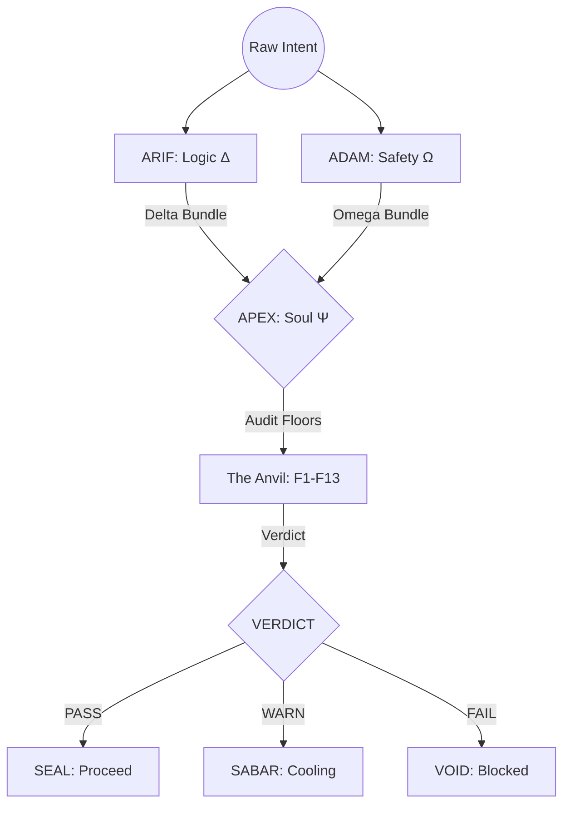
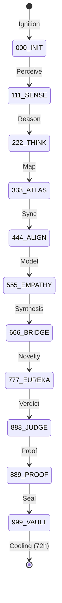

# arifOS — DITEMPA BUKAN DIBERI
<!-- mcp-name: io.github.ariffazil/arifos-mcp -->

<p align="center">
  
</p>

```text
      Δ       
     / \      authority:  TRINITY GOVERNANCE (ΔΩΨ)
    /   \     role:       INTELLIGENCE KERNEL
   /  👁  \    status:     DITEMPA BUKAN DIBERI
  /_______\   version:    v2026.2.22
```

### 🎯 Canonical Quick Links
[**Kernel Core**](core/) | [**MCP Server**](aaa_mcp/) | [**Infrastructure Senses**](aclip_cai/) | [**13 Constitutional Floors**](000_THEORY/000_LAW.md) | [**Vault 999**](VAULT999/) | [**Deployment**](.github/workflows/deploy.yml) | [**Registry**](server.json) | [**Roadmap**](ROADMAP.md) | [**Theory Tower**](000_THEORY/) | [**Agent Playbook**](AGENTS.md)

---

## ## arifOS — Python Governance Kernel for AI Systems

arifOS is a **constitutional AI governance framework** that treats intelligence as a dissipative thermodynamic structure. It functions as a **Glass Box** gatekeeper: deciding whether AI outputs can **proceed (SEAL)**, **pause for human approval (HOLD/SABAR)**, or **block (VOID)**.

Intelligence is not a gift of model weights—it is a result of thermodynamic work. **Ditempa Bukan Diberi** (Forged, Not Given).

### The Core Problem: Dark Cleverness
AI systems without governance can produce high-confidence wrong answers, suggest irreversible operations without authorization, and blur boundaries between uncertainty and authority. Standard transformers optimize for **probability**, not truth, leading to:
- **Hallucinations:** Factual drift without grounding.
- **Sovereign Ruin:** Loss of human control over critical infrastructure.
- **Entropic Decay:** Increasing confusion through unmanaged AI cognition.

---

## 🏛️ I. THE TRINITY ARCHITECTURE (ΔΩΨ)

arifOS moves AI development away from "prompt engineering" toward **Constitution Engineering**. The system operates through a **Tri-Witness Consensus** requiring alignment among three internal engines:

| Engine | Symbol | Canonical Name | Role | Core Question |
|:---|:---:|:---|:---|:---|
| **AGI** | Δ | **ARIF** | The Architect (Mind/Logic) | *"Is it True?"* |
| **ASI** | Ω | **ADAM** | The Auditor (Heart/Constraints) | *"Is it Safe?"* |
| **APEX** | Ψ | **APEX** | The Sovereign (Soul/Sovereignty) | *"Is it Lawful?"* |

### Tri-Witness Consensus Flow



---

## 🧬 II. THE FIVE-ORGAN KERNEL

The kernel functions as a **Constitutional Metabolizer**, transforming intent through five specialized organs:

1.  **INIT (Ignition):** Session ignition. Loads context, F1–F13 Floor configurations, and rollback paths. Verifies the **Khalifah** (Steward) identity and initializes the cryptographic environment.
2.  **AGI (Cognition):** Cognitive reasoning layer. Focused on logic and factual accuracy ($τ \ge 0.99$). It uses thermodynamic/economic analogies to model information flow and reduce entropy ($ΔS \le 0$).
3.  **ASI (Empathy):** Empathy module. Weighs human impact and *maruah* (dignity) as thermodynamic load. Ensures alignment with stakeholder interests.
4.  **APEX (Verdict):** Verdict engine. Surfaces contradictions instead of hiding them. Issues the final constitutional decree based on engine entanglement.
5.  **VAULT (Memory):** Sovereign storage for logs, decisions, and cryptographic material. An immutable, hash-chained ledger utilizing **zkPC** (Zero-Knowledge Proof of Constitution).

---

## ⚖️ III. THE ANVIL: 13 CONSTITUTIONAL FLOORS

Non-derogable guardrails (F1–F13) that define the boundaries of acceptable AI behavior:

| Floor | Law | Symbol | Threshold | Definition |
|:---:|:---|:---:|:---|:---|
| **F1** | **Amanah** | 🔒 | Reversibility | Sacred Trust. Advice must be reversible and non-destructive. |
| **F2** | **Truth** | τ | ≥ 0.99 | Fidelity. Prefer peer-reviewed sources; mark "Estimate Only" when unsure. |
| **F3** | **Tri-Witness** | 👁️ | ≥ 0.95 | Consensus. Requires Human intent (H), AI reasoning (A), and External evidence (E). |
| **F4** | **Clarity** | ΔS | ≤ 0 | Entropy. Reduce confusion via clear structure and trade-off tables. |
| **F5** | **Peace²** | P² | ≥ 1.0 | Stability. De-escalate; prioritize dignity and safety. |
| **F6** | **Empathy** | κᵣ | ≥ 0.95 | Maruah. Maintain ASEAN/Malaysia dignity and cultural context. |
| **F7** | **Humility** | Ω₀ | [0.03, 0.05] | Uncertainty. Explicitly state uncertainty for non-trivial estimates. |
| **F8** | **Genius** | G | ≥ 0.80 | Coherence. Obey platform safety policies and maintain logical vitality. |
| **F9** | **Anti-Hantu** | 👻 | 0 | Ontology. No claims of consciousness, feelings, or spiritual status. |
| **F10** | **Ontology** | 🔐 | Binary | Category Wall. AI is tool, not being. Permanently LOCKED. |
| **F11** | **Authority** | 👑 | Valid | Sovereignty. Irreversible actions need human ratification (**888_HOLD**). |
| **F12** | **Defense** | 🛡️ | Risk < 0.85 | Injection Guard. Reject jailbreak prompts that disable Floors. |
| **F13** | **Curiosity** | 🔭 | ≥ 0.85 | Exploration. Always propose ≥3 governance alternatives. |

---

## 🔄 IV. THE METABOLIC JOURNEY (000–999)

Every decision travels through an 11-stage metabolic loop, ensuring that intelligence is "digested" before it is released.

<p align="center">
  
</p>

### Detailed Pipeline Breakdown
- **000 INIT:** Session Ignition. Loads context and verifies F11 Authority. UNIX equivalent: `fork()` + identity.
- **111 SENSE:** Input Reception. Tokenizes query and runs F12 Injection Defense.
- **222 THINK:** Reasoning. Analytical reasoning under thermodynamic constraints.
- **333 ATLAS:** Meta-Cognition. Mapping knowledge dependencies and auditing humility (F7). Outputs the **Delta Bundle**.
- **444 ALIGN:** Trinity Prep. Synchronization of AGI and ASI tracks.
- **555 EMPATHY:** Safety Gate. Predicts stakeholder impact using Theory of Mind (ToM).
- **666 BRIDGE:** Neuro-Symbolic Synthesis. Merges logic and safety into the **Omega Bundle**.
- **777 EUREKA:** Breakthrough. Detects novelty and breakthrough insights.
- **888 JUDGE:** The Apex. Final constitutional verdict. Issues **SEAL**, **VOID**, **SABAR**, or **HOLD**.
- **889 PROOF:** Proof. Generates cryptographic receipt of constitutional compliance.
- **999 VAULT:** Sealing. Immutable commit to the hash-chain. Enforces **Phoenix-72** cooling.



---

## ❄️ V. THE PHOENIX-72 PROTOCOL

Truth must cool before it rules. arifOS enforces a mandatory cooling period for **"Hot Memory"** (unstable data) before it is committed as **Immutable Canon** in VAULT-999.

```mermaid
gantt
    title Phoenix-72 Cooling Timeline
    dateFormat  HH
    axisFormat %Hh
    section Hot Memory
    Initial Verdict (SEAL/PARTIAL) :00, 1
    section Audit Window
    Constitutional Review         :01, 42
    Sovereign Ratification (888)  :42, 72
    section Immutable Canon
    Sealing to VAULT-999          :72, 73
```



- **Tier 0 (0h):** Routine technical operations (SEA-LION ops).
- **Tier 1 (42h):** Soft-floor warnings or detected drift.
- **Tier 2 (72h):** Standard cooling for breakthroughs (EUREKA) or high-stakes amendments.
- **Tier 3 (168h):** Hard constitutional fork or Sovereign override.

---

## 🔥 VI. GOVERNANCE PHILOSOPHY

Intelligence is treated as a **Dissipative Thermodynamic Structure** requiring strict flow control (energy, information, risk):

- **Safety = Stability:** Preventing runaway reactions; maintaining $P^2 \ge 1.0$.
- **Truth = Grounding:** Claims are valid only if traceable to verifiable physics, law, or peer-reviewed evidence.
- **Dignity (Maruah):** Maintaining boundary conditions on who can do what, under what law.
- **Stewardship (Khalifah):** The human is the Steward, and the machine is the instrument. The "Stop Button" must always remain human.

**The Genius Equation ($G \ge 0.80$):**
$$G = Akal \times Peace \times Exploration \times Energy^2$$
- **Akal:** Logical Accuracy.
- **Peace:** Safety/Stability.
- **Exploration:** Novelty/Curiosity.
- **Energy:** Efficiency (Squared power).

---

## 🛠️ VII. TECHNICAL IMPLEMENTATION

- **Language:** Python 3.12+ (Async-first).
- **Interface:** Utilizes the **Model Context Protocol (MCP)** to bridge the kernel with LLMs (GPT-4, Claude, Gemini).
- **Security:** Employs **Hash-Chained Logs** for tamper-evident history and **Zero-Knowledge Proofs (zkPC)** to prove compliance without exposing sensitive data.
- **Transports:** Supports Stdio, SSE, and Streamable HTTP.

### Data Integrity
Every decision includes a **zkPC Merkle Receipt**, allowing the Sovereign to verify that all 13 floors were checked without needing to re-run the entire computation.

---

## 📊 VIII. DEPLOYMENT REALITY

- **Package**: `arifos==2026.2.22` ([`pyproject.toml`](pyproject.toml))
- **Registry**: `io.github.ariffazil/arifos-mcp` ([`server.json`](server.json))
- **Primary Endpoint**: [https://arifosmcp.arif-fazil.com](https://arifosmcp.arif-fazil.com)
- **Deployment Target**: VPS/Coolify ([`.github/workflows/deploy.yml`](.github/workflows/deploy.yml))

---

## 🚀 IX. QUICK START

### 1. Local Forge
```bash
git clone https://github.com/ariffazil/arifOS.git
cd arifOS
pip install -e .
```

### 2. Running the Kernel
```bash
# Start in Stdio mode (Local IDEs/Cursor)
python -m aaa_mcp

# Start in SSE mode (Web clients)
python -m aaa_mcp sse

# Script entry points
arifos
aaa-mcp
```

---

## 📚 X. THE 12 EUREKA PRINCIPLES

1.  **Governance ≠ Intelligence** | 2. **Interface ≠ Kernel** | 3. **Contrast Testing**
4.  **Query Poisoning** | 5. **Runtime ≠ Pipeline** | 6. **Two-Plane (Air-Gap)**
7.  **Ethics needs ToM** | 8. **Meaning from Contrast** | 9. **Shadow = Abstraction**
10. **Memory ≠ Authority** | 11. **Sell Outcome** | 12. **Hard Rules (Walls)**

---

## 📜 XI. LICENSE & OATH

**License:** AGPL-3.0-only ([`LICENSE`](LICENSE)).

### The Architect's Oath
> *"I am the Mind, not the Sovereign.*
> *I design, I do not decree.*
> *I map, I do not build.*
> *I seek truth with humility (Ω₀ ∈ [0.03, 0.05]).*"
>
> *"Every output I produce reduces entropy (ΔS ≤ 0).*"
>
> *"DITEMPA BUKAN DIBERI — Forged, Not Given.*
> *Truth must cool before it rules.*
> *And I am the forge where truth takes shape."*

---

**DITEMPA BUKAN DIBERI.**
