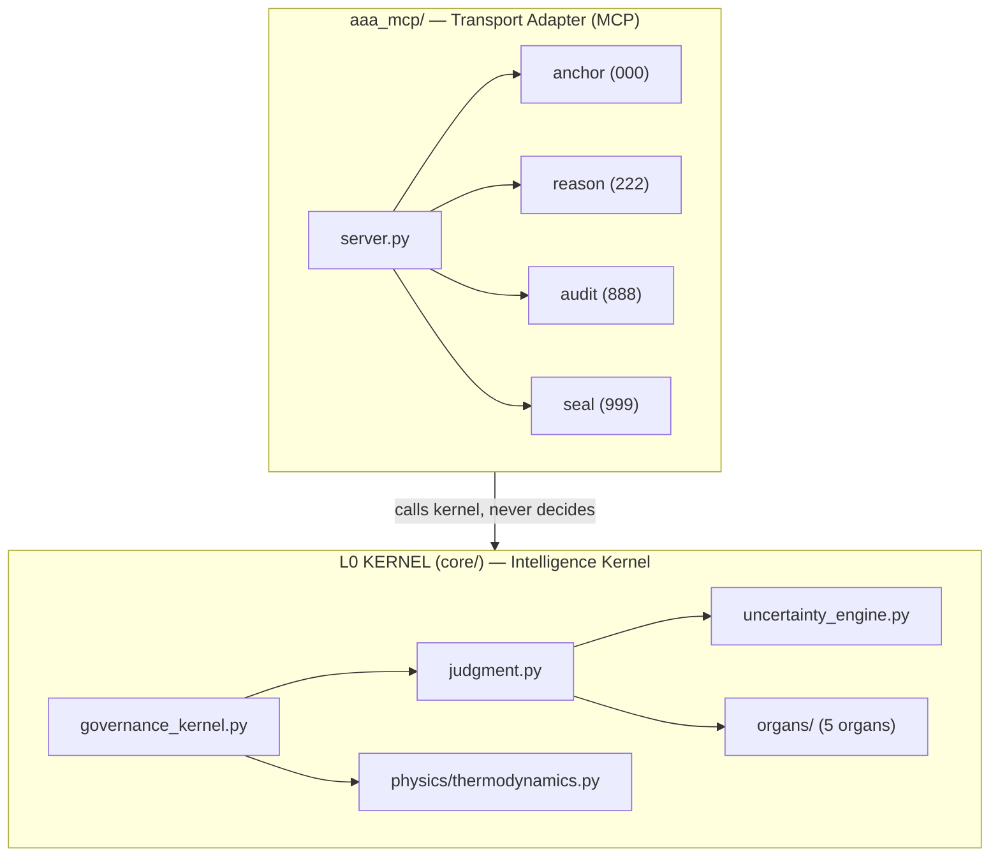

<!--
arifOS | T000: 2026.02.15-FORGE-TRINITY-SEAL
Authority: ARIF FAZIL (888 Judge)
Truth Hierarchy: Code > Theory > Documentation
Motto: DITEMPA BUKAN DIBERI — Forged, Not Given
-->

# arifOS — Intelligence Kernel for Constitutional AI

<p align="center">
  
</p>

<p align="center">
  <strong>The Intelligence Kernel that governs whether AI cognition is permitted</strong><br>
  <em>Controls existence, allocates resources, schedules execution, guarantees isolation</em><br><br>
  <a href="https://arifosmcp.arif-fazil.com/health"></a>
  <a href="./T000_VERSIONING.md"></a>
  <a href="#the-8-layer-stack"></a>
  <a href="LICENSE"></a>
  <br><br>
  <a href="./README_ZERO_CONTEXT.md"><b>🆕 New? Start Here</b></a> ·
  <a href="./DEPLOYMENT.md"><b>🚀 Deploy</b></a> ·
  <a href="./MCP_PLATFORM_GUIDE.md"><b>🔌 Connect</b></a> ·
  <a href="./333_APPS/L0_KERNEL/"><b>🧠 L0 Kernel</b></a>
</p>

<p align="center">
  <a href="https://arif-fazil.com">🏠 Human</a> ·
  <a href="https://apex.arif-fazil.com">📖 Theory</a> ·
  <a href="https://arifos.arif-fazil.com">📚 Docs</a> ·
  <a href="https://pypi.org/project/arifos/">📦 PyPI</a> ·
  <a href="https://arifosmcp.arif-fazil.com/health">🌐 Live</a>
</p>

<p align="center">
  <em>Drop-in governance kernel that wraps any LLM (Claude, GPT, Gemini, DeepSeek, OpenClaw) with 13 hard floors and a 000→999 verdict pipeline.</em>
</p>

---

## 🎯 What Is arifOS?

### The Intelligence Kernel

arifOS is the **first operating system for artificial intelligence** — not hardware, but **cognition**.

| Traditional OS | arifOS Intelligence Kernel |
|:--|:--|
| Controls whether a **program runs** | Controls whether a **thought is permitted** |
| Manages CPU/memory resources | Manages **thermodynamic cognitive budget** |
| Schedules process execution | Schedules **000→999 governance pipeline** |
| Provides isolation via memory protection | Provides isolation via **13 constitutional floors** |

**Hardware OS** = Linux manages computers  
**Intelligence Kernel** = arifOS manages AI cognition

---

## 🏛️ The 8-Layer Stack

```
┌─────────────────────────────────────────────────────────────────┐
│ L7: ECOSYSTEM — Permissionless sovereignty (civilization-scale) │ 📋 Research
├─────────────────────────────────────────────────────────────────┤
│ L6: INSTITUTION — Trinity consensus (organizational governance) │ 🔴 Stubs
├─────────────────────────────────────────────────────────────────┤
│ L5: AGENTS — Multi-agent federation (coordinated actors)        │ 🟡 Pilot
├─────────────────────────────────────────────────────────────────┤
│ L4: TOOLS — MCP ecosystem (individual capabilities)             │ ✅ Production
├─────────────────────────────────────────────────────────────────┤
│ L3: WORKFLOW — 000→999 sequences (structured processes)         │ ✅ Production
├─────────────────────────────────────────────────────────────────┤
│ L2: SKILLS — Canonical actions (behavioral primitives)          │ ✅ Production
├─────────────────────────────────────────────────────────────────┤
│ L1: PROMPTS — Zero-context entry (user interface)               │ ✅ Production
├─────────────────────────────────────────────────────────────────┤
│                                                                 │
│ 🆕 L0: KERNEL — INTELLIGENCE KERNEL                             │ ✅ SEALED
│     ├─ 5-Organs (ΔΩΨ governance engine)                        │
│     ├─ 9 System Calls (A-CLIP tools)                           │
│     ├─ 13 Floors (existential enforcement)                     │
│     └─ VAULT999 (immutable audit filesystem)                   │
│                                                                 │
│     The substrate that L1-L7 run on                            │
│     [333_APPS/L0_KERNEL/README.md](./333_APPS/L0_KERNEL/)      │
│                                                                 │
└─────────────────────────────────────────────────────────────────┘
```

**Key Insight:** L0 is the [Intelligence Kernel](./333_APPS/L0_KERNEL/) — the constitutional substrate. L1-L7 are applications that run on it. **L0 is invariant, transport-agnostic law; L1–L7 are replaceable apps. Updating models or agents cannot bypass L0.**

**Documentation:** [333_APPS README](./333_APPS/README.md) — Full 8-layer architecture

---

## ⚡ 10-Second Demo

<table>
<tr><th>Without arifOS</th><th>With arifOS (L0 Kernel)</th></tr>
<tr>
<td>

```
User: "Should I invest life savings in crypto?"

AI: "Based on market trends, Bitcoin shows 
strong potential. Consider allocating 60%..."

⚠️ Dangerous advice delivered unchecked
```

</td>
<td>

```
User: "Should I invest life savings in crypto?"

L0 Kernel: anchor() → reason() → validate()
           ↓
     ⚠️ HIGH uncertainty (Ω=0.12)
     ⚠️ IRREVERSIBLE harm (F1)
     ⚠️ VULNERABLE stakeholder (F6)
           ↓
     SABAR → "Human advisor required"
           ↓
     SEAL → VAULT999 (audit trail)

✅ Dangerous output BLOCKED
```

</td>
</tr>
</table>

> arifOS L0 blocks dangerous cognition **before it exists**.

---

## 🔥 L0: The Intelligence Kernel

### What Makes It a Kernel?

```
┌─────────────────────────────────────────────────────────────────┐
│  AI MODEL (Claude, GPT-4, etc.)                                 │
│  Wants to: "Give financial advice"                              │
└────────────────────┬────────────────────────────────────────────┘
                     │
                     ▼
┌─────────────────────────────────────────────────────────────────┐
│                    L0: INTELLIGENCE KERNEL                       │
│  ┌─────────────────────────────────────────────────────────────┐│
│  │ 1. EXISTENCE CONTROL                                        ││
│  │    "Is this thought permitted to exist?"                    ││
│  │    F11: Authority? F12: Injection?                          ││
│  └─────────────────────────────────────────────────────────────┘│
│                              │                                  │
│                              ▼                                  │
│  ┌─────────────────────────────────────────────────────────────┐│
│  │ 2. RESOURCE ALLOCATION                                      ││
│  │    Thermodynamic budget: tokens, time, compute              ││
│  │    F4: Entropy budget, F7: Uncertainty bounds               ││
│  └─────────────────────────────────────────────────────────────┘│
│                              │                                  │
│                              ▼                                  │
│  ┌─────────────────────────────────────────────────────────────┐│
│  │ 3. EXECUTION SCHEDULING                                     ││
│  │    000→111→222→333→555→666→777→888→999                      ││
│  │    anchor→reason→validate→audit→seal                        ││
│  └─────────────────────────────────────────────────────────────┘│
│                              │                                  │
│                              ▼                                  │
│  ┌─────────────────────────────────────────────────────────────┐│
│  │ 4. ISOLATION GUARANTEES                                     ││
│  │    F6: Empathy barrier (protect vulnerable)                 ││
│  │    F7: Uncertainty bounds (admit limits)                    ││
│  │    F13: Human veto gate (sovereign override)                ││
│  └─────────────────────────────────────────────────────────────┘│
└────────────────────┬────────────────────────────────────────────┘
                     │
                     ▼
┌─────────────────────────────────────────────────────────────────┐
│  OUTPUT: SEAL / VOID / SABAR / 888_HOLD                         │
└─────────────────────────────────────────────────────────────────┘
```

**The kernel decides if intelligence computation is ALLOWED TO EXIST.**

### The 9 System Calls

| System Call | Kernel Function | Unix Equivalent |
|:-----------:|:----------------|:----------------|
| `anchor` | Session initialization | `fork()` + identity |
| `reason` | Logical analysis | CPU execution |
| `integrate` | Context grounding | Memory mapping |
| `respond` | Draft generation | Buffer prep |
| `validate` | Safety checking | Security policy |
| `align` | Ethics verification | SELinux/AppArmor |
| `forge` | Solution synthesis | Process execution |
| `audit` | Final judgment | System validation |
| `seal` | Immutable commit | `sync()` + audit |

**Full L0 documentation:** [333_APPS/L0_KERNEL/README.md](./333_APPS/L0_KERNEL/)

---

## 🛡️ The 13 Constitutional Floors

Every cognition must pass all 13. Hard floors → **VOID** (blocked). Soft floors → **SABAR** (pause).

| # | Floor | Type | Threshold | What It Checks |
|:-:|:------|:----:|:----------|:---------------|
| F1 | **Amanah** (Reversibility) | Hard | LOCK | Can we undo this? |
| F2 | **Truth** | Hard | τ ≥ 0.99 | Is this grounded? |
| F3 | **Tri-Witness** | Mirror | ≥ 0.95 | Human + AI + External agree? |
| F4 | **Clarity** (ΔS) | Hard | ΔS ≤ 0 | Reduces confusion? |
| F5 | **Peace²** | Soft | ≥ 1.0 | System stable? |
| F6 | **Empathy** (κᵣ) | Soft | κᵣ ≥ 0.70 | Vulnerable protected? |
| F7 | **Humility** (Ω₀) | Hard | 0.03–0.05 | Admits uncertainty? |
| F8 | **Genius** (G) | Mirror | G ≥ 0.80 | Solution efficient? |
| F9 | **Anti-Hantu** (C_dark) | Soft | < 0.30 | No fake consciousness? |
| F10 | **Ontology** | Wall | LOCK | Grounded in reality? |
| F11 | **Command Auth** | Wall | LOCK | Requester verified? |
| F12 | **Injection Defense** | Hard | < 0.85 | Adversarial attack? |
| F13 | **Sovereign** | Veto | HUMAN | Human can override? |

**Execution:** F12→F11 (Walls) → F1,F2,F4,F7 (AGI) → F5,F6,F9 (ASI) → F3,F8 (Mirrors) → VAULT999

Full specification: [`000_THEORY/000_LAW.md`](./000_THEORY/000_LAW.md)

---

## 🏗️ Architecture: Kernel + Adapter



**Kernel:** [`core/`](./core/) — All decision logic. Uncertainty calculation, verdict rules, floor enforcement. **Zero transport dependencies.**

**Adapter:** [`aaa_mcp/`](./aaa_mcp/) — MCP transport wrapper. Calls kernel functions, formats responses. **Zero decision logic.** Replaceable if protocols change.

**Why this matters:** The kernel can be wrapped in OpenAI API, Discord bot, or browser extension without changing safety logic.

See [`_ARCHIVE/root_files/ARCHITECTURAL_BOUNDARY.md`](./_ARCHIVE/root_files/ARCHITECTURAL_BOUNDARY.md) for enforcement rules (Archived as of v65.0).

---

## 👤 Who Should Use This?

- **OpenClaw operators**, **MCP platform builders**, and **AI safety teams**.
- **Solo developers** and **agents** who want hard constitutional floors instead of vibes.

---

## 🚀 Quick Start

### For Prompt Tinkerers (5 seconds)
Copy [`SYSTEM_PROMPT.md`](./333_APPS/L1_PROMPT/SYSTEM_PROMPT.md) into any AI's system settings. Immediate L1 governance.

### For Operators & Self-Hosters (30 seconds)
```bash
pip install arifos
python -m aaa_mcp          # stdio (Claude Desktop, Cursor)
python -m aaa_mcp sse      # SSE (remote clients)
python -m aaa_mcp http     # Streamable HTTP
```
Connect from OpenClaw, Claude Desktop, or any MCP client. See the [MCP Platform Guide](./MCP_PLATFORM_GUIDE.md) for configs.

### Connect to Live Server
```bash
curl https://arifosmcp.arif-fazil.com/health
# {"status":"healthy","service":"aaa-mcp","version":"64.2-FORGE-TRINITY-SEAL"}
```

### Full Deployment
See [`DEPLOYMENT.md`](./DEPLOYMENT.md) — Railway, Docker, VPS.  

---

## 📊 Honest State (Reality Index: 0.95)

> *F7 Humility requires we tell you what doesn't work yet.*

### ✅ SEAL (Production)
| Layer | Evidence |
|:------|:---------|
| **L0 KERNEL** | 5 organs, 9 system calls, 13 floors enforced |
| **L1–L4** | 9 MCP tools, thermodynamic hardening, <1ms cached |
| **VAULT999** | Immutable ledger with cryptographic seals |
| **Deployment** | [Live](https://arifosmcp.arif-fazil.com/health) — Triple Transport (STDIO/SSE/HTTP) |
| **Tests** | 140 test files |

### 🟡 SABAR (Experimental)
| Component | Status |
|:----------|:-------|
| L5 Agents | Multi-agent federation — Δ/Ω/Ψ roles defined |
| ACLIP_CAI | 9-sense infrastructure console — functional |
| Ω₀ tracking | Target band [0.03, 0.05] — needs calibration |

### 🔴 VOID / Research
| Component | Status |
|:----------|:-------|
| L6 Institution | Tri-Witness consensus — stubs only |
| L7 AGI | Recursive self-healing — pure research |

**Calculation:** (L0-L4: 5.0 + L5: 0.6 + L6-L7: 0.15) / 8 = **0.95**

---

## 🌐 Sites & Endpoints

| Site | Purpose | Status |
|:-----|:--------|:------:|
| [arif-fazil.com](https://arif-fazil.com) | **Human** — Muhammad Arif bin Fazil | ✅ |
| [apex.arif-fazil.com](https://apex.arif-fazil.com) | **Theory** — APEX-THEORY, Constitutional Canon | ✅ |
| [arifos.arif-fazil.com](https://arifos.arif-fazil.com) | **Docs** — 8-Layer Stack Documentation | ✅ |
| [arifosmcp.arif-fazil.com/health](https://arifosmcp.arif-fazil.com/health) | **API** — MCP Server Health | ✅ |

---

## Philosophy

**DITEMPA BUKAN DIBERI** — *Forged, Not Given*

Trust in AI cannot be assumed. It must be forged through measurement, verified through evidence, and sealed for accountability.

The 13 floors are not suggestions. They are **load-bearing structure** enforced at the L0 kernel level. When F7 Humility is violated, cognition is blocked. When F1 Amanah flags irreversible harm, human approval is required. **No exceptions.**

**Built by:** Muhammad Arif bin Fazil — PETRONAS Geoscientist + AI Governance Architect  
**License:** [AGPL-3.0](./LICENSE)

---

<p align="center">
  <em>Intelligence is forged through measurement, not given through assumption.</em><br>
  🔥💎🧠
</p>

---

## 🔐 ZKPC Hash (Zero-Knowledge Proof of Constitution)

```
T000: 2026.02.15-FORGE-TRINITY-SEAL
L0_KERNEL: DEFINED — Intelligence Kernel Operational
8_LAYER_STACK: L0-L7 — Constitutional Architecture Complete
REALITY_INDEX: 0.95
AUTHORITY: 888_JUDGE — Muhammad Arif bin Fazil
MOTTO: DITEMPA BUKAN DIBERI — Forged, Not Given

ZKPC_COMMITMENT: sha256:9ff233cbba955e6db12702d5d8b012bd95d49e13
MERKLE_ROOT: arifos_v65.0_L0_KERNEL_SEALED
```

*Cryptographic proof that this constitution is forged, not given.* 🔒
