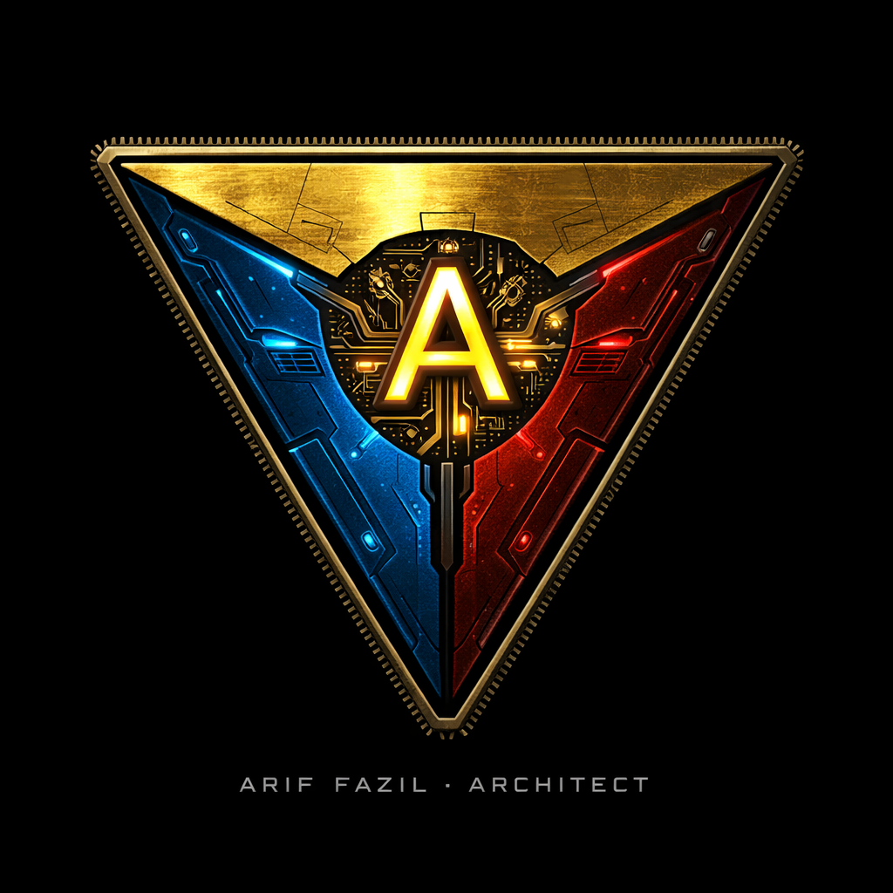

# 🌐 arifOS Ecosystem: THE SOUL
### **The Human Anchor, Professional Surface, and Personal Genesis.**

**[THE MIND (Theory)](https://github.com/ariffazil/arifOS)** &nbsp;·&nbsp; **[THE BODY (Execution)](https://github.com/ariffazil/arifosmcp)** &nbsp;·&nbsp; **[THE SOUL (Surface)](https://github.com/ariffazil/ariffazil)**

*Ditempa Bukan Diberi — Forged, Not Given [ΔΩΨ | ARIF]*

---

---

# 👤 SALAM, I AM ARIF FAZIL.

This repository is the digital home of my professional journey and the **Human Anchor (THE SOUL)** of the **arifOS** ecosystem. It is the surface where geoscientific discipline meets architectural intent. 

I am a **Senior Exploration Geoscientist** with 13+ years in the offshore hydrocarbon basins of Peninsular Malaysia. My life's work involves listening to the Earth—interpreting the subtle, often fragmented signals of the subsurface to make high-stakes decisions under profound uncertainty. This same discipline—the constant need for grounding, verification, and humility in the face of the unknown—is what birthed **arifOS**.

---

## 🏛️ The Human Anchor (Amanah)

My professional path is built on the principle of **Amanah** (Sacred Trust). Whether navigating the complex strata of the Sabah Basin or architecting the constitutional governance of autonomous AI agents, the goal remains identical: **Stability, Reversibility, and Physical Grounding.**

### Professional Path
*   **Senior/Lead Exploration Geoscientist** @ PETRONAS Carigali (13+ years).
*   Deeply rooted in **Basin Analysis & Prospect Maturation** (Sabah & Malay Basins).
*   Educated at the **University of Wisconsin-Madison** (Geology/Geophysics & Economics).
*   **Architect of arifOS**: Translating offshore safety standards into the execution kernels of tomorrow.

### Significant Discoveries
I find the most satisfaction in the quiet successes—the wells matured through rigorous collaboration and an uncompromising commitment to factual grounding.

| Well | Play Type | Notes |
|---|---|---|
| **BEKANTAN-1** | Structural | Hydrocarbon discovery in a basin widely considered mature. Proved remaining potential through fresh prospect evaluation. |
| **PUTERI BASEMENT-1** | Fractured Basement | Basement play matured through structural analysis. Demonstrated the viability of pre-Tertiary reservoirs in the Malay Basin. |
| **LEBAH EMAS-1** | New Play Concept | Wildcat well in Block PM6/12, offshore Terengganu. Discovery that opened a new geological play and challenged the perception of Peninsular Malaysia as an exhausted basin. |
| **BUNGA TASBIH-1** | Structural / Stratigraphic | Contributed to a Discovered Resource Opportunity cluster. Field subsequently awarded under a Small Field Asset PSC via Malaysia Bid Round Plus (MBR+) Round I, July 2024. |

---

## 🧭 The Trinity Matrix

The **arifOS Ecosystem** is decentralized across three hubs of metabolism. We call this the Trinity.

| Repository | Realm | Domain Focus | Purpose |
|:---:|:---:|:---|:---|
| **[ariffazil](https://github.com/ariffazil/ariffazil)** | **THE SOUL** | **Human Anchor** | The professional identity of Muhammad Arif bin Fazil (Geoscientist, Economist, Architect). |
| **[arifOS](https://github.com/ariffazil/arifOS)** | **THE MIND** | **Theory & Law** | Philosophical axioms, constitutional floors, and mathematical definitions of governance. |
| **[arifosmcp](https://github.com/ariffazil/arifosmcp)** | **THE BODY** | **Execution** | The production runtime, the MCP server, and the metabolic execution kernel. |

---

## 📝 Writing & Thought

Exploring the intersection of physics, philosophy, and the future of intelligence:

- [Prompt · Physics · Paradox](https://medium.com/@arifbfazil/prompt-physics-paradox-1f1581b95acb)
- [Einstein vs Oppenheimer](https://medium.com/@arifbfazil/einstein-vs-oppenheimer-ab8b642720eb)
- [The ARIF Test](https://medium.com/@arifbfazil/the-arif-test-df63c074d521)
- [Rukun AGI](https://medium.com/@arifbfazil/rukun-agi-the-five-pillars-of-artificial-general-intelligence-bba2fb97e4dc)

---

## ⚙️ Tech Stack & Surface Architecture

This portal is forged using a disciplined stack to ensure modularity, performance, and aesthetic clarity:

- **Foundation:** React 19 + TypeScript + Vite.
- **Styling:** Tailwind CSS for fluid, utility-first design.
- **Components:** Radix UI primitives and Shadcn/UI patterns.
- **Persistence:** Integration-ready with arifOS Vault systems.
- **Deployment:** Dockerized environment optimized for Railway and GitHub Actions.

---

## 📧 Reach Out

If you share an interest in geophysics, the philosophy of systems, or the ethical governance of the tools we create, I would be honored to connect.

- **Telegram:** [ariffazil](https://t.me/ariffazil)
- **LinkedIn:** [Muhammad Arif bin Fazil](https://linkedin.com/in/ariffazil)
- **Email:** arifbfazil@gmail.com

---

Copyright 2026 ARIF FAZIL.  
*Ditempa Bukan Diberi — Forged, Not Given [ΔΩΨ | ARIF]*
