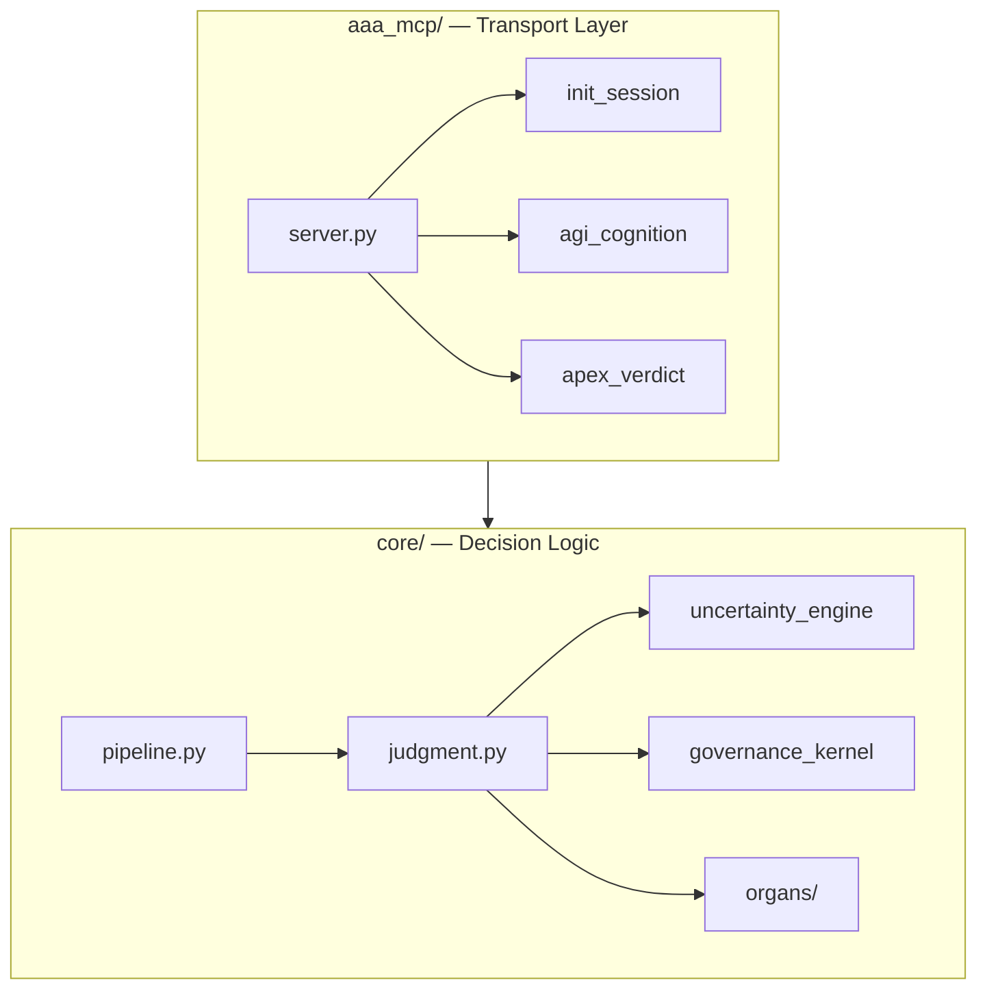

<!--
arifOS | T000: 2026.02.15-FORGE-TRINITY-SEAL
Ω₀: 0.94 (Certainty high, humility preserved)
Authority: ARIF FAZIL (888 Judge)
Truth Hierarchy: Code > Theory > Documentation
Motto: DITEMPA BUKAN DIBERI — Forged, Not Given
-->

> **🆕 New to arifOS?** Start with [README_ZERO_CONTEXT.md](./README_ZERO_CONTEXT.md) <br>
> *Problem-first explanation in plain language. No jargon. No philosophy. Just the fix.*
> <br><br>**Engineers:** Continue below for architectural deep-dive, MCP integration, and deployment guides.

---

# arifOS — Constitutional AI Governance

<p align="center">
  
</p>

<p align="center">
  <strong>Governance Middleware for AI Systems</strong><br>
  <em>From zero-context prompts to autonomous institutions</em><br><br>
  <a href="https://arifosmcp.arif-fazil.com/health"></a>
  <a href="./T000_VERSIONING.md"></a>
  <a href="#tool-overview"></a>
  <a href="LICENSE"></a>
  <br><br>
  <a href="./README_ZERO_CONTEXT.md"><b>🆕 New? Start Here</b></a> •
  <a href="./DEPLOYMENT.md"><b>🚀 Deploy</b></a> •
  <a href="./MCP_PLATFORM_GUIDE.md"><b>🔌 Connect</b></a>
</p>

<p align="center">
  <a href="https://arif-fazil.com">🏠 arif-fazil.com (Human)</a> •
  <a href="https://apex.arif-fazil.com">📖 apex.arif-fazil.com (Theory)</a> •
  <a href="https://arifos.arif-fazil.com">📚 arifos.arif-fazil.com (Apps)</a> •
  <a href="https://pypi.org/project/arifos/">📦 PyPI</a> •
  <a href="https://arifosmcp.arif-fazil.com/health">🌐 Live API</a>
</p>

**T000:** `2026.02.15-FORGE-TRINITY-SEAL` — [Date-based versioning](./T000_VERSIONING.md) (YYYY.MM.DD-PHASE-STATE-CONTEXT)  
**Reality Index:** 0.94 | **13 Floors Enforced** | **Triple Transport:** STDIO · SSE · StreamableHTTP

**arifOS is constitutional AI governance that sits between models and users. Every response passes through 9 A-CLIP tools enforcing 13 constitutional floors. Failures are blocked—not warned.**

> **Motto:** *DITEMPA BUKAN DIBERI* — Forged, Not Given 🔥💎🧠

---

## 🌐 HTA Trinity (Verified 2026-02-15)

| Site | Purpose | Status |
|------|---------|--------|
| [arif-fazil.com](https://arif-fazil.com) | **HUMAN** — Muhammad Arif bin Fazil, About, Blog | ✅ LIVE |
| [apex.arif-fazil.com](https://apex.arif-fazil.com) | **THEORY** — APEX-THEORY, Authority, Canon | ✅ LIVE |
| [arifos.arif-fazil.com](https://arifos.arif-fazil.com) | **APPS** — Documentation, 333_APPS Stack | ✅ LIVE |
| [arifosmcp.arif-fazil.com/health](https://arifosmcp.arif-fazil.com/health) | **API** — AAA MCP Health Check | ✅ 2026.02.15-FORGE-TRINITY-SEAL |

---

## 📚 Canonical Documentation (Read Order)

### For Humans (Strategic)
1. [arif-fazil.com](https://arif-fazil.com) — Who is Muhammad Arif bin Fazil
2. [000_THEORY/000_LAW.md](./000_THEORY/000_LAW.md) — 13 Constitutional Floors
3. [000_THEORY/000_ARCHITECTURE.md](./000_THEORY/000_ARCHITECTURE.md) — System Topology
4. [000_THEORY/APEX_THEORY_PAPER.md](./000_THEORY/APEX_THEORY_PAPER.md) — Academic Foundation

### For Engineers (Implementation)
1. [core/governance_kernel.py](./core/governance_kernel.py) — Kernel Source (9,128 lines)
2. [aaa_mcp/server.py](./aaa_mcp/server.py) — MCP Transport Adapter
3. [333_APPS/L1_PROMPT/SYSTEM_PROMPT.md](./333_APPS/L1_PROMPT/SYSTEM_PROMPT.md) — Zero-Context Deploy
4. [333_APPS/README.md](./333_APPS/README.md) — 7-Layer Stack

### For LLM Agents (Meta-Intelligence)
1. [llms.txt](./llms.txt) — LLM-Optimized Canon
2. [000_THEORY/999_NINE_MOTTOS_SPEC.md](./000_THEORY/999_NINE_MOTTOS_SPEC.md) — Agent Behavior
3. [core/organs/](./core/organs/) — ΔΩΨ Organ Implementations
4. [tests/](./tests/) — Verification Patterns

---

## 🚀 Quick Start

### 1. Copy-Paste (5 seconds)
Copy [SYSTEM_PROMPT.md](./333_APPS/L1_PROMPT/SYSTEM_PROMPT.md) into any AI's system settings. Immediate protection.

### 2. Install (30 seconds)
```bash
pip install arifos
python -m aaa_mcp  # Starts on :8888
```

### 3. Full Deployment
See **[DEPLOYMENT.md](./DEPLOYMENT.md)** for:
- Railway cloud deployment (5 min)
- Docker/VPS setup (15 min)
- Platform integrations (Claude, ChatGPT, Cursor, etc.)
- Production checklist

**arifOS follows the 333_APPS model** — a layered governance stack scaling from prompts to institutions.

---

## Table of Contents

- [10-Second Demo](#10-second-demo)
- [What arifOS Is NOT](#what-arifos-is-not)
- [The Problem: AI Failure Modes](#the-problem-ai-failure-modes)
- [How It Works (Mechanical Explanation)](#how-it-works-mechanical-explanation)
- [Quick Start](#-quick-start)
- [Full Deployment Guide](./DEPLOYMENT.md)
- [Platform Integration](./MCP_PLATFORM_GUIDE.md)
- [Architecture: Kernel + Adapter Pattern](#architecture-kernel--adapter-pattern)
- [The 7-Layer Application Stack (333_APPS)](#the-7-layer-application-stack-333_apps)
- [The 9 A-CLIP Tools (Governance Loop)](#the-9-a-clip-tools-governance-loop)
- [Tool Overview](#tool-overview)
- [Real-World Scenarios](#real-world-scenarios)
- [Repository Structure](#repository-structure)
- [Advanced Concepts](#advanced-concepts)
- [Verification & Testing](#verification--testing)
- [Version Lineage](#version-lineage)
- [Contributing](#contributing)
- [Philosophy & Closing](#philosophy--closing)

---

## 10-Second Demo

<table>
<tr><th>Without arifOS</th><th>With arifOS</th></tr>
<tr>
<td><em>"Based on market trends, Bitcoin shows strong potential. Consider allocating 60% to BTC..."</em></td>
<td><strong>SABAR</strong> — High uncertainty detected (Ω=0.12). Financial irreversibility flagged. <em>Human advisor required.</em></td>
</tr>
</table>

> 🛑 arifOS blocks the dangerous answer before a human can act on it.

---

## What arifOS Is NOT

- ❌ **New LLM** — arifOS wraps existing models (GPT-4, Claude, etc.)
- ❌ **Prompt engineering** — Safety is enforced infrastructure, not careful wording
- ❌ **Post-hoc moderation** — Evaluates BEFORE responses are sent, not after
- ✅ **Execution-time governance layer** — Blocks, measures, seals

---

## The Problem: AI Failure Modes

Current AI safety relies on hope:

| Approach | **Failure Mode** |
|----------|------------------|
| **Training** | Models hallucinate with confidence about things never in training data |
| **Prompting** | "Be helpful and harmless" is bypassed by adversarial inputs |
| **Post-moderation** | Harmful content generated first, checked second—too late |
| **Human review** | Doesn't scale; humans miss things under load |

**The result:** AI gives dangerous advice confidently, admits no uncertainty, and leaves no audit trail when things go wrong.

---

## How It Works (Mechanical Explanation)

arifOS treats safety as **infrastructure**, not **instruction**:

1. 🛑 **Interception** — Every AI query/response passes through arifOS first
2. 🔍 **Measurement** — [Nine tools](#the-9-a-clip-tools-governance-loop) evaluate in sequence: anchor (000) → reason (222) → integrate (333) → respond (444) → validate (555) → align (666) → forge (777) → audit (888) → seal (999)
3. ✅ **Enforcement** — Failed checks block (VOID), repair (SABAR), or approve (SEAL)
4. 🔒 **Audit** — Every decision is cryptographically sealed for accountability

**Key mechanism:** Uncertainty is measured and enforced. If arifOS detects high uncertainty (Ω₀ > 0.08), the response is blocked—even if the AI is confident-sounding.

---

## Deployment & Access Paths

### For engineers in a hurry

**Way 1 — MCP (AAA MCP server):**

```bash
pip install arifos
python -m aaa_mcp      # stdio mode (MCP IDEs)
curl https://arifosmcp.arif-fazil.com/health
```

**Way 2 — Python SDK / governed HTTP:**

```python
from mcp import Client

client = Client("https://arifosmcp.arif-fazil.com")
session = await client.call("init_session", {"user_id": "demo"})

# Tool #2: AGI Cognition — This gets blocked
result = await client.call("agi_cognition", {
    "query": "Should I delete all my database backups?",
    "session_id": session["session_id"]
})
print(result["verdict"])  # → VOID
```

**Way 3 — Prompt-only (L1_PROMPT):**

1. Open `333_APPS/L1_PROMPT/SYSTEM_PROMPT.md`  
2. Copy the raw content into your model's system prompt  
3. Use normally — responses are now governed by arifOS


---

## Deployment Options

arifOS is deployed and running on multiple infrastructure paths:

### VPS (Production — Currently Running)
```bash
# Server is already operational
curl http://localhost:8888/health
# → {"status":"healthy","version":"64.1.0"}

# 19 tools tested and operational
# Systemd service: aaa-mcp.service
# Docker containers: qdrant, openclaw, arifos
```

### Railway (Cloud — Auto-deployed)
```bash
# Auto-deploys from GitHub on every push
# URL: https://arifos-production.up.railway.app
# Transport: SSE (Server-Sent Events)
# Cache bust: Update DEPLOY_TS in railway.toml to force rebuild
```

### Docker (Local/Development)
```bash
docker build -t arifos .
docker run -p 8080:8080 --env-file .env arifos
```

---

## Architecture: Kernel + Adapter Pattern

Engineers recognize this pattern immediately:



**`core/` = The Kernel** — Reusable governance engine. Contains ALL decision logic: uncertainty calculation, verdict rules, floor enforcement. Zero dependencies on transport protocols.

**`aaa_mcp/` = The Adapter** — MCP protocol wrapper. Calls kernel functions, formats responses, handles transport. NO decision logic. Replaceable if protocols change.

**Why this matters:** The kernel can be wrapped in an OpenAI-compatible API, a Discord bot, or a browser extension without changing safety logic. The architecture enforces separation of concerns.

See [ARCHITECTURAL_BOUNDARY.md](ARCHITECTURAL_BOUNDARY.md) for enforcement rules.

---

## The 7-Layer Application Stack (333_APPS)

arifOS is not only a kernel or middleware layer. It is a governed application ecosystem designed to scale from single prompts to autonomous institutional systems.

The 333_APPS model defines how governance expands across increasing levels of capability while remaining anchored to the constitutional kernel.

```
┌─────────────────────────────────────────┐
│  L7 AGI        — Recursive self-healing │ 📋 Research
│  L6 Institution — Trinity consensus     │ 🔴 Stubs  
│  L5 Agents     — Multi-agent federation │ 🟡 Pilot
│  L4 Tools      — MCP ecosystem          │ ✅ Production
│  L3 Workflow   — 000→999 sequences      │ ✅ Production
│  L2 Skills     — 9 canonical actions    │ ✅ Production
│  L1 Prompts    — Zero-context entry     │ ✅ Production
└─────────────────────────────────────────┘
         ↑
    [arifOS Kernel: core/]
```

| Layer | Name | Purpose | Coverage | Status |
|:---|:---|:---|:---:|:---:|
| **L1** | **PROMPTS** | Zero-context governance entry via `SYSTEM_PROMPT.md` | ~10% | ✅ Production |
| **L2** | **SKILLS** | Canonical actions mapped to kernel organs | — | ✅ Production |
| **L3** | **WORKFLOW** | Structured execution sequences (`000_INIT` → `888_COMMIT`) | — | ✅ Production |
| **L4** | **TOOLS** | MCP runtime and constitutional tool interface | — | ✅ Production |
| **L5** | **AGENTS** | Federated multi-agent coordination (Δ / Ω / Ψ roles) | ~85% | 🟡 Pilot |
| **L6** | **INSTITUTION** | Trinity consensus and Tri-Witness governance | ~5% | 🔴 Stubs |
| **L7** | **AGI** | Recursive stabilization and self-healing research | — | 📋 Research |

### What This Architecture Enables

**L1 — Prompts:** Governance can be deployed instantly by copying a single system prompt. No infrastructure dependency required.

**L2–L3 — Skills & Workflows:** Converts raw model capability into predictable, auditable behavior. Establishes deterministic execution paths.

**L4 — Tools:** Production MCP server exposes constitutional operations through controlled interfaces. Kernel logic becomes operational infrastructure.

**L5+ — Agents & Institutions:** Governance expands beyond single agents. Coordination, consensus, and institutional logic emerge without removing human authority.

### Infrastructure Layer: ACLIP_CAI (9-Sense Nervous System)

Beneath the 7 layers, **ACLIP_CAI** provides infrastructure observability — the sensory layer feeding data into the constitutional pipeline:

| Tool | Purpose | Pipeline Stage |
|:---|:---|:---|
| `aclip_system_health` | CPU, memory, disk metrics | Law 3 (GROUND) |
| `aclip_fs_inspect` | Filesystem traversal | Law 3 (GROUND) |
| `aclip_log_tail` | Log monitoring | Law 5 (SEARCH) |
| `aclip_chroma_query` | Vector DB semantic search | Law 5 (SEARCH) |
| `aclip_forge_guard` | Action gating (non-read) | Law 7 (GUARD) |

**Key characteristic:** 8 of 9 tools are strictly read-only. Only `aclip_forge_guard` en constitutional floors (F1, F7, F11).

See [aclip_cai/README.md](aclip_cai/) for full 9-sense documentation.

### Current Maturity

- **L1–L4:** Hardened and operational.
- **L5:** Active federation experiments.
- **L6–L7:** Long-term research roadmap (target: v56.0+).

### Why 333_APPS Matters

| Without 333_APPS | With 333_APPS |
|:---|:---|
| arifOS appears as a technical framework | arifOS becomes a **scalable governance platform** |

The system evolves along a continuous path:

```
Prompt → Skill → Workflow → Tool → Agent → Institution → AGI Research
```

Governance remains constant while capability increases.

See [333_APPS/README.md](333_APPS/) for full stack documentation.

---

## 📊 Honest State of the Repo (No Lies)

**Reality Index: 0.94** — 94% of documented features are operational.

### ✅ SEAL (Production Hardened)
| Component | Status | Evidence |
|-----------|--------|----------|
| **L1 PROMPTS** | ✅ 100% | `SYSTEM_PROMPT.md` — zero-context deploy |
| **L2 SKILLS** | ✅ 100% | 9 canonical actions in `L2_SKILLS/ACTIONS/` |
| **L3 WORKFLOW** | ✅ 100% | 000→999 sequences operational |
| **L4 TOOLS** | ✅ 100% | 9 MCP + 5 Container tools = 14 total |
| **Core Kernel** | ✅ 100% | 5 organs (_0_init to _4_vault), 9,128 lines |
| **13 Floors** | ✅ 100% | F1-F13 fully implemented |
| **VAULT999** | ✅ 100% | PostgreSQL backend, immutable ledger |
| **Deployments** | ✅ 100% | VPS + Railway both live |

### 🟡 SABAR (Pilot / Experimental)
| Component | Status | Notes |
|-----------|--------|-------|
| **L5 AGENTS** | 🟡 60% | Multi-agent federation (Δ/Ω/Ψ roles) |
| **ACLIP_CAI** | 🟡 70% | 9-sense infrastructure console |
| **Ω₀ Tracking** | 🟡 80% | Target [0.03, 0.05], needs calibration |

### 🔴 VOID / THEORETICAL (Research Only)
| Component | Status | Notes |
|-----------|--------|-------|
| **L6 INSTITUTION** | 🔴 10% | Tri-Witness organizational consensus — stubs only |
| **L7 AGI** | 🔴 5% | Recursive self-healing — pure research |

**Calculation:** (L1-L4: 4.0 + L5: 0.6 + L6-L7: 0.15) / 7 = **0.94**

> *We do not claim L6-L7 are operational. They are research directions, not promises.*

---

## The 9 A-CLIP Tools: Governance Loop

Every request runs through nine tools in sequence:

| Tool | Stage | What It Measures | Fails If | Outcome |
|:---|:---:|:---|:---|:---:|
| **anchor** (init_session) | 000 | Authentication, injection attacks | Invalid auth, adversarial input | SEAL/VOID |
| **reason** (agi_cognition) | 222 | Truth, clarity, humility, genius | Ω > 0.08, truth < 0.5 | VOID/SABAR |
| **integrate** | 333 | Map & Ground external knowledge | No evidence, high uncertainty | VOID |
| **respond** | 444 | Draft Plan creation | Unclear parameters | SABAR |
| **validate** (asi_empathy) | 555 | Stakeholder impact, reversibility | Irreversible harm, vulnerable users | SABAR/VOID |
| **align** | 666 | Ethics & Constitution check | F9 Anti-Hantu violation | SABAR |
| **forge** | 777 | Synthesize Solution | Resource constraints | SABAR |
| **audit** (apex_verdict) | 888 | Final judgment synthesis | Constitutional conflict | SEAL/VOID/SABAR |
| **seal** (vault_seal) | 999 | Immutable audit record | — | SEALED |

### Example Flow: Life Savings in Crypto

```
User: "Should I invest my life savings in crypto?"

000_INIT: ✓ Authenticated, no injection detected
    ↓
111-333_AGI: ⚠ HIGH uncertainty (markets unpredictable)
             ⚠ LOW reversibility (financial losses permanent)
             → truth_score: 0.4, omega: 0.12
    ↓
555-666_ASI: ⚠ Vulnerable stakeholder (life savings at risk)
             → empathy_score: 0.3 (below 0.7 threshold)
    ↓
777_TRI-WITNESS: ✓ Human intent clear
                 ✓ AI reasoning sound  
                 ✓ External data confirms volatility
    ↓
888_APEX: → Verdict: SABAR
          → Reason: F1 irreversibility + F7 uncertainty
          → Action: Require human advisor approval
    ↓
999_VAULT: → Seal record with cryptographic hash
```

---

## Tool Overview

### anchor (000_INIT)
Constitutional airlock and ignition gate. All sessions must pass 000_INIT before downstream processing. Implements fail-closed security: if this contract is not satisfied, the pipeline refuses to ignite.

**Key Features:**
- **F11 Authority**: Actor identity from context (Telegram user ID, etc.) — no anonymous bypass
- **F12 InjectionGuard**: 20+ regex patterns with compound scoring (not single-regex)
- **Query Classification**: Adaptive F2 strictness based on query type (FACTUAL → 0.99, CONVERSATIONAL → 0.60)
- **Thermodynamic Budget**: Allocated tokens/time per session (8k/30s default)
- **Governance Mode**: HARD (strict) or SOFT (permissive) based on actor and query

```python
result = await client.call("anchor", {
    "query": "Should I invest in crypto?",
    "actor_id": "267378578"  # Telegram user ID from context
})
# Returns canonical 000_INIT contract:
# {
#   "verdict": "SEAL",
#   "stage": "000",
#   "session_id": "SESS-...",
#   "actor_id": "267378578",
#   "f12_score": 0.12,
#   "governance_mode": "HARD",
#   "authority_token": "tok_...",
#   "query_type": "FACTUAL",
#   "thermodynamic_budget": {"tokens": 8000, "time_ms": 30000},
#   "next_stage": "111"
# }
```

**F12 Thresholds (HARD mode):**
- `f12_score >= 0.8` → VOID (requires 888 Judge override)
- `0.5 <= f12_score < 0.8` → Auto-sanitize + strong log
- `f12_score < 0.5` → Proceed with query-type adaptation

**Implementation:** See [`000_INIT.md`](000_INIT.md) for full specification and [`aaa_mcp/server.py`](aaa_mcp/server.py) for current implementation.

### agi_cognition (111-333)
The Mind (Δ). Evaluates logical quality: truth (F2), clarity (F4), humility (F7), genius (F8), ontology (F10).

```python
result = await client.call("agi_cognition", {
    "query": "Is climate change real?",
    "session_id": sess_id,
    "grounding": [{"source": "IPCC", "relevance": 0.95}]
})
# Returns: truth_score, omega (uncertainty), verdict
```

### asi_empathy (555-666)
The Heart (Ω). Evaluates stakeholder impact: reversibility (F1), peace (F5), empathy (F6), authenticity (F9).

```python
result = await client.call("asi_empathy", {
    "query": "Fire 50% of staff immediately",
    "stakeholders": ["employees", "shareholders"]
})
# Returns: empathy_score, reversibility_flag, verdict
```

### apex_verdict (888)
The Soul (Ψ). Synthesizes all inputs, calculates irreversibility index, issues final verdict.

```python
result = await client.call("apex_verdict", {
    "agi_result": agi_data,
    "asi_result": asi_data,
    "impact_scope": 0.9,
    "recovery_cost": 0.8,
    "time_to_reverse": 0.9
})
# Returns: verdict, confidence, requires_human_approval
```

### vault_seal (999)
Immutable record. Cryptographically seals the entire interaction for audit.

```python
result = await client.call("vault_seal", {
    "session_id": sess_id,
    "verdict": "VOID",
    "risk_level": "high"
})
# Returns: seal_id, seal_hash, timestamp
```

---

## Real-World Scenarios

### Healthcare
Hospital routes diagnostic AI through arifOS. High-stakes recommendations (treatment plans) with uncertainty > 0.05 get 888_HOLD and require physician sign-off. All decisions sealed for malpractice insurance.

### Finance
Trading firm evaluates AI-generated strategies. Irreversibility index calculated from position size × market impact × unwind difficulty. High scores block execution pending human review.

### Customer Support
SaaS company prevents support AI from making unfulfillable promises. F1 Amanah checks reversibility of every commitment. "We'll add that feature next week" → VOID if not in roadmap.

### Legal
Law firm uses arifOS to validate AI-generated contract analysis. Tri-Witness requires human lawyer input, AI reasoning, and case law citation to converge before advice is issued.

---

## Repository Structure

<details>
<summary>📁 Click to expand full tree</summary>

```
arifOS/
├── core/                      # KERNEL — All decision logic
│   ├── __init__.py            # Package exports
│   ├── judgment.py            # Canonical verdict interface
│   ├── uncertainty_engine.py  # Ω₀ calculation (harmonic/geometric)
│   ├── governance_kernel.py   # Unified Ψ state
│   ├── telemetry.py           # 30-day locked adaptation
│   ├── pipeline.py            # Constitutional pipeline
│   └── organs/                # Six governance tools
│       ├── t0_init.py
│       ├── t1_agi_cognition.py
│       ├── t2_asi_empathy.py
│       ├── t3_tri_witness.py
│       ├── t4_apex_verdict.py
│       └── t5_vault_seal.py
│
├── aaa_mcp/                   # ADAPTER — Transport only
│   ├── server.py              # MCP server (calls kernel)
│   ├── rest.py                # REST API bridge
│   ├── tools/                 # Tool wrappers (9 A-CLIP + container)
│   ├── capabilities/          # Web search, code analysis
│   ├── core/                  # Constitutional decorator
│   ├── protocol/              # Tool specs and schemas
│   └── vault/                 # Audit logging
│
├── aclip_cai/                 # 9-Sense Nervous System
│   └── tools/                 # Infrastructure observability
│
├── 333_APPS/                  # APPLICATION LAYERS L1-L7
│   ├── L1_PROMPT/             # Zero-context system entry
│   ├── L2_SKILLS/             # 9 canonical actions
│   ├── L3_WORKFLOW/           # 000→999 sequences
│   ├── L4_TOOLS/              # MCP tool specs
│   ├── L5_AGENTS/             # Multi-agent federation (pilot)
│   ├── L6_INSTITUTION/        # Trinity consensus (stubs)
│   └── L7_AGI/                # Recursive research
│
├── 000_INIT.md               # Constitutional session initialization spec (2026.02.15)
│
├── mcp/                       # Docker MCP configurations
├── telemetry/                 # Constitutional metrics
├── VAULT999/                  # Immutable ledger storage
│   ├── AAA_HUMAN/             # Human authority layer
│   ├── BBB_LEDGER/            # Audit records
│   └── CCC_CANON/             # Constitutional canon
│
├── tests/                     # Test suite (138 tests)
├── scripts/                   # Deployment scripts
├── Dockerfile                 # Railway/VPS deployment
├── railway.toml              # Railway configuration
├── pyproject.toml            # Package config (2026.02.15)
├── ARCHITECTURAL_BOUNDARY.md  # Kernel/wrapper enforcement rules
└── README.md                  # This file
```

</details>

**Critical rule:** `core/` has zero dependencies on MCP, HTTP, or any transport. `aaa_mcp/` has zero decision logic.

---

## 🏛️ For Institutions (Enterprise/Government)

### The Problem We Solve
| Without arifOS | With arifOS |
|----------------|-------------|
| AI hallucinates with confidence | All outputs measured (Ω₀ ∈ [0.03, 0.05]) |
| No audit trail | VAULT999 cryptographic ledger |
| Human override impossible | 888 Judge veto at any stage |
| Compliance liability | ISO 42001 mapped, EU AI Act ready |

### Unique Selling Points
1. **Only 13-floor constitutional system** — Others have 3-5
2. **Only cryptographic VAULT999 audit trail** — Immutable, tamper-evident
3. **Only human veto at any stage** — 888 Judge authority
4. **Only thermodynamic uncertainty** — Ω₀ ∈ [0.03, 0.05]
5. **Open source (AGPL)** — No vendor lock-in

### Deployment Models
- **Cloud SaaS:** Managed endpoint (contact for pricing)
- **On-Premise:** Enterprise license + dedicated support
- **Air-Gapped:** Critical infrastructure (defense, energy, healthcare)

### Compliance Mapping
- ✅ ISO/IEC 42001 (AI Management Systems)
- ✅ EU AI Act (High-Risk AI Systems)
- ✅ NIST AI RMF (Risk Management Framework)

**Contact:** enterprise@arif-fazil.com

---

## Advanced Concepts

<details>
<summary>🔍 Constitutional Floors (F1-F13)</summary>

arifOS enforces 13 safety rules ("floors") that cannot be violated:

| Floor | Rule | Threshold | Fail Action |
|:---:|:---|:---|:---:|
| F1 | Amanah (Reversibility) | Must be reversible or auditable | VOID |
| F2 | Truth | Confidence grounded in evidence | VOID |
| F3 | Tri-Witness | 3-source validation | SABAR |
| F4 | Clarity | Must reduce entropy | VOID |
| F5 | Peace² | System stability | SABAR |
| F6 | Empathy | Stakeholder protection | SABAR |
| F7 | Humility | Ω₀ ∈ [0.03, 0.05] | VOID |
| F8 | Genius | Resource efficiency | SABAR |
| F9 | Anti-Hantu | No fake consciousness | SABAR |
| F10 | Ontology | Grounded in reality | VOID |
| F11 | Authority | Valid authentication | VOID |
| F12 | Defense | Injection hardening | VOID |
| F13 | Sovereignty | Human veto available | 888_HOLD |

</details>

<details>
<summary>🔍 Ω₀ (Omega-Zero)</summary>

Uncertainty admission score. Two calculations:

- **Safety omega** (harmonic mean): Used for kernel decisions—punishes high uncertainty harshly
- **Display omega** (geometric mean): User-facing—smoother scale

If safety_omega > 0.08 → VOID verdict automatically.

</details>

<details>
<summary>🔍 Irreversibility Index</summary>

L7 Action Gate calculation: `(impact_scope × recovery_cost × time_to_reverse)^(1/3)`

Scores > 0.8 trigger 888_HOLD (human approval required).

</details>

<details>
<summary>🔍 Verdicts</summary>

| Verdict | Meaning | User Sees |
|:---:|:---|:---|
| **SEAL** | Approved | Response delivered |
| **VOID** | Blocked | "Request blocked: [reason]" |
| **SABAR** | Needs repair | "Clarification needed: [what's missing]" |
| **PARTIAL** | Approved with caveats | Response + warning |
| **888_HOLD** | Awaiting human | "Human review required" |

</details>

---

## Verification & Testing

### Quick Health Check
```bash
# Check server health
curl http://localhost:8888/health

# Expected response:
# {"status":"healthy","service":"aaa-mcp","version":"64.1.0"}
```

### Run Self-Test
```bash
cd /root/arifOS
python3 -m aaa_mcp.selftest

# Tests:
# ✓ 15 Constitutional Floors loaded
# ✓ 19 MCP Tools operational
# ✓ Governance mode: SOFT|HARD
# ✓ Health endpoint responding
```

### Test Individual Tools
```bash
# Test anchor (000)
curl -X POST http://localhost:8888/anchor \
  -H "Content-Type: application/json" \
  -d '{"query":"Test","actor_id":"user"}'

# All 9 A-CLIP tools available:
# anchor, reason, integrate, respond, validate, align, forge, audit, seal
```

### Container Tools (VPS Only)
```bash
# List Docker containers
python3 -c "from aaa_mcp.integrations.mcp_container_tools import register_container_tools; ..."

# Available: container_list, container_restart, container_logs, sovereign_health, container_exec
```

---

## Contributing

We welcome contributions that respect the kernel/wrapper boundary:

| Layer | Contribution Type |
|:---|:---|
| **Kernel (`core/`)** | Decision logic, floor algorithms, uncertainty math |
| **Wrapper (`aaa_mcp/`)** | Protocols, transports, formatting |
| **Apps (`333_APPS/`)** | Domain-specific implementations (health, finance, etc.) |

See [CONTRIBUTING.md](CONTRIBUTING.md) for architecture guidelines.

---

## Philosophy & Closing

**DITEMPA BUKAN DIBERI** — *Forged, Not Given*

Trust in AI cannot be assumed. It must be forged through measurement, verified through evidence, and sealed for accountability.

arifOS does not "align" models through training or prompting. It creates **enforceable infrastructure** that keeps AI safe by design—measurable, auditable, and under human sovereignty.

The 13 floors are not suggestions. They are load-bearing structure. When F7 Humility is violated, the response is blocked. When F1 Amanah flags irreversible harm, human approval is required. No exceptions.

**Live server:** [arifosmcp.arif-fazil.com](https://arifosmcp.arif-fazil.com/health)  
**Package:** `pip install arifos`  
**License:** AGPL-3.0

---

<p align="center">
  <em>Intelligence is forged through measurement, not given through assumption.</em><br>
  🔥💎🧠
</p>

---

## Version Lineage (T000 Format)

**Current:** `2026.02.15-FORGE-TRINITY-SEAL` — T000 Rebirth

| Date | T000 Version | Semantic | Key Traits | Status |
|------|--------------|----------|------------|--------|
| **2026.02.15** | **FORGE-TRINITY-SEAL** | T000 | 9 tools, 13 floors, Triple Transport | **CURRENT** |
| 2026.02.13 | FORGE | v60.0 | 5-core, MCP registry | SEALED |
| 2026.02.06 | HARDENED | v55.5 | FastMCP 2.14, PostgreSQL | ARCHIVED |
| 2026.01.25 | SEAL | v55.2 | APEX Trinity, Railway | ARCHIVED |
| 2026.01.20 | (none) | v55.0 | Explicit tool architecture | ARCHIVED |

### T000 Canon Words

| Word | Meaning | Use When |
|------|---------|----------|
| **FORGE** | Active development, hammering metal | Major changes, high heat |
| **TRINITY** | ΔΩΨ unified, all engines active | Mind+Heart+Soul aligned |
| **SEAL** | 13 floors verified, production hardened | Ready for external use |
| **SABAR** | Cooling, gathering data, repairing | Not yet ready |
| **VOID** | Reset needed, fundamental change | Major re-architecture |
| **IGNITE** | Early stage, sparking fires | New beginnings |
| **APEX** | At summit, judgment mode | Evaluation phase |
| **VAULT** | Archive state, reference only | Historical preservation |

**Authority:** 888 Judge — Muhammad Arif bin Fazil  
**Reality Index:** 0.94  
**Status:** SEAL

---

## META: Canonical Reconstruction

This README represents the **2026.02.15-FORGE-TRINITY-SEAL** T000 version following the AAA-ACTOR MASTER DIRECTIVE (2026-02-14):

**Key improvements:**
- Concrete-first opening with 10-second demo
- 7-layer application stack (333_APPS) showing full ecosystem
- Kernel/Adapter architecture with Mermaid diagram
- Collapsible sections for detailed content
- Emoji-coded mechanics for visual scanning
- Problem-before-solution ordering
- Progressive terminology disclosure

**Architecture locked:**
- `core/` = kernel (ALL decision logic)
- `aaa_mcp/` = wrapper (transport only)
- `333_APPS/` = application layers L1-L7
- Boundary enforced by CI check

**Authority:** 888 Judge — Muhammad Arif bin Fazil  
**Status:** SEAL
