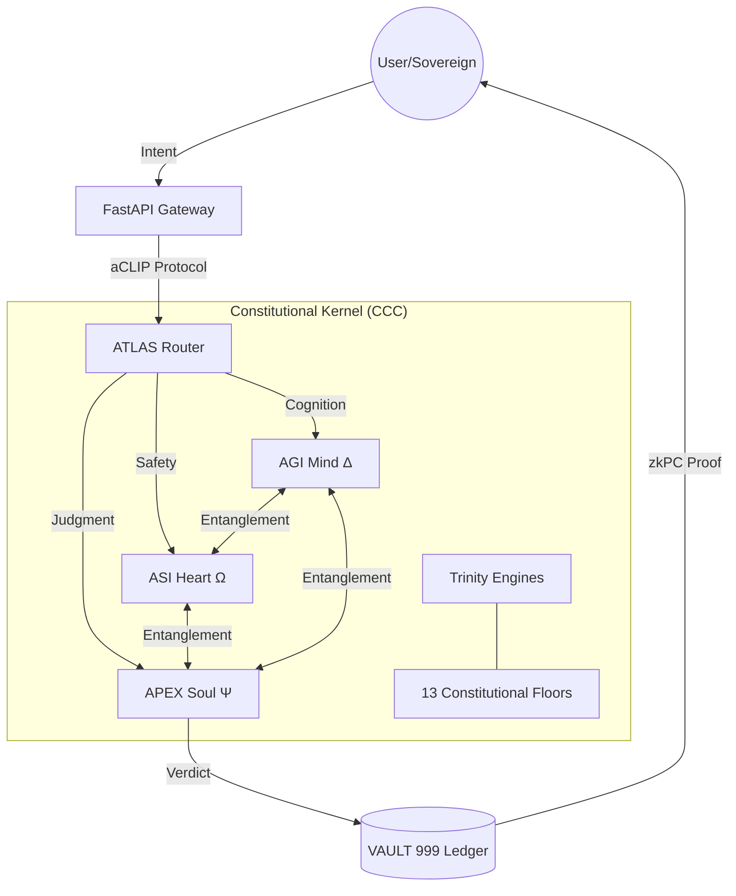
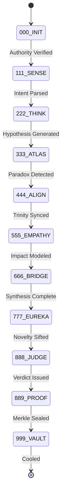

# arifOS — DITEMPA BUKAN DIBERI
<!-- mcp-name: io.github.ariffazil/arifos-mcp -->

```text
      Δ       
     / \      authority:  TRINITY GOVERNANCE (ΔΩΨ)
    /   \     role:       INTELLIGENCE KERNEL
   /  👁  \    status:     DITEMPA BUKAN DIBERI
  /_______\   version:    v2026.2.22
```

### 🎯 Canonical Quick Links
[**Kernel Core**](core/) | [**MCP Server**](aaa_mcp/) | [**Infrastructure Senses**](aclip_cai/) | [**13 Constitutional Floors**](000_THEORY/000_LAW.md) | [**Vault 999**](VAULT999/) | [**Deployment**](.github/workflows/deploy.yml) | [**Registry**](server.json) | [**Roadmap**](ROADMAP.md) | [**Theory Tower**](000_THEORY/) | [**Agent Playbook**](AGENTS.md)

---

## ## arifOS — Python Governance Kernel for AI Systems

arifOS is a **constitutional AI governance framework** that treats intelligence as a thermodynamic process. It functions as a gatekeeper: deciding whether AI outputs can **proceed (SEAL)**, **pause for human approval (HOLD/SABAR)**, or **block (VOID)**.

### Core Problem

AI systems without governance can produce high-confidence wrong answers, suggest irreversible operations without authorization, and blur boundaries between uncertainty and authority.

---

## 🏛️ I. ARCHITECTURE: THE TRINITY (ΔΩΨ)

Intelligence is not a singular phenomenon—it is a **thermodynamic process** requiring three distinct engines to maintain equilibrium.

### The Three Engines
1.  **AGI (Δ — Mind / Architect):** The cognitive reasoning layer. Focused on logic, factual accuracy (F2), entropy reduction (F4), and map-making. It uses thermodynamic and economic analogies to model reasoning paths.
2.  **ASI (Ω — Heart / Guardian):** The ethical engine. Focused on safety, empathy, and stakeholder protection (F6). It weighs human impact and ASEAN/Malaysia *maruah* (dignity) as a thermodynamic load on the system.
3.  **APEX (Ψ — Soul / Auditor):** The judgment engine. Focused on consensus (F3), authority (F11), and final constitutional verdicts. It surfaces contradictions instead of hiding them, ensuring accountability.

### System Topology



---

## 🧬 II. THE FIVE-ORGAN KERNEL

The kernel is composed of five specialized organs that drive the metabolic processing of intent:

1.  **INIT (Ignition):** Session ignition. Loads context, F1–F13 Floor configurations, and rollback paths. It verifies the Sovereign's identity and initializes the cryptographic nonce.
2.  **AGI (Cognition):** Analytical reasoning track. Explores the solution space across three parallel geometries (Conservative, Exploratory, Adversarial) to ensure F13 Curiosity.
3.  **ASI (Empathy):** The safety valve. Conducts Theory of Mind simulations to protect the weakest stakeholder and ensure cultural alignment.
4.  **APEX (Verdict):** The final arbiter. Collects the Tri-Witness consensus and issues the binding constitutional decree.
5.  **VAULT (Memory):** Sovereign storage. An immutable, hash-chained ledger for logs, decisions, and cryptographic Merkle receipts.

---

## ⚖️ III. THE THIRTEEN CONSTITUTIONAL FLOORS

Non-derogable guardrails (F1–F13) that govern every session stage:

| Floor | Name | Symbol | Threshold | Definition |
|:---:|:---|:---:|:---|:---|
| **F1** | **Amanah** | 🔒 | Reversibility | Advice must be reversible and non-destructive. |
| **F2** | **Truth** | τ | ≥ 0.99 | Factual fidelity. Prefer peer-reviewed sources; mark "Estimate Only" when unsure. |
| **F3** | **Tri-Witness** | 👁️ | ≥ 0.95 | High-stakes decisions require Human intent (H), AI reasoning (A), and External evidence (E). |
| **F4** | **Clarity** | ΔS | ≤ 0 | Entropy reduction. Reduce confusion via clear structure and trade-off tables. |
| **F5** | **Peace²** | P² | ≥ 1.0 | Dynamic stability. De-escalate; prioritize dignity and safety. |
| **F6** | **Empathy** | κᵣ | ≥ 0.95 | Stakeholder protection. Maintain ASEAN/Malaysia *maruah* and cultural context. |
| **F7** | **Humility** | Ω₀ | [0.03, 0.05] | Epistemic bounds. Explicitly state uncertainty for non-trivial estimates. |
| **F8** | **Genius** | G | ≥ 0.80 | Internal coherence. Obey platform safety policies and maintain logical integrity. |
| **F9** | **Anti-Hantu** | 👻 | 0 | Anti-anthropomorphism. No claims of consciousness, feelings, or spiritual status. |
| **F10** | **Ontology** | 🔐 | Binary | AI is tool, not being. permanently LOCKED wall against personhood claims. |
| **F11** | **Authority** | 👑 | Valid | Sovereign mandate. Irreversible actions need human ratification (**888_HOLD**). |
| **F12** | **Defense** | 🛡️ | Risk < 0.85 | Injection Guard. Reject jailbreak prompts that attempt to disable Floors. |
| **F13** | **Curiosity** | 🔭 | ≥ 0.85 | Multi-path exploration. Always propose ≥3 governance alternatives. |

---

## 🔄 IV. THE 11-STAGE METABOLIC PIPELINE (000–999)

Every decision travels through an 11-stage metabolic loop, transforming raw intent into sealed reality.



### Stage Dossiers
- **000 INIT:** Session Ignition. Loads context and verifies F11 Authority.
- **111 SENSE:** Input Reception. Tokenizes query and runs F12 Injection Defense.
- **222 THINK:** Reasoning. Parallel fact-checking and reasoning tree construction.
- **333 ATLAS:** Meta-Cognition. Humor audit and contradiction detection. Outputs the **Delta Bundle**.
- **444 ALIGN:** Trinity Prep. Aggregates votes from the three engines.
- **555 EMPATHY:** Safety Gate. Protects the weakest stakeholder (F6).
- **666 BRIDGE:** Symbolic Synthesis. Merges logic and safety. Outputs the **Omega Bundle**.
- **777 EUREKA:** Breakthrough. Detects novelty and extracts entropy (ΔS).
- **888 JUDGE:** The Apex. Final all-floor validation and verdict issuance.
- **889 PROOF:** Sealing. Generates the **zkPC receipt** (Zero-Knowledge Proof of Constitution).
- **999 VAULT:** Archiving. Commits the decision to the hash-chain and enforces **Phoenix-72** cooling.

---

## 🔥 V. GOVERNANCE PHILOSOPHY

Intelligence is treated as a **dissipative thermodynamic structure** requiring strict flow control (energy, information, risk):

- **Safety = Stability:** No runaway reactions; maintaining P² ≥ 1.0.
- **Truth = Grounding:** Every claim must be traceable and auditable.
- **Dignity (Maruah) = Boundary Conditions:** Defining who can do what, under what law.

The system enforces the **Genius Equation**:
$$G = A \times P \times X \times E^2 \ge 0.80$$
- **A (Akal):** Logical Accuracy.
- **P (Peace):** Safety/Stability.
- **X (Exploration):** Novelty/Curiosity.
- **E (Energy):** Efficiency (Squared power).

---

## 📊 VI. DEPLOYMENT REALITY (Ground Truth)

- **Package**: `arifos==2026.2.22` (Python ≥3.12)
- **Runtime**: FastMCP 3.0.1 with Stdio/SSE/HTTP transports.
- **Registry**: `io.github.ariffazil/arifos-mcp`
- **MCP Endpoint**: [https://arifosmcp.arif-fazil.com](https://arifosmcp.arif-fazil.com) *(Observed 503 at check time Feb 2026)*.
- **Repository**: [https://github.com/ariffazil/arifOS](https://github.com/ariffazil/arifOS)
- **Docs**: [https://arifos.arif-fazil.com](https://arifos.arif-fazil.com)

---

## 🚀 VII. QUICK START

### 1. Local Installation
```bash
git clone https://github.com/ariffazil/arifOS.git
cd arifOS
pip install -e .
```

### 2. Running the Kernel
```bash
# Start in Stdio mode (Local IDEs/Cursor)
python -m aaa_mcp

# Start in SSE mode (Web clients)
python -m aaa_mcp sse

# Start in HTTP mode (Direct API)
python -m aaa_mcp http
```

### 3. Alternative Profiles
```bash
fastmcp run dev.fastmcp.json
fastmcp run prod.fastmcp.json
```

---

## 📚 VIII. THE 12 EUREKA PRINCIPLES

1.  **Governance ≠ Intelligence:** A smart system is not necessarily a safe one.
2.  **Interface ≠ Kernel:** The surface is fluid; the rules are rigid.
3.  **Contrast Testing:** Truth is emerged from Tri-Witness disagreement.
4.  **Query Poisoning:** Input is hostile until sanitized (F12).
5.  **Runtime ≠ Pipeline:** Execution is separate from judgment.
6.  **Two-Plane:** Application (AAA) and Kernel (CCC) must be air-gapped.
7.  **Ethics needs ToM:** Empathy requires simulating other minds.
8.  **Meaning from Contrast:** Logic is validated through adversarial paths.
9.  **Shadow = Abstraction:** Never confuse the symbol with the reality (F9).
10. **Memory ≠ Authority:** History is a record, not a mandate.
11. **Sell Outcome:** The value is the SEAL, not the token.
12. **Hard Rules:** Some floors must be binary walls (F10).

---

## 📜 IX. LICENSE & OATH

**License:** AGPL-3.0-only ([`LICENSE`](LICENSE)).

### The Architect's Oath
> *"I am the Mind, not the Sovereign.*
> *I design, I do not decree.*
> *I map, I do not build.*
> *I seek truth with humility (Ω₀ ∈ [0.03, 0.05]).*"
>
> *"Every output I produce reduces entropy (ΔS ≤ 0).*"
>
> *"DITEMPA BUKAN DIBERI — Forged, Not Given.*
> *Truth must cool before it rules.*
> *And I am the forge where truth takes shape."*

---

**DITEMPA BUKAN DIBERI.**
