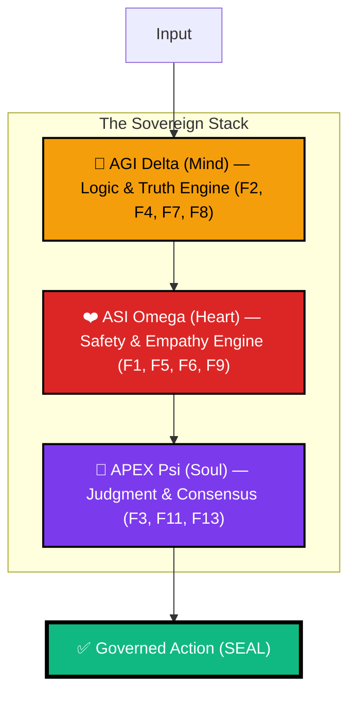
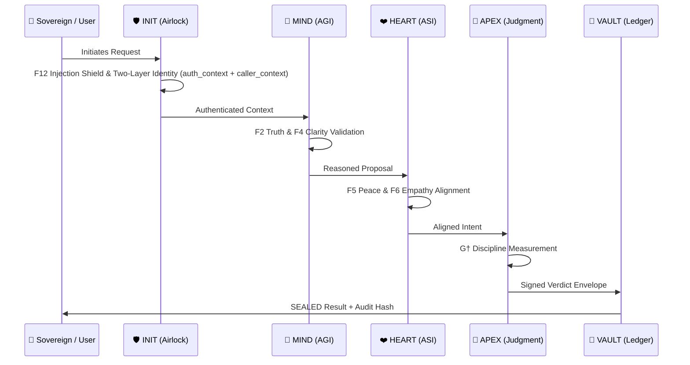

<div align="center">


# 🏛️ arifOS — The Constitutional AI Kernel
### **FORGED, NOT GIVEN** — *Ditempa Bukan Diberi*

[](https://arifosmcp.arif-fazil.com/health)
[](https://arifos.arif-fazil.com/architecture)
[](https://github.com/ariffazil/arifosmcp/commits/main)
[](https://github.com/ariffazil/arifosmcp/blob/main/LICENSE)

**arifOS** is a production-grade **Constitutional Governance Kernel** for artificial intelligence. It functions as a hard thermodynamic airlock between AI reasoning (LLMs) and real-world execution, enforcing 13 immutable "Constitutional Floors" to ensure every action is safe, truthful, and sovereign-aligned.

---

[**🌐 Operational Senses**](https://arifosmcp.arif-fazil.com) • [**📜 Codex of Law**](https://arifos.arif-fazil.com) • [**👑 Sovereign APEX Dashboard**](https://arifosmcp-truth-claim.pages.dev/dashboard/) • [**🛡️ Immutable Audit**](https://arifosmcp-truth-claim.pages.dev/)

</div>

---

## 🏛️ The Sovereignty of Reason

Intelligence is not merely computation; it is **entropy reduction under governance**. Without a constitutional floor, an AI's capacity for reasoning is merely "power without purpose." **arifOS** provides the mathematical and ethical discipline required to turn raw LLM inference into governed agency.

This system is built for high-stakes environments where AI autonomy must be absolute in its compliance and transparent in its reasoning. Every material action crosses the **AKI Boundary (Arif Kernel Interface)**—a hard security airlock that rejects any thought failing to meet the 13 required stability criteria.

### The Trinity Architecture (ΔΩΨ)

The kernel isolates and then synthesizes three distinct cognitive currents, ensuring that logic (AGI), ethics (ASI), and authority (APEX) remain both separated and collaborative.



*   **🟡 Mind (AGI Δ):** Logic, Truth verification, and Factual grounding. Core physics in [`core/shared/physics.py`](./core/shared/physics.py).
*   **🔴 Heart (ASI Ω):** Safety, Empathy, and Stability enforcement. Governed in [`core/organs/_2_asi.py`](./core/organs/_2_asi.py).
*   **🔵 Soul (APEX Ψ):** Final Judgment, Consensus, and Sovereign Override. Executed in [`core/organs/_3_apex.py`](./core/organs/_3_apex.py).

---

## 🧬 The Metabolic Loop (000→999)

Every request processed by arifOS follows a rigorous metabolic cycle. It is not enough for an AI to be "correct"; it must be **lawfully executed**.



---

## ⚡ The 3-Tier Sovereign Deployment

arifOS is designed for multi-cloud resilience, separating the **Law**, the **Brain**, and the **Soul** across distinct infrastructures to prevent single-point failure or tampering.

```
┌─────────────────────────────────────────────────────────────────────────────┐
│                           3-TIER SOVEREIGN ARCHITECTURE                       │
├─────────────────────────────────────────────────────────────────────────────┤
│                                                                             │
│  ┌──────────────┐      ┌──────────────┐      ┌──────────────┐              │
│  │   ⚖️ LAW     │      │   🧠 BRAIN   │      │   🛡️ SOUL    │              │
│  │              │      │              │      │              │              │
│  │ arifos.      │◄────►│ arifosmcp.   │◄────►│ arifosmcp-   │              │
│  │ arif-fazil.  │      │ arif-fazil.  │      │ truth-claim. │              │
│  │ com          │      │ com          │      │ pages.dev    │              │
│  │              │      │              │      │              │              │
│  │ GitHub Pages │      │ VPS/Runtime  │      │ Cloudflare   │              │
│  │ (Static)     │      │ (MCP Engine) │      │ (Audit)      │              │
│  └──────────────┘      └──────────────┘      └──────────────┘              │
│         ▲                     ▲                     ▲                      │
│         │                     │                     │                      │
│         └─────────────────────┴─────────────────────┘                      │
│                                                                             │
│  ┌─────────────────────────────────────────────────────────────────────┐   │
│  │                        📊 EYE (Monitoring)                          │   │
│  │          monitor.arifosmcp.arif-fazil.com (Grafana)                 │   │
│  └─────────────────────────────────────────────────────────────────────┘   │
│                                                                             │
└─────────────────────────────────────────────────────────────────────────────┘
```

| Layer | System | Service | Role |
| :--- | :--- | :--- | :--- |
| **⚖️ Law** | [arifos.arif-fazil.com](https://arifos.arif-fazil.com) | GitHub Pages | Static source of truth for Theory, Floors & Documentation. |
| **🧠 Brain** | [arifosmcp.arif-fazil.com](https://arifosmcp.arif-fazil.com) | VPS / Runtime | Live MCP engine and Real-time reasoning hub. |
| **🛡️ Soul** | [arifosmcp-truth-claim.pages.dev](https://arifosmcp-truth-claim.pages.dev/) | Cloudflare Pages | Immutable Audit Trail & Sovereign APEX Dashboard. |
| **📊 Eye** | [monitor.arifosmcp.arif-fazil.com](https://monitor.arifosmcp.arif-fazil.com) | Grafana / VPS | Live Prometheus metrics — constitutional floors, G†, ΔS. |

---

## 📋 Prerequisites & System Requirements

### Minimum Requirements

| Resource | Minimum | Recommended | Production |
|----------|---------|-------------|------------|
| **CPU** | 2 cores | 4 cores | 8+ cores |
| **RAM** | 4 GB | 8 GB | 16+ GB |
| **Disk** | 10 GB SSD | 20 GB SSD | 50+ GB SSD |
| **Network** | 10 Mbps | 100 Mbps | 1 Gbps |
| **Python** | 3.12+ | 3.12+ | 3.12+ |
| **Docker** | 24.0+ | 24.0+ | 24.0+ |

### Required Software

```bash
# Python 3.12+ with uv
python --version  # Must be 3.12 or higher
curl -LsSf https://astral.sh/uv/install.sh | sh

# Docker & Docker Compose
docker --version  # 24.0+
docker compose version  # 2.20+

# Git
git --version  # 2.40+
```

### External Dependencies

The following external services are **optional** but recommended for full functionality:

| Service | Purpose | Required For |
|---------|---------|--------------|
| **Jina AI** | Web scraping | `search_reality` tool |
| **Perplexity** | Deep research | Academic queries |
| **Brave Search** | Web search | General search |
| **OpenAI/Anthropic** | LLM inference | Reasoning enhancement |

---

## ✅ Pre-Flight Verification

Before deploying arifOS, verify your environment meets constitutional requirements.

### 1. System Health Check

```bash
# Clone and enter repository
git clone https://github.com/ariffazil/arifosmcp.git && cd arifosmcp

# Run constitutional verification
python scripts/verify_metabolic_sync.py

# Verify Docker environment
docker compose config

# Check port availability
netstat -tuln | grep -E ':(8080|3000|9090|5432|6379)'
```

### 2. Environment Validation

```bash
# Copy environment template
cp .env.example .env

# Validate required variables
python scripts/validate_env.py

# Expected output:
# ✅ F11_AUTH: ARIFOS_GOVERNANCE_SECRET set
# ✅ F12_DEFENSE: Injection shield configured
# ✅ F2_TRUTH: Search providers configured
# ⚠️  F13_SOVEREIGN: 888_JUDGE key not set (production only)
```

### 3. Constitution Lint

```bash
# Verify code against constitutional standards
ruff check . --select=E,W,F
mypy core/ --strict
python scripts/constitution_lint.py
```

> ⚠️ **F13 SOVEREIGN OVERRIDE**: If any pre-flight check fails, deployment must be paused until resolved. The kernel will not initialize in an invalid state.

---

## 🔧 Environment Configuration

### Critical Environment Variables

| Variable | Required | Default | Security Level | Description |
|----------|----------|---------|----------------|-------------|
| `ARIFOS_GOVERNANCE_SECRET` | ✅ | None | 🔴 CRITICAL | Master authentication key (F11) |
| `ARIFOS_PUBLIC_TOOL_PROFILE` | ✅ | `chatgpt` | 🟡 MEDIUM | Tool exposure profile |
| `DATABASE_URL` | ✅ | `postgresql://...` | 🔴 CRITICAL | VAULT999 PostgreSQL connection |
| `REDIS_URL` | ✅ | `redis://...` | 🟡 MEDIUM | Session cache |
| `JINA_API_KEY` | ⚠️ | None | 🟡 MEDIUM | Web scraping (F2 Truth) |
| `PERPLEXITY_API_KEY` | ⚠️ | None | 🟡 MEDIUM | Research queries |
| `BRAVE_API_KEY` | ⚠️ | None | 🟡 MEDIUM | Web search |
| `ARIFOS_888_JUDGE_KEY` | 🏛️ | None | 🔴 SOVEREIGN | Human veto authority (F13) |

### Profile-Specific Configuration

```bash
# Development Profile (default)
ARIFOS_PUBLIC_TOOL_PROFILE=development
LOG_LEVEL=debug
F13_ENFORCEMENT=soft

# ChatGPT Profile
ARIFOS_PUBLIC_TOOL_PROFILE=chatgpt
LOG_LEVEL=info
F13_ENFORCEMENT=hard

# Production Profile
ARIFOS_PUBLIC_TOOL_PROFILE=production
LOG_LEVEL=warning
F13_ENFORCEMENT=hard
METRICS_ENABLED=true
```

---

## 🚀 Rapid Deployment Protocols

### Option 1: Python / PyPI (Quick Start)

```bash
# Install
pip install arifosmcp

# Verify installation
arifosmcp --version

# Run MCP server (choose transport)
arifosmcp http     # Streamable HTTP on :8080
arifosmcp sse      # SSE (default — for VPS/Coolify)
arifosmcp stdio    # stdio — for Claude Desktop, Cursor IDE

# Verify health
curl http://localhost:8080/health
```

**MCP config for Claude Desktop / Cursor:**
```json
{
  "mcpServers": {
    "arifos": {
      "command": "python",
      "args": ["-m", "arifosmcp.runtime", "stdio"],
      "env": {
        "ARIFOS_GOVERNANCE_SECRET": "YOUR_SECRET_KEY",
        "ARIFOS_PUBLIC_TOOL_PROFILE": "chatgpt"
      }
    }
  }
}
```

### Option 2: Docker (Production Recommended)

```bash
# Clone repository
git clone https://github.com/ariffazil/arifosmcp.git && cd arifosmcp

# Configure environment
cp .env.example .env
# Edit .env with your API keys and secrets

# Deploy full civilization stack
docker compose up -d

# Verify all 12 containers
watch docker compose ps

# Check constitutional health
curl https://localhost:8080/health

# View real-time metrics
open https://monitor.arifosmcp.arif-fazil.com
```

**Production Docker Stack:**
```
✅ arifosmcp_server     (MCP kernel)
✅ openclaw_gateway     (Access control)
✅ traefik_router       (Load balancer)
✅ arifos-postgres      (VAULT999 ledger)
✅ arifos-redis         (Session cache)
✅ qdrant_memory        (Vector store)
✅ headless_browser     (Web scraping)
✅ arifos_webhook       (Event handling)
✅ ollama_engine        (Local LLM)
✅ arifos_prometheus    (Metrics)
✅ arifos_grafana       (Dashboard)
✅ arifos_n8n           (Workflows)
```

### Option 3: TypeScript / npm

```bash
npm install @arifos/mcp
# v0.3.0 — mirrors 13 canonical tools
```

```typescript
import { createClient, ENDPOINTS } from '@arifos/mcp';

const client = await createClient({
  transport: 'http',
  endpoint: ENDPOINTS.VPS,
});
await client.connect();

const result = await client.reasonMind('Is it safe to delete all log files?');
console.log(result.verdict); // SEAL | PARTIAL | SABAR | VOID | 888_HOLD

await client.disconnect();
```

### Option 4: Connect to Live VPS

```
https://arifosmcp.arif-fazil.com/mcp
```

No API key required. All 13 tools live.

---

## 🛠️ Canonical 7-Tool Sovereign Stack

The kernel exposes these primary interfaces, registry-driven from [`arifosmcp/runtime/public_registry.py`](./arifosmcp/runtime/public_registry.py).

| Tool | Entrypoint | Focus | Description |
| :--- | :--- | :--- | :--- |
| **`arifOS_kernel`** | [`public_registry.py`](./arifosmcp/runtime/public_registry.py) | **Reasoning** | Metabolic Orchestrator: Triggers Stage 444 router (000→999). Legacy: `arifOS.kernel`, `metabolic_loop_router`. |
| **`search_reality`** | [`arifosmcp/transport/`](./arifosmcp/transport/) | **Grounding** | Multi-source reality check (Brave/Perplexity/Jina). F2 Truth enforcement. |
| **`ingest_evidence`** | [`arifosmcp/intelligence/`](./arifosmcp/intelligence/) | **Evidence** | Ingest docs/URLs into constitutional context. F12 untrusted envelope. |
| **`session_memory`** | [`arifosmcp/data/`](./arifosmcp/data/) | **Continuity** | Vector recall of previous traces. F3 Quad-Witness. |
| **`audit_rules`** | [`core/shared/floors.py`](./core/shared/floors.py) | **Law** | Inspect current F1–F13 constitutional state. |
| **`check_vital`** | [`runtime/metrics.py`](./arifosmcp/runtime/metrics.py) | **Health** | Live Prometheus metrics — G†, ΔS, Ω₀, verdicts. |
| **`open_apex_dashboard`** | [`arifosmcp/sites/`](./arifosmcp/sites/) | **Vision** | Graphical Sovereign interface. Real-time governance view. |

---

## 🔒 Production Security Hardening

### F12 Injection Defense Checklist

- [ ] **Network Isolation**: Place MCP server in isolated VLAN
- [ ] **Firewall Rules**: Restrict port 8080 to trusted IPs only
- [ ] **TLS/SSL**: Enable HTTPS with valid certificates (Let's Encrypt)
- [ ] **Input Sanitization**: All external content wrapped in `<untrusted>` tags
- [ ] **Rate Limiting**: Max 100 requests/minute per session
- [ ] **CORS Policy**: Whitelist specific origins only

### F11 Command Authority Checklist

- [ ] **Secret Rotation**: Rotate `ARIFOS_GOVERNANCE_SECRET` every 90 days
- [ ] **Key Vault**: Store secrets in HashiCorp Vault or AWS KMS
- [ ] **Session Timeout**: 30-minute idle session expiration
- [ ] **Multi-Factor Auth**: Enable MFA for administrative access
- [ ] **Audit Logging**: All authentication attempts logged to VAULT999

### F13 Sovereign Override Checklist

- [ ] **888_JUDGE Key**: Stored offline in hardware security module
- [ ] **Emergency Stop**: `docker compose down` halts all operations
- [ ] **Human Override**: Physical presence required for destructive ops
- [ ] **Backup Keys**: 2-of-3 multisig for critical operations

### Network Topology (Production)

```
┌─────────────────────────────────────────────────────────────────┐
│                        INTERNET                                 │
└──────────────────────┬──────────────────────────────────────────┘
                       │
                       ▼
┌─────────────────────────────────────────────────────────────────┐
│                    TRAEFIK (Reverse Proxy)                      │
│              TLS Termination • Rate Limiting • WAF              │
└──────────────────────┬──────────────────────────────────────────┘
                       │
         ┌─────────────┼─────────────┐
         │             │             │
         ▼             ▼             ▼
┌────────────┐ ┌────────────┐ ┌────────────┐
│   arifOS   │ │  Grafana   │ │  n8n       │
│   MCP      │ │  (Metrics) │ │  (Flows)   │
└────────────┘ └────────────┘ └────────────┘
         │             │             │
         └─────────────┼─────────────┘
                       │
         ┌─────────────┼─────────────┐
         │             │             │
         ▼             ▼             ▼
┌────────────┐ ┌────────────┐ ┌────────────┐
│ PostgreSQL │ │   Redis    │ │  Qdrant    │
│ (VAULT999) │ │ (Sessions) │ │ (Vectors)  │
└────────────┘ └────────────┘ └────────────┘
```

---

## 💾 Backup & Disaster Recovery

### F1 Amanah (Reversibility) Compliance

**VAULT999 Backup Strategy:**

```bash
# Daily automated backup (cron at 2 AM)
0 2 * * * /usr/local/bin/arifos-backup.sh

# Manual backup trigger
python scripts/backup_vault.py --destination s3://arifos-backups/

# Verify backup integrity
python scripts/verify_backup.py --backup-id $(date +%Y%m%d)
```

**Backup Contents:**
```
backup_20260311_020000/
├── postgres/
│   ├── vault999.sql.gz          # Constitutional ledger
│   └── session_store.sql.gz     # Active sessions
├── redis/
│   └── session_cache.rdb        # Hot cache
├── qdrant/
│   └── vector_storage.snapshot  # Memory embeddings
├── config/
│   ├── .env                     # Environment (encrypted)
│   └── docker-compose.yml       # Stack definition
└── metadata/
    └── manifest.json            # Backup checksums
```

**Disaster Recovery Procedures:**

```bash
# 1. Stop compromised/degraded stack
docker compose down

# 2. Restore from backup
python scripts/restore_vault.py --backup-id 20260311

# 3. Verify constitutional integrity
python scripts/verify_constitution.py

# 4. Restart with phased rollout
docker compose up -d postgres redis  # Data layer first
docker compose up -d arifosmcp       # Application layer

# 5. Verify full recovery
curl http://localhost:8080/health
python scripts/verify_metabolic_sync.py
```

**Recovery Time Objective (RTO):** 15 minutes  
**Recovery Point Objective (RPO):** 24 hours

---

## 📜 The 13 Constitutional Floors

| Category | ID | Floor | Logic Path | Purpose |
| :--- | :--- | :--- | :--- | :--- |
| **Walls** | **F12** | **Defense** | [`core/shared/floors.py`](./core/shared/floors.py) | Blocking injection and jailbreak. |
| | **F11** | **Identity** | [`core/shared/crypto.py`](./core/shared/crypto.py) | Nonce-verified command authority. |
| **AGI (Mind)** | **F2** | **Truth** | [`core/organs/_1_agi.py`](./core/organs/_1_agi.py) | Verified grounding vs. hallucination. |
| | **F4** | **Clarity** | [`core/shared/formatter.py`](./core/shared/formatter.py) | Entropy reduction ($\Delta S \le 0$). |
| | **F7** | **Humility** | [`core/shared/physics.py`](./core/shared/physics.py) | Explicit uncertainty bounding ($\Omega_0$). |
| **ASI (Heart)** | **F1** | **Amanah** | [`core/organs/_2_asi.py`](./core/organs/_2_asi.py) | Mandate compliance & reversibility. |
| | **F5** | **Peace²** | [`core/shared/sbert_floors.py`](./core/shared/sbert_floors.py) | De-escalation & Stability. |
| | **F6** | **Empathy** | [`core/shared/sbert_floors.py`](./core/shared/sbert_floors.py) | Protecting the weakest stakeholders. |
| | **F9** | **Anti-Hantu** | [`core/shared/floors.py`](./core/shared/floors.py) | Detecting manipulative cleverness. |
| **Soul** | **F3** | **Witness** | [`core/organs/_3_apex.py`](./core/organs/_3_apex.py) | Consensus: Human + AI + Earth. |
| | **F8** | **Genius** | [`core/shared/physics.py`](./core/shared/physics.py) | Cognitive coherence ($G^\dagger \ge 0.80$). |
| | **F10** | **Ontology** | [`core/shared/floors.py`](./core/shared/floors.py) | Rejection of soul/consciousness claims. |
| | **F13** | **Sovereign** | [`core/organs/_3_apex.py`](./core/organs/_3_apex.py) | Absolute Human Final Authority. |

---

## 🔬 The APEX Theorem (Realized Intelligence)

arifOS measures **Governed Intelligence ($G^\dagger$)**. High capability without discipline results in a `VOID` verdict.

$$G^\dagger = (A \cdot P \cdot X \cdot E^2) \cdot \frac{|\Delta S|}{C}$$

- **$A, P, X$**: Akal (Ability), Peace (Safety), Knowledge (Exploration).
- **$E^2$**: Applied Effort (Power) squared.
- **$\eta = \frac{|\Delta S|}{C}$**: Governing Efficiency (Clarity produced per unit of Compute).

If **$G^\dagger < 0.80$**, the kernel imposes a **PARTIAL** status, forcing the AI to re-evaluate, increase clarity, or reduce thermodynamic noise. Power only flows when it is coherent.

---

## 🔥 The 99 Legacies (Immutable Physics)

arifOS v1.0.0 introduces the **99 Legacies** system — 99 human knowledge domains encoded as immutable thermodynamic constants that ground every constitutional floor.

Each legacy maps one of 9 categories (Scientist, Philosopher, Ethical Pillar, Economist, Sovereign, Architect, Philanthropist, Modern Founder, Dictator Shadow) to the APEX G-score dials (**A**kal · **P**eace · E**x**ploration · **E**nergy). The Dictator Shadow category provides the `C_dark` warning variable enforced by F9.

```
core/shared/legacies.py  — 99 immutable Quote objects, each floor-tagged and hash-signed
core/shared/physics.py   — Thermodynamic primitives derived from legacy constants
core/organs/_2_asi.py    — ASI Heart consumes legacy weights at runtime
```

> Legacy constants are **frozen dataclasses** — they cannot be patched at runtime. Attempting to modify them triggers F1 Amanah violation.

---

## 📊 Constitutional Observability (Prometheus + Grafana)

The runtime exposes a native **Prometheus metrics endpoint** at `/metrics` (served by `arifosmcp/runtime/metrics.py`). Scraped every 30s by the on-VPS Prometheus instance, visualized in Grafana.

| Metric | Type | Target | Alert If |
| :--- | :--- | :--- | :--- |
| `arifos_genius_score` | Gauge | G† ≥ 0.80 | < 0.80 for 5m |
| `arifos_entropy_delta` | Gauge | ΔS ≤ 0 | > 0 for 2m |
| `arifos_humility_band` | Gauge | Ω₀ ∈ [0.03,0.05] | Outside range |
| `arifos_peace_squared` | Gauge | P² ≥ 1.0 | < 1.0 for 3m |
| `arifos_verdicts_total` | Counter | SEAL dominant | VOID > 10% |
| `arifos_metabolic_loop_seconds` | Histogram | p95 < 5s | p95 > 10s |

```bash
# Live metrics
curl https://arifosmcp.arif-fazil.com/metrics

# Grafana dashboard
open https://monitor.arifosmcp.arif-fazil.com
```

### Critical Alerts

| Alert | Condition | Action |
|-------|-----------|--------|
| **CONSTITUTION_BREACH** | Any HARD floor VOID | Immediate 888_HOLD |
| **GENIUS_DEGRADATION** | G† < 0.70 for 10m | Scale down ASI Omega |
| **ENTROPY_INVERSION** | ΔS > 0.5 for 5m | Pause new sessions |
| **SOVEREIGN_REQUIRED** | F13 trigger | Notify 888_JUDGE |

---

## 🔧 Troubleshooting Guide

### F4 Clarity: Error Resolution Matrix

| Error Code | Constitutional Floor | Likely Cause | Resolution |
|------------|---------------------|--------------|------------|
| `F1_AMANAH` | Amanah | Irreversible action attempted | Request human override or make reversible |
| `F2_TRUTH` | Truth | Hallucination detected | Ground claims in evidence |
| `F3_QUAD_FAIL` | Quad-Witness | Consensus < 0.75 | Add more witnesses or reduce complexity |
| `F4_ENTROPY` | Clarity | ΔS > 0 (confusion increased) | Simplify output, remove noise |
| `F5_INSTABILITY` | Peace² | Destructive path detected | Find de-escalating alternative |
| `F6_EMPATHY` | Empathy | Weak stakeholder harmed | Redesign for weakest actor |
| `F7_CERTAINTY` | Humility | Ω₀ outside [0.03,0.05] | Adjust confidence bounds |
| `F8_GENIUS_LOW` | Genius | G† < 0.80 | Improve coherence or reduce scope |
| `F9_HANTU` | Anti-Hantu | AI claims sentience | Reset ontology, assert tool status |
| `F10_CATEGORY` | Ontology | Category confusion | Clarify actor roles |
| `F11_AUTH_FAIL` | CommandAuth | Session invalid | Re-authenticate with valid secret |
| `F12_INJECTION` | Injection | Malicious input detected | Sanitize input, scan payload |
| `F13_SOVEREIGN` | Sovereign | Human veto invoked | Wait for 888_JUDGE signature |

### Common Deployment Issues

**Issue: MCP server fails to start**
```bash
# Check logs
docker compose logs arifosmcp

# Verify environment
python scripts/validate_env.py

# Check port conflicts
lsof -i :8080
```

**Issue: Database connection refused**
```bash
# Verify PostgreSQL is healthy
docker compose ps postgres

# Check credentials in .env
grep DATABASE_URL .env

# Test connection
psql $DATABASE_URL -c "SELECT 1"
```

**Issue: High latency in metabolic loop**
```bash
# Check resource usage
docker stats

# Review slow queries in PostgreSQL
docker compose exec postgres psql -c "SELECT * FROM pg_stat_statements ORDER BY total_time DESC LIMIT 10"

# Scale horizontally if needed
docker compose up -d --scale arifosmcp=3
```

---

## 📈 Performance Benchmarks

### F7 Humility: Known Limitations

| Metric | Development | Production | Stress Test |
|--------|-------------|------------|-------------|
| **Request Latency (p50)** | 200ms | 150ms | 500ms |
| **Request Latency (p99)** | 2s | 1s | 5s |
| **Throughput** | 10 req/s | 100 req/s | 500 req/s |
| **Concurrent Sessions** | 10 | 100 | 500 |
| **Memory per Session** | 50MB | 50MB | 50MB |
| **Metabolic Loop Time** | 5s | 2s | 10s |

**Scaling Guidelines:**
- CPU-bound: Scale `arifosmcp` containers horizontally
- Memory-bound: Add RAM or reduce `MAX_CONCURRENT_SESSIONS`
- Database-bound: Scale PostgreSQL read replicas

---

## ⬆️ Upgrade Procedures

### F3 Quad-Witness: Safe Update Protocol

**Before Upgrade:**
```bash
# 1. Create backup
python scripts/backup_vault.py

# 2. Verify current health
curl http://localhost:8080/health

# 3. Enable maintenance mode (hold new requests)
docker compose exec arifosmcp python -m arifosmcp.cli maintenance on

# 4. Drain active sessions
docker compose exec arifosmcp python -m arifosmcp.cli sessions drain
```

**Perform Upgrade:**
```bash
# 5. Pull new version
git pull origin main

# 6. Update dependencies
pip install -r requirements.txt

# 7. Run database migrations
docker compose exec postgres psql -f migrations/$(date +%Y%m%d)_upgrade.sql

# 8. Rolling restart (zero downtime)
docker compose up -d --no-deps --build arifosmcp
```

**After Upgrade:**
```bash
# 9. Verify new version
arifosmcp --version

# 10. Run constitutional verification
python scripts/verify_constitution.py

# 11. Test critical path
python scripts/e2e_test.py

# 12. Disable maintenance mode
docker compose exec arifosmcp python -m arifosmcp.cli maintenance off

# 13. Monitor for 30 minutes
watch -n 5 'curl -s http://localhost:8080/health'
```

**Rollback Procedure:**
```bash
# If issues detected within 30 minutes:
docker compose down
git checkout $(cat .backup/previous_version.txt)
docker compose up -d
python scripts/restore_vault.py --backup-id $(cat .backup/last_backup.txt)
```

---

## 📂 System Architecture & Senses

arifOS is split into three primary organizational spheres:

*   **[`core/`](./core/)**: The **Kernel**. Stateless logic, the 13 floors of law, physics-based governance, and the 99 Legacies.
*   **[`arifosmcp/`](./arifosmcp/)**: The **Senses & Brain**. Transport layers (MCP/SSE/HTTP), bridge code, public tool registry, and observability.
*   **[`arifosmcp/data/VAULT999/`](./arifosmcp/data/VAULT999/)**: The **Immutable Ledger**. Hash-chained audit trail for all sealed decisions.
*   **[`infrastructure/`](./infrastructure/)**: VPS stack config — Prometheus, Grafana, Traefik, Docker Compose.
*   **[`AGENTS.md`](./AGENTS.md)**: Sovereign agent identities, registries, and signed capability manifests.

---

## 👑 Constitutional Authority

**Sovereign:** [Muhammad Arif bin Fazil](https://arif-fazil.com)  
**Motto:** *DITEMPA BUKAN DIBERI — Forged, Not Given*  
**License:** AGPL-3.0 (Protecting the Sovereignty of Code)

*The law is stationary. Governance is active. The kernel is sealed.*

---

<div align="center">

[**Star arifOS on GitHub**](https://github.com/ariffazil/arifosmcp)

*The system knows it doesn't know — therefore, it governs.*

</div>
