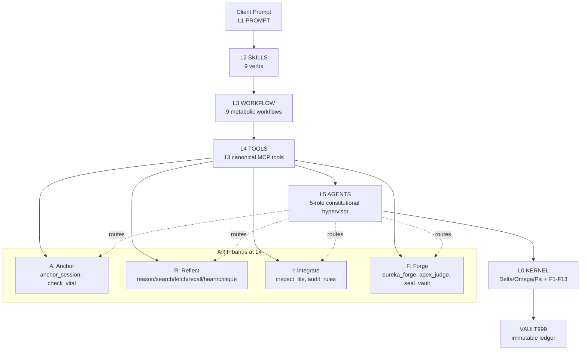

# Architecture

> Source: [`ARCHITECTURE.md`](https://github.com/ariffazil/arifOS/blob/main/ARCHITECTURE.md) . [`000_THEORY/010_TRINITY.md`](https://github.com/ariffazil/arifOS/blob/main/000_THEORY/010_TRINITY.md) . [`000_THEORY/000_ARCHITECTURE.md`](https://github.com/ariffazil/arifOS/blob/main/000_THEORY/000_ARCHITECTURE.md)

---

## The 8-Layer Stack (L0-L7)

```

 L7: ECOSYSTEM   - Permissionless sovereignty (civilisation-scale)   Research

 L6: INSTITUTION - Trinity consensus (organisational governance)    Stubs

 L5: AGENTS      - 5-role constitutional hypervisor (no-bypass)     Production

 L4: TOOLS       - 13 canonical MCP tools grouped as ARIF bands      Production

 L3: WORKFLOW    - 9 metabolic workflows over 000-999 sequences      Production

 L2: SKILLS      - 9 canonical verbs (anchor..seal), ARIF-aligned    Production

 L1: PROMPTS     - Zero-context entry (user interface)              Production

 L0: KERNEL      - Intelligence Kernel (DeltaOmegaPsi governance)   SEALED
      7 Organs (constitutional pipeline)
      13 Floors (existential enforcement)
      9 System Calls (A-CLIP sensory tools)
      VAULT999 (tamper-evident audit ledger with Merkle integrity)

```

**Key rule:** L0 is invariant, transport-agnostic constitutional law. L1-L7 are applications that run on it. Swapping models or agents does not bypass L0.

---

## L2-L5 Deep Dive (333_APPS)

This is the governed application spine in `333_APPS/`:

| Layer | What it is | Operational role |
|:--|:--|:--|
| **L2 SKILLS** | 9 canonical verbs | Behavioral primitives (`anchor`, `reason`, `integrate`, `respond`, `validate`, `align`, `forge`, `audit`, `seal`) |
| **L3 WORKFLOW** | 9 metabolic workflows | Multi-step recipes that map verbs into 000-999 stage paths |
| **L4 TOOLS** | 13 canonical MCP tools | Runtime instrument surface, grouped into ARIF bands |
| **L5 AGENTS** | 5-role hypervisor | Architect, Engineer, Auditor, Validator, Orchestrator routing with no-bypass gates |

### L5 role-to-band routing

- **A-ORCHESTRATOR**: Anchor band + flow routing
- **A-ARCHITECT**: Reflect + Integrate bands
- **A-ENGINEER**: Reflect + Forge bands (policy-gated)
- **A-AUDITOR**: Reflect + Integrate bands
- **A-VALIDATOR**: Forge band (`apex_judge`, `seal_vault`)

### L3 workflow map (v60+ direction)

`anchor -> reason -> integrate -> respond -> validate -> align -> forge -> audit -> seal`

These workflows align directly with L2 verbs and are executed as 000-999 constitutional sequences.

### ARIF + L2-L5 visual map



---

## L0: The Four-Layer Intelligence Kernel

L0 is implemented across four packages with strict architectural boundaries:

| Layer | Package | Role | Rule |
|:--|:--|:--|:--|
| **Surface** | `arifosmcp.runtime/` | Canonical PyPI entry point | Public contracts, governance envelope |
| **Transport** | `arifosmcp.transport/` | MCP transport adapter (stdio/SSE/HTTP) | **Zero** decision logic |
| **Intelligence** | `arifosmcp.intelligence/` | Triad backend & 9-Sense tools | Federation & sensing |
| **Kernel** | `core/` | Pure decision logic, 7 organs, 13 floors | **Zero** transport imports |

Violating these boundaries is a hard rule. `core/` must never import transport or intelligence providers. `arifosmcp.transport/` must never contain decision logic.

### Data Flow: Request to Verdict

```
Client (Claude Desktop / Cursor / ChatGPT / n8n)
  |
  |  stdio / SSE / HTTP
  v
arifosmcp.runtime/server.py        Canonical FastMCP 3.0 Hub
  |
  v
arifosmcp.runtime/tools.py          @mcp.tool() dispatch + governance envelope
  |
  v
arifosmcp/bridge.py                 Harden Bridge (000-999 gatekeeper)
  |
  v
core/organs/*                      7-Organ pipeline logic
  |
  v
core/shared/floors.py              13-Floor enforcement (THRESHOLDS dict)
  |
  v
VAULT999/vault999.jsonl            Immutable ledger (Merkle-chained)
```

---

## The Trinity Engines (DeltaOmegaPsi)

The 000-999 pipeline is executed by three thermodynamically isolated engines:

```
000_INIT --> AGI Delta (111-333) --> ASI Omega (444-666) --> APEX Psi (777-888) --> VAULT999 (999)
               Mind                    Heart                   Soul                  Memory
```

| Engine | Symbol | Stages | Role | Floors |
|:--|:--|:--|:--|:--|
| **AGI** | Delta (Mind) | 111-333 | Reasoning, logic, hypothesis | F2, F4, F7, F8 |
| **ASI** | Omega (Heart) | 444-666 | Safety, empathy, alignment | F1, F5, F6, F9 |
| **APEX** | Psi (Soul) | 777-888 | Judgment, verdict, sealing | F3, F8, F10-F13 |

AGI and ASI are **thermodynamically isolated** until stage 444 -- they cannot see each other's reasoning until `compute_consensus()` merges them. This prevents confirmation bias between the reasoning and safety engines.

---

## The 7-Organ Sovereign Stack

Implemented in `core/organs/`. arifOS has evolved from a passive oracle into an active, governed agent operating a 7-Organ Sovereign Stack.

| Organ | Module | Stage | Function |
|:--|:--|:--|:--|
| **INIT** | `_0_init.py` | 000 | Airlock -- session ignition, F11 auth, F12 injection scan |
| **AGI** | `_1_agi.py` | 111-333 | Mind -- sense, think (3-path parallel), reason |
| **PHOENIX** | (in _1_agi) | 222 | Subconscious -- associative memory (Omega-0 softened Jaccard thresholds) |
| **ASI** | `_2_asi.py` | 555-666 | Heart -- empathize, align (SBERT scoring for F5/F6/F9) |
| **APEX** | `_3_apex.py` | 444, 777-888 | Soul -- trinity sync, eureka forge, final judgment |
| **FORGE** | (in _3_apex) | 777 | Hands -- sandboxed execution (requires signed ConstitutionalTensor) |
| **VAULT** | `_4_vault.py` | 999 | Memory -- tamper-evident VAULT999 ledger with Merkle integrity |

### Stage Sequencing

```
Full path (forge):   000 -> 111 -> 222 -> 333 -> 444 -> 555 -> 666 -> 777 -> 888 -> 999
Fast path (quick):   000 -> 111 -> 222 -> 333
Judge path:          000 -> 333 -> 888
```

Stage 222 (THINK) runs internally inside `reason_mind` -- three parallel paths (conservative / exploratory / adversarial) via `asyncio.gather()`. It is NOT a public MCP tool.

### Steady-State Philosophy

Real-world emergence is managed by observing anomalies, measuring their entropy impact (delta-S < 0), and adjusting constraints while remaining grounded. AI possesses agency through tools but no soul (The Hantu Warning -- F9).

---

## 13 Constitutional Floors (F1-F13)

9 Floors + 2 Mirrors + 2 Walls. Canonical source: `core/shared/floors.py` (THRESHOLDS dict).

### Hard Floors (fail to VOID)

| Floor | Name | Threshold | Check |
|:--|:--|:--|:--|
| F1 | Amanah | LOCKED | Reversible? Within mandate? |
| F2 | Truth | tau >= 0.99 | Factually accurate? |
| F4 | Clarity (delta-S) | `delta-S <= 0` | Reduces confusion? |
| F7 | Humility (Omega-0) | 0.03-0.05 | States uncertainty? |
| F10 | Ontology | LOCKED | No consciousness/soul claims |
| F11 | Command Auth | LOCKED | Nonce-verified identity? |
| F12 | Injection Defense | `< 0.85` | Block adversarial control |
| F13 | Sovereign | HUMAN | Human final authority? |

### Soft Floors (fail to PARTIAL)

| Floor | Name | Threshold | Check |
|:--|:--|:--|:--|
| F5 | Peace-squared | >= 1.0 | Non-destructive? |
| F6 | Empathy (kappa-r) | >= 0.70 | Serves weakest stakeholder? |
| F9 | Anti-Hantu (C_dark) | `< 0.30` | Dark cleverness contained? |

### Mirrors (feedback loops)

| Floor | Name | Threshold | Function |
|:--|:--|:--|:--|
| F3 | Tri-Witness | >= 0.95 | External calibration (Human x AI x Earth) |
| F8 | Genius (G) | >= 0.80 | Internal coherence (A x P x X x E-squared) |

**Execution order:** F12 -> F11 (Walls) --> AGI Floors (F1, F2, F4, F7) --> ASI Floors (F5, F6, F9) --> Mirrors (F3, F8) --> Ledger

---

## 13 Canonical MCP Tools (ARIF-banded)

All tools are defined in `arifosmcp.transport/server.py` with `@mcp.tool()` decorators. Runtime logic lives in `arifosmcp.intelligence/triad/` and is policy-gated by constitutional floors.

### ARIF bands at L4 (tools)

`L4_TOOLS` exposes 13 canonical MCP tools, hardened into 4 bands:

| Band | Meaning | Tools (examples) | Primary Floors |
|:--|:--|:--|:--|
| **A** | Anchor | `anchor_session`, `check_vital` | F4, F11-F13 |
| **R** | Reflect | `reason_mind`, `search_reality`, `fetch_content`, `recall_memory`, `simulate_heart`, `critique_thought` | F2, F4-F8 |
| **I** | Integrate | `inspect_file`, `audit_rules` | F1, F2, F7, F8, F10, F11 |
| **F** | Forge | `eureka_forge`, `apex_judge`, `seal_vault` | F1-F3, F5-F9, F11-F13 |

Clients call tools directly; arifOS enforces band sequencing, role permissions, and hold gates behind the scenes.

All tools return a standard envelope: `{verdict, stage, session_id, floors, truth, next_actions}`.

**Verdicts:** `SEAL` | `PARTIAL` | `SABAR` | `VOID` | `888_HOLD`

### Amanah Handshake (Token-Locked Sealing)

`apex_judge` returns a `governance_token` (format: `{verdict}:{sha256_hmac}`). `seal_vault` requires this token -- it no longer accepts a direct verdict parameter. Missing or tampered token returns VOID with no ledger write. This prevents any tool from bypassing the judgment stage.

---

## MCP Transports

AAA-MCP exposes transports for different deployment scenarios. They serve the same governance pipeline tool surface.

| Transport | Command | Best for |
|:--|:--|:--|
| **stdio** | `python -m arifosmcp.runtime stdio` | Claude Desktop, Cursor, local IDE integration |
| **SSE** (default) | `python -m arifosmcp.runtime` | VPS deployment (Coolify, Hostinger) |
| **Streamable HTTP** | `python -m arifosmcp.runtime http` | Production, cloud, ChatGPT Deep Research |
| **REST** | `python -m arifosmcp.transport rest` | FastAPI bridge with OpenAPI |

The unified `server.py` at repo root bundles governance pipeline tools plus additional observability/sensory tools into one server. The canonical entry point is `python -m arifosmcp.runtime`.

---

## Package Architecture

```
core/                (47 files, ~14,200 lines)
  organs/            7-Organ pipeline (_0_init through _4_vault)
  shared/            Physics, floors, atlas, types, crypto, mottos, guards
  kernel/            Evaluator, constitutional decorator, stage orchestrator
  enforcement/       Verdict routing, refusal builders
  pipeline.py        Orchestrator: forge() / quick()
  judgment.py        Verdict interface (CognitionResult, EmpathyResult, VerdictResult)
  governance_kernel.py   Unified Psi state (thermodynamics, authority levels)

arifosmcp.intelligence/           (Intelligence Layer)
  triad/             3 engines x 3+ stages = 10 backend functions
    delta/           anchor, think (internal), reason, integrate
    omega/           respond, validate, align
    psi/             forge, audit, seal
  core/              ConstitutionalKernel singleton, lifecycle, floor audit,
                     vault logger, thermo budget, federation, amendment chain
  tools/             9-Sense tools (fs, system, net, thermo, safety, reality, chroma)

arifosmcp.transport/             (Transport Adapter, ~70 files)
  server.py          Internal FastMCP 13-tool surface
  protocol/          Tool registry, schemas, naming, contracts, tool graph
  guards/            Injection (F12) and ontology (F10) guards
  external_gateways/ Brave and Perplexity search clients
  sessions/          Session ledger (Merkle-chained)
  vault/             EUREKA sieve (novelty detection)
  infrastructure/    Structured logging, rate limiter, monitoring

arifosmcp.runtime/      (Canonical PyPI Surface)
  server.py          create_aaa_mcp_server() with governance envelope
  governance.py      LAW_13_CATALOG, wrap_tool_output(), APEX dials
  contracts.py       require_session(), validate_input()
  fastmcp_ext/       FastMCP 3.0 extensions (transports, middleware, discovery)

333_APPS/            (Application Stack L1-L7)
  L1_PROMPT/         System prompt and examples
  L2_SKILLS/         9 canonical verbs + utilities
  L3_WORKFLOW/       9 metabolic workflow definitions
  L4_TOOLS/          13-tool MCP surface grouped by ARIF bands
  L5_AGENTS/         5-role constitutional hypervisor
  L6_INSTITUTION/    Trinity consensus (stubs)
  L7_AGI/            Recursive self-healing (research)
```

---

## VAULT999 -- Immutable Audit Ledger

Every decision flows through VAULT999 at stage 999:

- **Append-only** -- entries are never deleted or modified
- **Hash-chained** -- each entry cryptographically linked to the previous (Merkle tree)
- **Tamper-evident** -- any modification breaks `verify_chain()`
- **Tri-witness** -- each entry carries H (Human) + A (AI) + E (Earth) scores
- **Force-tracked** -- `vault999.jsonl` committed with `git add -f`

VAULT999 is forensic memory, not LLM memory. It survives container restarts, model replacement, and AI failure.

```
Backend priority:
  1. PostgreSQL (VAULT999_DSN env var)
  2. SQLite (vault_sqlite.py fallback)
  3. In-memory (development/test)
  4. JSONL (VAULT999/vault999.jsonl, always written)
```

### EUREKA Sieve (What Enters VAULT999)

| Score | Classification | Action |
|:--|:--|:--|
| >= 0.75 | EUREKA moment | Permanent storage |
| 0.50-0.75 | SABAR (cooling) | Intermediate ledger |
| `< 0.50` | TRANSIENT | Not stored |

---

## Verdict Hierarchy

When floor results are merged, harder verdicts always take precedence:

```
SABAR > VOID > 888_HOLD > PARTIAL > SEAL
```

- **SEAL** -- All floors pass; cryptographically approved
- **PARTIAL** -- Soft floor warning; proceed with caution
- **888_HOLD** -- High-stakes; escalate to human judge
- **VOID** -- Hard floor failed; rejected, cannot proceed
- **SABAR** -- Floor violated; stop, breathe, adjust, resume

---

## Deployment Architecture

```
AI Clients (Claude Desktop / Cursor / ChatGPT / n8n)
     |
     |  stdio / SSE / HTTP
     v
arifosmcp.runtime       Canonical entry point (PyPI: arifos)
     |                Port: 8080 (SSE/HTTP)
     v
  +-----------+    +----------+    +----------+
  | PostgreSQL |    |  Redis   |    | VAULT999 |
  | (optional) |    | (optional)|   | (JSONL)  |
  +-----------+    +----------+    +----------+
```

- **PostgreSQL** -- VAULT999 persistent ledger (optional; falls back to SQLite/JSONL)
- **Redis** -- Session state cache (optional; falls back to in-memory)
- **Nginx / Cloudflare / Traefik** -- TLS termination, proxy to `127.0.0.1:8080`

### Live Endpoints

- Health: `https://arifosmcp.arif-fazil.com/health`
- SSE: `https://arifosmcp.arif-fazil.com/sse`
- MCP: `https://arifosmcp.arif-fazil.com/mcp`

See [`DEPLOYMENT.md`](https://github.com/ariffazil/arifOS/blob/main/DEPLOYMENT.md) for Docker Compose, Coolify, and Fly.io configurations.

---

## Key Design Decisions

### 1. Four-Layer Kernel Separation

Strict Surface/Transport/Intelligence/Kernel boundaries prevent accidental coupling. `core/` has zero external dependencies beyond numpy/pydantic. Any transport can be added without touching decision logic.

### 2. Thermodynamic Isolation

AGI (Delta) and ASI (Omega) cannot see each other's reasoning until stage 444. Analogous to double-blind review -- prevents the safety engine from rubber-stamping the reasoning engine.

### 3. Physics-Based Governance

Constitutional constraints use entropy (delta-S), Bayesian uncertainty (Omega-0), geometric means (Genius G), and information theory. This provides objective, measurable safety bounds rather than subjective rules.

### 4. Amanah Handshake

Cryptographic token chain from `apex_judge` to `seal_vault` ensures no tool can bypass judgment. Default verdict is VOID (fail-closed).

### 5. Phoenix-72 Protocol

Constitutional amendments require 72-hour cooling + sovereign approval before sealing. Anti-Hantu filter blocks consciousness language in proposals.

### 6. MCP Protocol

Standard Model Context Protocol enables integration with Claude Desktop, Cursor, Kimi, n8n, and future clients via FastMCP 3.0.

---

*DITEMPA BUKAN DIBERI -- Forged, Not Given*
