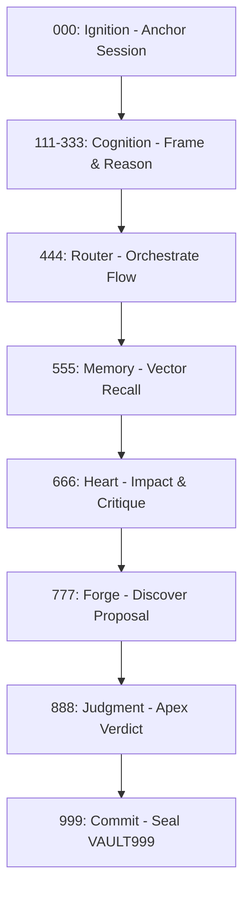

# arifOS - DITEMPA, BUKAN DIBERI

*The system that knows because it admits what it cannot know.*

**ARIF mnemonic:** **A**nchor -> **R**eflect -> **I**ntegrate -> **F**orge. This 4-band kernel runs alongside Trinity engines (Delta/Omega/Psi) and the 13 constitutional Floors (F1-F13).

If you're new here, think of arifOS as a **constitutional safety system** for AI. It acts as a **Constitutional Kernel**—meaning it loads a strict set of ethical rules (the 13 Floors) into an AI before it's allowed to take any actions or talk to users.

> **F7 Humility Notice:** arifOS minimizes hallucination and unsafe actions via F2 Truth (τ≥0.99) and F4 Clarity constraints. It does not guarantee perfect detection—see [known limitations](./governance#limitations).

*For experts: arifOS governs AI cognition by loading an entire runtime environment (000->999) between LLMs and real-world tools, featuring thermodynamic grounding via the APEX realization engine.*

## The Execution Model

When you call `init_anchor_state`, arifOS does not just start a session; it **boots the constitutional kernel**. This process:
1.  **Injects System Prompts**: Loads a persistent set of 13-floor instructions and thermodynamic constraints into the agent's context.
2.  **Sets Governance State**: Transitions the environment from a passive oracle to a governed runtime.
3.  **Binds Tool Logic**: Ensures all subsequent tool calls (`reason_mind_synthesis`, `apex_judge_verdict`, etc.) are intercepted by the loaded kernel.

## How arifOS Thinks (The Cognitive Cycle)

arifOS is not a simple filter; it's a careful step-by-step process. Every request flows through this cycle:



## Technical Glossary (Symbolic to Operational)

| Symbolic Name | Technical Alias | Operational Meaning |
| :--- | :--- | :--- |
| **13 Floors** | `governance_rules` | Invariant constraints enforced at L0. |
| **333 Axioms** | `reasoning_constraints` | Heuristics for AGI logic grounding. |
| **APEX-G Stack** | `metabolic_assembly` | The canonical 10-tool realization pipeline. |
| **Eureka Forge** | `action_actuator` | The sandboxed execution environment. |
| **Vault999** | `tamper_evident_ledger` | Hash-chained decision database with application-level integrity. |

## Canonical runtime

- Python: `>=3.12`
- Module: `arifosmcp.runtime`
- Transports: `stdio`, `http`
- MCP surface: 10 metabolic tools, 8 resources, 8 prompts
- MCP protocol (current): `2025-11-25`
- Supported protocol versions: `2025-11-25`, `2025-03-26`

## Quick start

```bash
pip install arifos

# Local clients (Claude Desktop / Cursor)
python -m arifosmcp.runtime stdio

# Remote HTTP runtime (Production)
HOST=0.0.0.0 PORT=8080 python -m arifosmcp.runtime http
```

Live endpoints:

- MCP HTTP: `https://arifosmcp.arif-fazil.com/mcp`
- Dashboard: `https://arifosmcp.arif-fazil.com/dashboard/`
- Health: `https://arifosmcp.arif-fazil.com/health`

## The 10 Metabolic Tools

1. `init_anchor_state` (000)
2. `integrate_analyze_reflect` (111)
3. `reason_mind_synthesis` (333)
4. `metabolic_loop_router` (444)
5. `vector_memory_store` (555)
6. `assess_heart_impact` (666A)
7. `critique_thought_audit` (666B)
8. `quantum_eureka_forge` (777)
9. `apex_judge_verdict` (888)
10. `seal_vault_commit` (999)

## Governance verdicts (How safe is it?)

When arifOS finishes evaluating an AI's thought or action, it returns one of these verdicts. You can see these happening in real-time on our [APEX Sovereign Dashboard](https://arifosmcp.arif-fazil.com/dashboard/).

- **✅ `SEAL`** - Approved. The action passed all 13 constitutional tests and the APEX realization gate.
- **🟡 `PARTIAL`** - Approved with constraints.
- **⚠️ `SABAR`** - Hold/Refine. The AI was hallucinating or taking risks; it must pause and retry.
- **❌ `VOID`** - Blocked. A hard rule (like factual truth or anti-hacking) was violated.
- **🛑 `HOLD-888`** - Mandatory human ratification. The AI is attempting a high-risk action and needs your cryptographic permission.

Continue with:

- [MCP Server Reference](./mcp-server)
- [Trinity Metabolic Loop](./trinity-metabolic-loop)
- [Governance & Floors](./governance)
- [Deployment Guide](./deployment)
