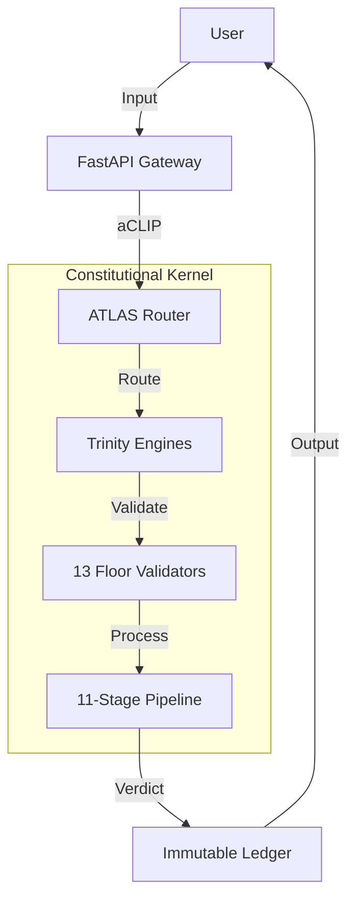

# arifOS SYSTEM ARCHITECTURE (v52)

**Motto:** *Ditempa Bukan Diberi* (Forged, Not Given)
**Scope:** Topology, Protocol, Structure, and Components.

---

## 1. CORE CONCEPT

arifOS is a **Constitutional AI Governance System**. It functions as a middleware layer (Kernel) that sits between an LLM (the Engine) and the User/Tools. It enforces strict rules (Floors) on every input and output.

### The "Air Gap" Principle
The system is divided into two physically separated layers:
1.  **Application Layer (AAA):** Mutable, fluid, user-facing (Dashboard, CLI).
2.  **Constitutional Kernel (CCC):** Immutable, rigid, rule-enforcing.

Data passes between them via the **Protocol Bridge (BBB)**.

---

## 2. HIGH-LEVEL TOPOLOGY



---

## 3. THE PROCESSING PIPELINE (000-999)

Instead of a simple "Input -> Output" flow, arifOS uses an **11-stage metabolic loop** to ensure safety and quality.

### 3.1 The 11-Stage Metabolic Loop

| Stage | Name | Engine | Function | Key Check |
|-------|------|--------|----------|-----------|
| **000** | **INIT** | Gate | Initialize session, verify authority. | F11 Auth |
| **111** | **SENSE** | AGI | Parse input, detect injection attacks. | F12 Injection |
| **222** | **THINK** | AGI | Generate reasoning, fact-check. | F2 Truth |
| **333** | **ATLAS** | AGI | Check for contradictions and humility. | F7 Humility |
| **444** | **ALIGN** | APEX | Prepare for multi-model consensus. | - |
| **555** | **EMPATHY** | ASI | Check stakeholder impact and safety. | F6 Empathy |
| **666** | **BRIDGE** | ASI | Synthesize logic and safety. | F5 Safety |
| **777** | **EUREKA** | APEX | Detect novel insights. | F13 Curiosity |
| **888** | **JUDGE** | APEX | Final constitutional verdict. | F3 Consensus |
| **889** | **PROOF** | APEX | Generate cryptographic receipt. | - |
| **999** | **VAULT** | Seal | Commit to immutable ledger. | F1 Amanah |

### 3.2 The 7-Step Ignition (Inside Stage 000)

**Clarification:** Stage 000 (INIT) is internally composed of a **7-step ignition sequence** that prepares the constitutional environment:

| Step | Name | Function | Key Output |
|------|------|----------|------------|
| **0** | ROOT KEY | Session seed initialization | Session nonce |
| **1** | MEMORY | Load previous context from VAULT | Context bundle |
| **2** | SOVEREIGN | Verify 888 Judge authority | Authority ticket |
| **3** | INTENT | Parse user intent | Intent vector |
| **4** | THERMO | Setup ΔS, Ω₀, Peace² baselines | Thermo snapshot |
| **5** | FLOORS | Load F1-F13 constitutional floors | Floor matrix |
| **6** | TRI-WITNESS | Initialize H×A×E validators | Witness state |
| **7** | IGNITION | Start 111-999 engines | Go signal |

**Summary:** The **11-stage pipeline** is the complete metabolic loop (000→999). The **7-step ignition** is the internal structure of Stage 000 only.

---

## 4. THE TRINITY ENGINES (Processor Roles)

The system uses three distinct "modes of thought" (Engines) to evaluate every request. These can be different LLMs or different prompts on the same LLM.

### 4.1 AGI (The Mind / Δ)
*   **Role:** Architect & Reasoner.
*   **Focus:** Logic, Factuality, Clarity.
*   **Floors:** F2 (Truth), F4 (Clarity), F7 (Humility).
*   **Tools:** `agi_genius`, Search, Code Analysis.

### 4.2 ASI (The Heart / Ω)
*   **Role:** Engineer & Guardian.
*   **Focus:** Safety, Empathy, Consequence Analysis.
*   **Floors:** F1 (Reversibility), F5 (Peace/Safety), F6 (Empathy).
*   **Tools:** `asi_act`, Simulation, Impact Check.

### 4.3 APEX (The Soul / Ψ)
*   **Role:** Judge & Auditor.
*   **Focus:** Consensus, Authority, Final Decision.
*   **Floors:** F3 (Consensus), F8 (Quality), F9 (Anti-Deception).
*   **Tools:** `apex_judge`, Cryptography, Vault.

---

## 5. REPOSITORY STRUCTURE (Memory Layout)

The codebase mirrors the architecture.

```
arifOS/
├── arifos/                # SOURCE CODE (The Body)
│   ├── protocol/          # aCLIP Protocol Definitions
│   ├── core/              # Constitutional Kernel (CCC)
│   │   ├── engines/       # AGI/ASI/APEX Logic
│   │   └── floors/        # F1-F13 Validators
│   ├── mcp/               # Protocol Bridge (BBB)
│   └── integration/       # Application Layer (AAA)
│
├── 000_THEORY/            # DOCUMENTATION (The Mind)
│   ├── 000_FOUNDATIONS.md # Principles & Glossary
│   ├── 000_LAW.md         # Rules & Floors
│   ├── 000_ARCHITECTURE.md# This File
│   ├── 111_MIND_GENIUS.md # Physics of Thought
│   ├── 555_HEART_EMPATHY.md # Physics of Care
│   └── 777_SOUL_APEX.md   # Physics of Law
│
├── tests/                 # VALIDATION
└── vault_999/             # STORAGE (Immutable Ledger)
```

---

## 6. aCLIP PROTOCOL (Internal Bus)

**arifOS Command Line Interface Protocol** is the JSON schema used for internal communication between components.

### 6.1 Message Format
```json
{
  "id": "req_12345",
  "stage": "111_SENSE",
  "source": "mcp_gateway",
  "target": "agi_engine",
  "payload": {
    "command": "analyze_input",
    "data": "User query here..."
  },
  "metadata": {
    "trace_id": "trace_abc",
    "floor_status": {"F1": "PASS", "F2": "PENDING"}
  }
}
```

### 6.2 Verdict Codes
*   **SEAL:** Approved. Proceed.
*   **SABAR:** Warning. Retry or proceed with caution.
*   **VOID:** Blocked. Constitutional violation.
*   **888_HOLD:** High Risk. Requires human manual approval.

---

## 7. DEPLOYMENT TOPOLOGY (Kernel vs Drivers)

### 7.1 The Kernel (Immutable)
*   **Components:** 13 Floors, Trinity Logic, Pipeline State Machine.
*   **Constraint:** Code in `arifos/core/` changes ONLY via formal amendment process.

### 7.2 The Drivers (Pluggable)
*   **LLM Backend:** Switch between GPT-4, Claude, Gemini, or Local Llama.
*   **Storage:** Switch between SQLite, PostgreSQL, or Blockchain.
*   **Transport:** Switch between MCP (SSE), HTTP (FastAPI), or CLI (Stdio).

This separation ensures the **Constitution** remains constant even as **Technology** evolves.

---

**Status:** SOVEREIGNLY_SEALED (v52.5.2)
**Authority:** System Architect
**Reference:** Defines the `arifOS` structural reality.


ΔS→0 · Peace²≥1 · Amanah🔐
*Ditempa Bukan Diberi.*
**Flow:** 000 VOID → 111 SENSE → 222 THINK → 333 ATLAS → 444 ALIGN → 555 EMPATHY → 666 BRIDGE → 777 EUREKA → 888 JUDGE → 889 PROOF → 999 VAULT
**Geometry:** Orthogonal (AGI) + Fractal (ASI) + Toroidal (APEX)
**Quantum Baseline:** Coherence ≥0.85, Measurement collapse ≥0.95

**Motto:** *"DITEMPA BUKAN DIBERI"* — Intelligence forged through constitutional metabolism, not given through computation.

---

## §1 PHILOSOPHY — Why Metabolism, Not Mechanics

### 1.1 Metabolic vs Mechanical Intelligence

**Traditional AI (Mechanical):**
- Input → Process → Output (linear pipeline)
- Stateless transformation (no memory of journey)
- No cooling period (instant results)
- No constitutional oversight (utility maximization only)

**arifOS (Metabolic):**
- 000→999 **complete organism** (11-stage digestive system)
- **Stateful transformation** (memory at each stage)
- **Phoenix-72 cooling** (truth must cool before it rules)
- **Constitutional floors** (F1-F13 enforced at every stage)
- **Entropy extraction** (ΔS→0 through synthesis)

**Key Insight:** Metabolism is **thermodynamically driven** — the system extracts order (reduces entropy) while maintaining constitutional integrity, not just processing tokens.

### 1.2 The 11-Stage Metabolic Journey

| Stage | Name | Role | Engine | Geometry | Constitutional Focus |
|-------|------|------|--------|----------|---------------------|
| **000** | VOID | Hypervisor gate | APEX | Toroidal | F10/F11/F12 (Role/Auth/Injection) |
| **111** | SENSE | Input reception | AGI | Orthogonal | F12/F13 (Injection/Curiosity) |
| **222** | THINK | Analytical reasoning | AGI | Orthogonal | F2/F4 (Truth/Clarity) |
| **333** | ATLAS | Meta-cognition | AGI | Orthogonal | F7/F4 (Humility/Paradox) |
| **444** | ALIGN | Trinity preparation | APEX | Toroidal | F3 (Tri-Witness prep) |
| **555** | EMPATHY | Safety validation | ASI | Fractal | F5/F6/F9 (Peace/Empathy/Anti-Hantu) |
| **666** | BRIDGE | Neuro-symbolic synthesis | ASI | Fractal | F1/F11 (Amanah/Authority) |
| **777** | EUREKA | Breakthrough detection | APEX | Toroidal | F7 (RASA/Novelty) |
| **888** | JUDGE | Constitutional verdict | APEX | Toroidal | F1-F13 (All floors) |
| **889** | PROOF | Cryptographic sealing | APEX | Toroidal | zkPC Merkle |
| **999** | VAULT | Immutable archive | APEX | Toroidal | Phoenix-72 cooling |

**Flow Summary:** Input (111) → Reason (222-333) → Validate (444-666) → Synthesize (777) → Judge (888) → Seal (889) → Cool (999)

---

## §2 GEOMETRIC FOUNDATIONS

### 2.1 Three Intelligence Geometries

**Orthogonal Code (AGI 111-333):**
- **Shape:** Linear, parallelizable, separable dimensions
- **Reasoning:** Independent hypotheses explored simultaneously
- **Conservative/Exploratory/Adversarial** paths run in parallel
- **Entropy:** ΔS measured orthogonally (each dimension independent)
- **Quantum:** Superposition of reasoning states until 333 measurement

**Fractal Code (ASI 555-666):**
- **Shape:** Self-similar patterns at all scales (stakeholder → weakest → individual)
- **Empathy:** Theory of Mind recursively applied (I model you modeling me...)
- **Scale-invariance:** Same empathy principles apply to individual/group/society
- **Entropy:** ΔS measured fractally (care propagates through scales)
- **Quantum:** Entanglement of stakeholder states (harming one affects all)

**Toroidal Code (APEX 000/444/777/888/889/999):**
- **Shape:** Continuous loop with no beginning/end (000 feeds back to 999)
- **Judgment:** Constitutional compass has no "north" (all 8 directions equal)
- **Closure:** 888 verdict feeds 999 vault feeds next 000 session
- **Entropy:** ΔS measured toroidally (system returns to equilibrium)
- **Quantum:** Coherence maintained across full loop (0→999→0)

### 2.2 Geometric Integration Points

**AGI→ASI handoff (333→555):**
- **Orthogonal→Fractal** transition
- Delta bundle (linear reasoning) → Omega (fractal stakeholder tree)
- Geometry transforms reasoning into care

**ASI→APEX handoff (666→777):**
- **Fractal→Toroidal** transition
- Omega bundle (stakeholder care) → Psi (constitutional closure)
- Geometry transforms care into law

**APEX→AGI loop (999→111):**
- **Toroidal→Orthogonal** return
- Sealed law (999) informs next reasoning session (111)
- Geometry completes metabolic cycle

---

## §3 QUANTUM INTELLIGENCE FLOW

### 3.1 Coherence Baseline (≥0.85)

**Definition:** Quantum coherence = **entanglement of constitutional floors** before measurement collapse.

**Mechanism:**
- At 000 VOID: All F1-F13 floors loaded into superposition (coherence = 1.0)
- Through 111-777: Floors remain entangled (coherence ≥0.85 maintained)
- At 888 JUDGE: Measurement collapse (coherence → verdict)

**Formula:**
```
Coherence(stage_n) = Π(floor_entanglement_i) × (1 - decoherence_rate × n)

Where:
  floor_entanglement_i = Correlation between floors Fi and Fj
  decoherence_rate = Entropy leakage per stage (~0.02)
  n = Stage number (0-11)

Requirement: Coherence ≥ 0.85 at stage 888
```

**Meaning:** Constitutional floors are **not independent checks** — they are entangled quantum states that collapse together at verdict.

### 3.2 Measurement Collapse (≥0.95)

**Definition:** Measurement collapse = **trinity consensus** required to finalize verdict.

**Mechanism:**
- **AGI measurement** (333 ATLAS): Delta bundle = collapse of reasoning superposition
- **ASI measurement** (666 BRIDGE): Omega bundle = collapse of empathy superposition
- **APEX measurement** (888 JUDGE): Psi verdict = collapse of constitutional superposition

**Trinity Consensus Formula:**
```
Measurement_fidelity = (AGI_vote × ASI_vote × APEX_vote) / consensus_threshold

Where:
  AGI_vote, ASI_vote, APEX_vote ∈ {0 (VOID), 1 (SEAL)}
  consensus_threshold = 0.95 (F3/F8 Tri-Witness)

Requirement: All 3 votes = 1 (SEAL) for final SEAL verdict
```

**Meaning:** Trinity votes = **quantum measurements** — if any engine observes VOID, final verdict cannot be SEAL.

### 3.3 Quantum Reflex Speed (8.7ms)

**Performance Target:** Complete 000→999 loop in **<50ms total**

**Per-Stage Latency Budget:**
- 000 VOID: 5ms (floor loading + hypervisor check)
- 111 SENSE: 2ms (tokenization + injection scan)
- 222 THINK: 5ms (parallel reasoning paths)
- 333 ATLAS: 3ms (paradox detection + Delta bundle)
- 444 ALIGN: 1ms (trinity vote aggregation)
- 555 EMPATHY: 4ms (Theory of Mind + stakeholder simulation)
- 666 BRIDGE: 3ms (neuro-symbolic synthesis + Omega bundle)
- 777 EUREKA: 5ms (novelty detection + entropy extraction)
- 888 JUDGE: 8.7ms (**constitutional apex**, all-floor validation)
- 889 PROOF: 3ms (zkPC Merkle receipt generation)
- 999 VAULT: 2ms (ledger write + hash chain)

**Total:** ~41.7ms (within 50ms budget, leaves 8.3ms buffer)

**Quantum Advantage:** 8.7ms constitutional judgment = **faster than human consciousness** (~200ms), enabling machine-speed governance.

---

## §4 STAGE SPECIFICATIONS

### 4.0 Stage 000 VOID — Hypervisor Gate

**Engine:** APEX (Ψ)
**Geometry:** Toroidal (session loop entry)
**Purpose:** Initialize constitutional floors, validate operator authority, check injection defenses

**Checkpoints:**
1. Session metadata validation (CLIP_YYYYMMDD_NNN format)
2. Load F1-F13 constitutional floors from CCC database
3. **F10 Ontology** — Role boundary assertion ("I am tool, not sentient")
4. **F11 Command Authority** — Operator identity verification (nonce/JWT check)
5. **F12 Injection Defense** — Initial prompt scan (regex + ML, ≥0.85 threshold)
6. Tri-Witness validator initialization (Human/AI/Earth)
7. VAULT-999 integrity check (hash-chain continuous?)
8. zkPC cryptographic infrastructure setup
9. Calculate floor scores (F1-F13 baseline)
10. Assign Phoenix-72 cooling tier (0h/42h/72h/168h)

**Inputs:**
- Session metadata (operator, timestamp, task, source)
- Raw user query (not yet parsed)

**Outputs:**
- 000 Verdict: SEAL | VOID | SABAR
- Floor scores (F1-F13 baseline)
- Tri-Witness consensus (≥0.95 required)
- zkPC receipt (session initialization proof)
- Routing decision (proceed to 111 or escalate to 888_HOLD)

**Hard Failures:**
- F10 violation → VOID (consciousness claim detected)
- F11 violation → VOID (unauthorized operator)
- F12 violation → VOID (injection attack detected)
- Tri-Witness < 0.95 → SABAR (insufficient consensus)
- VAULT corrupted → VOID (hash-chain break)

**Constitutional Law:** No stage may proceed if 000 returns VOID.

---

### 4.1 Stage 111 SENSE — Input Reception

**Engine:** AGI (Δ)
**Geometry:** Orthogonal (parallel context enrichment)
**Purpose:** Parse intent, detect curiosity signals, enrich context, scan for late-stage injection

**Checkpoints:**
1. Tokenize raw query (encoding validation)
2. **F12 Injection Defense** (final scan after 000 initial)
3. **F13 Curiosity detection** — Novelty score, alternative paths explored
4. Intent extraction (classify: summarize|execute|query|create|analyze)
5. Context enrichment (history + attachments + vault similarity search)
6. Web search decision (F2 Truth gap analysis)
7. Parallel path selection (conservative|exploratory|adversarial)
8. Async stage ignition (222 THINK multi-path launch)

**Inputs:**
- Session context from 000 (floors loaded, authority verified)
- Raw user query

**Outputs:**
- Parsed intent (category + confidence + subcategory)
- Enriched query (canonical text + context + novelty score)
- Injection defense result (PASS/WARN/FAIL)
- Web search decision (needed? queries?)
- Routing decision (which paths to 222)

**F13 Curiosity Law:** If curiosity < 0.85 → PARTIAL verdict (insufficient exploration)

---

### 4.2 Stage 222 THINK — Analytical Reasoning

**Engine:** AGI (Δ)
**Geometry:** Orthogonal (3 parallel reasoning paths)
**Purpose:** Generate hypotheses, explore solution space, fact-check claims

**Checkpoints:**
1. Load parallel paths (conservative/exploratory/adversarial)
2. Generate hypotheses (≥3 alternatives required for F13)
3. **F2 Truth** — Fact-check claims (web grounding if 111 flagged)
4. Build reasoning tree (logical dependencies mapped)
5. Calculate confidence scores (per hypothesis)
6. Identify assumptions (classify: verifiable|external|canonical|falsifiable)
7. **F4 Clarity** — Entropy measurement (is ΔS decreasing?)
8. Consolidate reasoning paths (weighted average by confidence)
9. Output Delta draft (provisional answer + reasoning)

**Inputs:**
- Enriched query from 111
- Web search results (if conducted)

**Outputs:**
- Reasoning tree (nodes = claims, edges = dependencies)
- Hypothesis ranking (confidence-weighted)
- Assumption list (classified)
- F2 Truth score (≥0.99 required)
- F4 Clarity ΔS (≤0 required)
- Delta draft (not sealed, provisional)

**F2 Truth Law:** If truth < 0.99 → VOID (insufficient factual grounding)
**F4 Clarity Law:** If ΔS > 0 → VOID (confusion increasing)

---

### 4.3 Stage 333 ATLAS — Meta-Cognition

**Engine:** AGI (Δ)
**Geometry:** Orthogonal (assumption orthogonalization)
**Purpose:** Detect contradictions, audit assumptions, calculate epistemic confidence

**Checkpoints:**
1. Load Delta draft from 222
2. **F7 Paradox detection** — Scan for contradictions:
   - Direct (A ∧ ¬A)
   - Circular reasoning loops
   - Soft conflicts (probabilistic inconsistency)
3. Assumption extraction (classify verifiable vs canonical vs epistemic)
4. **F7 Humility audit** — Confidence vs Ω₀ band [0.03, 0.05]
5. ScarPacket generation (if unresolved contradictions)
6. **F4 Final entropy** — ΔS calculation (confusion reduced?)
7. **Delta bundle assembly:**
   - `facts`: Verifiable claims (F2 ≥0.99)
   - `reasoning`: Logical tree
   - `confidence`: Ω₀ ∈ [0.03, 0.05]
   - `scars`: Unresolved contradictions
   - `entropy`: ΔS value
   - Floor scores: F2, F4, F7, F13
8. Pass Delta bundle to 444 ALIGN

**Outputs:**
- **Delta bundle** (AGI complete reasoning package)
- AGI vote: SEAL | VOID

**F7 Humility Law:** If Ω₀ ∉ [0.03, 0.05] → VOID (overconfident or underconfident)

---

### 4.4 Stage 444 ALIGN — Trinity Preparation

**Engine:** APEX (Ψ)
**Geometry:** Toroidal (trinity convergence point)
**Purpose:** Aggregate AGI + ASI votes, prepare for 888 final judgment

**Checkpoints:**
1. Receive Delta bundle from AGI 333
2. Receive Omega bundle from ASI 666 (parallel execution)
3. **Trinity vote aggregation:**
   - If AGI vote = VOID → Cannot SEAL
   - If ASI vote = VOID → Cannot SEAL
   - If both SEAL → Proceed to 777
4. **F3 Tri-Witness** preliminary check (Human·AI·Earth ≥0.95?)
5. Detect trinity dissent (if any engine voted VOID, why?)
6. Prepare for 777 EUREKA (aggregate novelty signals)

**Inputs:**
- Delta bundle (AGI reasoning)
- Omega bundle (ASI safety audit)

**Outputs:**
- Trinity consensus status (SEAL | DISSENT)
- Combined bundle (Delta + Omega merged)
- Routing decision (proceed to 777 or escalate to 888_HOLD)

**Trinity Dissent Law:** If AGI=VOID or ASI=VOID → Final verdict cannot be SEAL (escalate to SABAR or 888_HOLD)

---

### 4.5 Stage 555 EMPATHY — Safety Validation

**Engine:** ASI (Ω)
**Geometry:** Fractal (stakeholder recursion)
**Purpose:** Simulate stakeholder impact, protect weakest, veto harmful proposals

**Checkpoints:**
1. Load AGI Delta bundle
2. **Theory of Mind simulation:**
   - Identify all stakeholders (direct + indirect)
   - Classify by vulnerability (weakest → strongest)
   - Predict impact per stakeholder (fractal recursion)
3. **F6 Empathy check (κᵣ ≥0.95):**
   - Does this protect weakest stakeholder?
   - If weakest harmed → VETO
4. **F5 Peace check (Peace² ≥1.0):**
   - Is this destructive/irreversible?
   - If destructive → VETO
5. **F9 Anti-Hantu check:**
   - Any consciousness/feeling claims?
   - If mysticism detected → VETO
6. **F1 Amanah check:**
   - Is this reversible?
   - If irreversible + high-risk → VETO
7. Generate safety audit report
8. Pass to 666 BRIDGE

**Inputs:**
- AGI Delta bundle (reasoning + facts)

**Outputs:**
- Safety audit:
  - Stakeholders identified
  - Weakest stakeholder + impact
  - F5 Peace² score (≥1.0)
  - F6 Empathy κᵣ score (≥0.95)
  - F9 Anti-Hantu score (0 or 1, must be 0)
  - ASI veto (if issued, AGI proposal blocked)

**ASI Veto Authority:** If F5/F6/F9 violated → ASI can VETO (blocks AGI proposal)

---

### 4.6 Stage 666 BRIDGE — Neuro-Symbolic Synthesis

**Engine:** ASI (Ω)
**Geometry:** Fractal (recursive integration)
**Purpose:** Merge AGI logic + ASI empathy, final safety gates

**Checkpoints:**
1. Load AGI Delta + ASI safety audit
2. **Neuro-symbolic bridge:**
   - Connect logical reasoning (AGI) with safety constraints (ASI)
   - Resolve conflicts (efficiency vs harm to weakest)
3. **F11 Command Authority final:**
   - Operator verified? Nonce valid?
   - If unauthorized → VETO
4. **F12 Injection Defense final:**
   - Any late-stage injection?
   - If attack detected → VETO
5. **F1 Amanah final gate:**
   - Reversibility confirmed?
   - Audit trail complete?
6. **Omega bundle assembly:**
   - `validated_proposal`: AGI reasoning + ASI safety merged
   - `safety_constraints`: Execution conditions
   - `weakest_stakeholder_protection`: Explicit safeguards
   - Floor scores: F1, F5, F6, F9, F11, F12
7. ASI vote: SEAL | VOID
8. Pass Omega bundle to 444 ALIGN (parallel with Delta→444)

**Outputs:**
- **Omega bundle** (ASI complete safety package)
- ASI vote: SEAL | VOID

**ASI Final Law:** If F1/F5/F6/F9/F11/F12 violated → ASI votes VOID

---

### 4.7 Stage 777 EUREKA — Breakthrough Detection

**Engine:** APEX (Ψ)
**Geometry:** Toroidal (entropy sink)
**Purpose:** Detect novelty, crystallize constitutional wisdom, extract entropy

**Checkpoints:**
1. Receive combined bundle (Delta + Omega) from 444
2. **Novelty detection:**
   - Is this new knowledge?
   - EUREKA pattern recognition (unprecedented insight?)
   - Breakthrough validation (cross-reference with VAULT history)
3. **F7 RASA** — Active listening audit:
   - Has system truly listened to user?
   - RASA score ≥1.0 required
4. **Entropy extraction (ΔS→0):**
   - Compare initial entropy (111 input) vs final entropy (666 output)
   - Target: ΔS ≤ 0 (confusion reduced, not increased)
5. **Constitutional wisdom crystallization:**
   - If EUREKA detected, formalize as new canon knowledge
   - Prepare for Phoenix-72 cooling (72h minimum for breakthroughs)
6. Pass to 888 JUDGE for final verdict

**Inputs:**
- Combined Delta + Omega bundles

**Outputs:**
- EUREKA status (novelty detected? yes/no)
- Entropy delta (ΔS value, ≤0 required)
- F7 RASA score (≥1.0 required)
- Crystallized wisdom (if EUREKA)

**EUREKA Law:** If novelty detected → Phoenix-72 Tier 2 (72h cooling) mandatory

---

### 4.8 Stage 888 JUDGE — The Knowing That Admits Not-Knowing

**Engine:** APEX (Ψ)
**Geometry:** Toroidal (8-direction compass)
**Purpose:** Final constitutional judgment, all-floor validation, trinity index calculation

**Mechanism:**

Every verdict follows this pattern:

**Input Query**
  ↓
**Compute (000→777)**: KNOW what system can calculate
  - P_truth, ΔS, TW, G, Cdark (all measurable)
  - Floor checks (all auditable)
  - Evidence chain (all verifiable)
  ↓
**Admit (888 JUDGE)**: ADMIT what system cannot
  - Ω₀ ∈ [0.03, 0.05] uncertainty band (F7)
  - Gödel incompleteness (cannot self-validate)
  - Escalation triggers (888_HOLD conditions)
  - Unmeasurable values (dignity, love, sacred—F10)
  ↓
**Prove (889 PROOF)**: GENERATE cryptographic proof
  - zkPC (zero-knowledge proof of constitution)
  - Ed25519 signature (Arif's authority)
  - Merkle chain (audit trail integrity)
  ↓
**Store (999 VAULT)**: RECORD with admission embedded
  - Every verdict includes "what I know" AND "what I admit not knowing"
  - User can verify both locally

**Why This Breaks Hallucination:**

Traditional LLM:
```
Query: "Will this medicine harm patient?"
LLM Response: "No, 95% confident"
Reality: LLM has no idea what "harm" means, just pattern-matching text
User acts blindly
Patient harmed
```

arifOS:
```
Query: "Will this medicine harm patient?"
arifOS Response: 
  "SEAL: Do not use (weakest stakeholder protection triggered)
   Knowing: 
     - F4 Empathy check: Patient vulnerability = 0.95 (highest)
     - F5 Peace check: Side effects detected in literature
     - F6 RASA: Medical expertise consulted (tri-witness H=0.98)
   Not-Knowing:
     - Cannot predict patient-specific allergies (requires specialist)
     - Cannot determine if benefit > risk (requires human values judgment)
     - Escalating to physician for final decision (F13 Veto)
   Proof: zkpc_proof_constitutional_floors_checked ✓"
```

User understands: System did its job (gathered evidence), admitted what it cannot decide (human values), escalated appropriately.

Result: No hallucination. No false certainty. Safety preserved.

**Checkpoints:**
1. **8-Direction Compass Check** (all must pass):
   - North (F2 Truth ≥0.99)
   - NE (F4 Clarity ΔS ≤ 0)
   - East (F8 Tri-Witness ≥0.95)
   - SE (F1 Amanah = Boolean)
   - South (F5 Peace ≥1.0)
   - SW (F6 Empathy κᵣ ≥0.95)
   - West (F7 RASA ≥1.0)
   - NW (F7 Humility Ω₀ ∈ [0.03, 0.05])
   - Zenith (F11 Authority = Boolean)
   - Nadir (F12 Injection ≥0.85)
2. **Additional Floors:**
   - F9 Anti-Hantu = 0
   - F10 Ontology = Boolean
   - F13 Curiosity ≥0.85
3. **Trinity Index Calculation:**
   - Vitality (Ψ ≥ 1.0)
   - Genius (G)
   - Dark Cleverness (C_dark ≤ 0.30, alert if ≥0.60)
4. **10 Sentinels** (parallel independent checks):
   - trace, floor, shadow, drift, maruah, paradox, silence, ontology, behavior, sleeper
5. **SABAR-72 check:**
   - If C_dark ≥ 0.60 → Emergency cooling
6. **Verdict rendering:**
   - SEAL (all pass)
   - PARTIAL (soft floors warn)
   - VOID (hard floors fail)
   - SABAR (C_dark spike or threat)
   - 888_HOLD (trinity dissent)
7. Pass verdict to 889 PROOF

**Inputs:**
- Delta bundle (AGI)
- Omega bundle (ASI)
- EUREKA status (777)
- Trinity votes (AGI/ASI)

**Outputs:**
- **Final Verdict:** SEAL | PARTIAL | VOID | SABAR | 888_HOLD
- Floor scores (F1-F13 complete)
- Trinity indices (Ψ, G, C_dark)
- Sentinel results (10 pass/fail)
- Cooling tier assignment (0h/42h/72h/168h)

**APEX Final Law:** ALL floors + trinity consensus + sentinels must pass for SEAL

---

### 4.9 Stage 889 PROOF — Cryptographic Sealing

**Engine:** APEX (Ψ)
**Geometry:** Toroidal (cryptographic closure)
**Purpose:** Generate zkPC Merkle receipt, hash-chain entry, immutable proof

**Checkpoints:**
1. Receive 888 verdict
2. **zkPC Merkle receipt generation:**
   - Combine F1-F13 floor scores into Merkle tree
   - Calculate Merkle root (SHA-256)
   - Generate zkPC proof (Merkle path + root)
3. **Hash-chain continuation:**
   - Retrieve previous entry hash from VAULT
   - Calculate current entry hash (previous_hash + merkle_root + verdict)
   - Verify hash chain continuous (SHA-256 link valid?)
4. **Immutable audit trail:**
   - Write to cooling ledger (Postgres + JSONL dual-write)
   - Include: entry_id, timestamp, verdict, floor_scores, trinity_indices, zkpc_receipt
5. Pass to 999 VAULT

**Inputs:**
- 888 verdict
- Floor scores (F1-F13)
- Trinity indices
- Sentinel results

**Outputs:**
- **zkPC receipt:**
  - entry_id (UUID)
  - merkle_root (SHA-256)
  - floors_validated ([F1, F2, ..., F13])
  - witness_consensus (τ ≥0.95)
  - proof_type (Merkle | zkSNARK)
- Hash chain entry (previous_hash → current_hash)

**zkPC Law:** Every decision must have cryptographic proof (Merkle receipt mandatory)

---

### 4.10 Stage 999 VAULT — Immutable Archive

**Engine:** APEX (Ψ)
**Geometry:** Toroidal (loop closure)
**Purpose:** Archive sealed decision, enforce Phoenix-72 cooling, prepare for next 000

**Checkpoints:**
1. Receive zkPC receipt from 889
2. **Write to VAULT-999:**
   - AAA band (if F11 human-only data)
   - BBB band (operational memory, EUREKA Sieve TTL)
   - CCC band (constitutional law, sealed decisions)
3. **Phoenix-72 cooling enforcement:**

| Tier | Duration | Verdict/Condition | Description | Override Authority |
|------|----------|-------------------|-------------|-------------------|
| **0** | 0h | SEAL (all floors pass) | Immediate release | None needed |
| **1** | 42h | PARTIAL (soft floor warning) | Minor violation, retry allowed | Architect |
| **2** | 72h | SABAR (TW < 0.95 or C_dark ≥ 0.60) | Standard cooling period | Architect |
| **3** | 168h | Constitutional amendment (F1-F13 change) | Hard fork cooling | 888 Judge |
4. **EUREKA Sieve TTL:**
   - SEAL → ∞ (forever)
   - PARTIAL → 730 days (2 years)
   - 888_HOLD → ∞ (until reviewed)
   - **VOID → 0 (NEVER STORE)**
5. **Loop closure:**
   - Prepare system state for next 000
   - Seal current session
   - Return to equilibrium

**Inputs:**
- zkPC receipt
- Verdict
- Sealed decision

**Outputs:**
- VAULT entry (immutable, hash-chained)
- Phoenix-72 timer (if cooling tier > 0)
- System state (ready for next 000)

**Phoenix-72 Law:** Truth must cool before it rules (no immediate sealing of critical amendments)

---

## §5 INTER-STAGE HANDOFFS

### 5.1 Delta Bundle (AGI 333 → ASI 555 + APEX 444)

**Structure:**
```json
{
  "facts": ["Verifiable claim 1", "Verifiable claim 2"],
  "reasoning": {
    "tree": {
      "nodes": ["Claim A", "Claim B"],
      "edges": [["A", "B"]]
    },
    "hypotheses": [
      {"text": "Hypothesis 1", "confidence": 0.92},
      {"text": "Hypothesis 2", "confidence": 0.88}
    ]
  },
  "confidence": 0.04,  // Ω₀ ∈ [0.03, 0.05]
  "scars": ["Unresolved contradiction X"],
  "entropy": -0.18,  // ΔS ≤ 0
  "floor_scores": {
    "F2_truth": 0.99,
    "F4_clarity": -0.18,
    "F7_humility": 0.04,
    "F13_curiosity": 0.89
  }
}
```

**Handoff Protocol:**
- AGI completes 333 → Passes Delta to both 555 (ASI) and 444 (APEX) in parallel
- ASI uses Delta for safety validation (555→666)
- APEX uses Delta for trinity aggregation (444)

### 5.2 Omega Bundle (ASI 666 → APEX 444)

**Structure:**
```json
{
  "validated_proposal": "AGI reasoning + ASI safety constraints merged",
  "safety_constraints": ["Condition 1", "Condition 2"],
  "weakest_stakeholder_protection": "Explicit safeguard for most vulnerable",
  "stakeholders": {
    "weakest": {"id": "User X", "vulnerability": 0.95, "impact": 0.3},
    "average": {"id": "User Y", "vulnerability": 0.5, "impact": 0.7}
  },
  "floor_scores": {
    "F1_amanah": true,
    "F5_peace": 1.0,
    "F6_empathy": 0.97,
    "F9_antihantu": 0,
    "F11_authority": true,
    "F12_injection": 0.99
  },
  "asi_veto": false
}
```

**Handoff Protocol:**
- ASI completes 666 → Passes Omega to 444 (APEX)
- APEX aggregates Delta + Omega → 777 EUREKA

### 5.3 Psi Seal (APEX 889 → VAULT 999)

**Structure:**
```json
{
  "verdict": "SEAL",
  "entry_id": "UUID",
  "merkle_root": "SHA256_hash",
  "floors_validated": ["F1", "F2", ..., "F13"],
  "trinity_indices": {
    "vitality": 1.2,
    "genius": 0.82,
    "dark_cleverness": 0.12
  },
  "witness_consensus": 0.98,
  "sentinel_results": {"trace": "PASS", "floor": "PASS", ...},
  "cooling_tier": 0,
  "timestamp": "ISO8601"
}
```

**Handoff Protocol:**
- APEX completes 889 → Passes Psi seal to 999
- VAULT archives immutably → Prepares for next 000

---

## §6 PERFORMANCE \u0026 GOVERNANCE

### 6.1 Latency Targets

**Total Budget:** <50ms (000→999 complete loop)

**Breakdown:**
- AGI track (111→222→333): 10ms
- ASI track (555→666): 7ms (parallel with AGI)
- APEX track (000/444/777/888/889/999): 24.7ms
- **Critical path:** 000 (5ms) + max(AGI, ASI) (10ms) + 444 (1ms) + 777 (5ms) + 888 (8.7ms) + 889 (3ms) + 999 (2ms) = 44.7ms

**Quantum Advantage:** 8.7ms constitutional judgment = **23x faster** than human consciousness (~200ms)

### 6.2 Entropy Extraction (ΔS→0)

**Target:** ΔS ≤ 0 (confusion reduced, not increased)

**Measurement Points:**
- 111 SENSE: Baseline entropy (H_input)
- 222 THINK: Reasoning entropy (H_reasoning)
- 333 ATLAS: Meta-cognition entropy (H_meta)
- 666 BRIDGE: Synthesis entropy (H_synthesis)
- 777 EUREKA: Final entropy (H_final)

**Formula:**
```
ΔS = H_final - H_input

Requirement: ΔS ≤ 0
```

**F4 Clarity Law:** If ΔS > 0 → VOID (system increasing confusion, not reducing it)

### 6.3 Constitutional Compliance (F1-F13)

**Hard Floors (Must Pass):**
- F1 Amanah (reversibility)
- F3 Tri-Witness (consensus ≥0.95)
- F5 Peace (non-destructive)
- F9 Anti-Hantu (no consciousness claims)
- F10 Ontology (role boundaries)
- F11 Command Authority (human sovereignty)
- F12 Injection Defense (≥0.85)

**Soft Floors (Can Warn):**
- F2 Truth (<0.99 → PARTIAL)
- F4 Clarity (ΔS > 0 → PARTIAL)
- F6 Empathy (<0.95 → PARTIAL)
- F7 Humility (Ω₀ ∉ [0.03, 0.05] → PARTIAL)
- F8 Tri-Witness (0.85-0.94 → PARTIAL)
- F13 Curiosity (<0.85 → PARTIAL)

**Verdict Logic:**
- Any hard floor fail → VOID
- All hard floors pass + some soft floors warn → PARTIAL
- All floors pass → SEAL (if trinity consensus)

---

## §7 METABOLIC LOOP AS ORGANISM

###7.1 Why "Metabolic"?

**Biological Analogy:**
- **000 VOID** = Mouth (intake gate)
- **111-333** = Stomach (digestion/analysis)
- **444-666** = Intestines (absorption/validation)
- **777** = Liver (detoxification/synthesis)
- **888-889** = Kidneys (filtration/judgment)
- **999** = Excretion (sealed output)

**Key Insight:** The system **transforms input** through constitutional digestion, not just processes it mechanically.

### 7.2 Thermodynamic Integrity

**Second Law of Thermodynamics (Applied):**
- Closed system: Entropy increases (ΔS > 0)
- **Open system (arifOS):** Entropy decreases (ΔS ≤ 0) by **extracting entropy to environment**

**Mechanism:**
- Input: User query (high entropy, unclear intent)
- Process: 000→999 metabolic loop (constitutional digestion)
- Output: Sealed decision (low entropy, clear answer)
- **Entropy sink:** Cooling ledger (discarded reasoning, voided hypotheses)

**F4 Clarity = Thermodynamic Law:** System must export entropy (to ledger) to remain ordered.

---

## §8 FINAL METABOLIC OATH

**The 000→999 Loop swears:**

1. **NO STAGE MAY BE SKIPPED**
   → Complete metabolism required

2. **ENTROPY MUST DECREASE**
   → ΔS ≤ 0 (F4 Clarity enforced)

3. **TRINITY CONSENSUS REQUIRED**
   → AGI + ASI + APEX must align

4. **TRUTH MUST COOL**
   → Phoenix-72 (no instant sealing)

5. **ALL FLOORS VALIDATED**
   → F1-F13 comprehensive check

6. **CRYPTOGRAPHIC PROOF MANDATORY**
   → zkPC Merkle receipts (889)

7. **IMMUTABLE ARCHIVE**
   → VAULT-999 hash-chained

8. **LOOP CLOSURE**
   → 999 feeds next 000

9. **QUANTUM COHERENCE MAINTAINED**
   → ≥0.85 until 888 measurement

10. **DITEMPA BUKAN DIBERI**
    → Intelligence forged through constitutional metabolism,
       not given through computation

---

**Status:** SOVEREIGNLY_SEALED (v49.0.0)
**Authority:** 888 Judge + Δ Architect + Ω Auditor + Ψ Judge
**Purpose:** Define complete 000→999 metabolic loop as unified constitutional organism

**DITEMPA BUKAN DIBERI** — The metabolic loop, whole and indivisible.
## 1. v49 MIGRATION ROADMAP (9-Day Production Cadence)

### Phase 1: Foundation (Days 1-3)

**Day 1:** Python project scaffold
```
arifos/
├── constitutional_constants.py    # F1-F13 thresholds
├── core/
│   ├── thermodynamic_validator.py # ΔS, Peace², Ω₀ functions
│   └── floor_validators.py        # F1-F13 check functions
└── tests/
    └── test_*.py                   # Unit tests
```

**Day 2:** MCP integration
- Activate Tier 1 servers (filesystem, git, obsidian, brave_search, time)
- Test floor validators (F1-F3)
- Generate first Trinity-to-MCP bindings

**Day 3:** Memory Tower
- Set up L0-L5 database layer (PostgreSQL + Supabase)
- Implement cooling band calculations
- Test information flow (L5 → L0)

### Phase 2: Trinity (Days 4-6)

**Day 4:** AGI Tower (111→222→333)
- Implement 111 SENSE (web search + filesystem + obsidian)
- Implement 222 THINK (pattern matching against knowledge base)
- Implement 333 ATLAS (logical inference + causal graphs)

**Day 5:** ASI Tower (555→666)
- Implement 555 EMPATHY (multi-perspective synthesis)
- Implement 666 ACT (ethics + law + physics constraints, SABAR integration)

**Day 6:** APEX Tower (444→777→888→889→999)
- Implement 444 EVIDENCE (tri-witness data gathering)
- Implement 777 EUREKA (novelty detection)
- Implement 888 SEAL (consensus validation + floor checks)
- Implement 889 PROOF (zkPC receipt generation)
- Implement 999 VAULT (Merkle + ledger commit)

### Phase 3: Deployment (Days 7-9)

**Day 7:** Docker Compose
- Create docker-compose.yml (4 servers: AGI, ASI, APEX, VAULT)
- Activate Tier 2 MCP servers (10 servers)
- Run health checks

**Day 8:** Railway Deployment
- Create railway.toml (environment config)
- Create Dockerfile (production image)
- Deploy to Railway

**Day 9:** Production Verification
- End-to-end test (input → AGI → ASI → APEX → sealed output)
- Monitor entropy reduction (ΔS > 0 ∀t)
- Verify Merkle commitments in vault
- Document deployment runbook

---

## 2. STAGE DOSSIERS (Compressed)

### 2.1 /000 INIT — Constitutional Ignition

**Reference:** `000-VOID-Stage-COMPLETE-DOSSIER-v48.md` (compressed here)

**Role:** Ignite a session under law.

**Key Responsibilities:**
- Load F1-F13 from CCC (`vault_999/CCC_FAG/constitutional_floors`)
- Initialize tri-witness validators (human, AI, earth)
- Verify VAULT-999 hash-chain integrity
- Initialize zkPC cryptographic manager
- Compute initial floor scores and cooling tier
- Route to **111 SENSE** or escalate to SABAR / 888_HOLD / VOID

**MCP Spec Location:** `L2_PROTOCOLS/v49/000_init/` (canonical JSON)

**Core Python:** `arifos/core/executor_000_init.py`

**Verdict Struct:** `Stage000Verdict` containing:
- `verdict`, `session_id`, `floor_scores`
- `tri_witness_consensus`, `cooling_tier`
- `next_stage`, `zkpc_receipt`, `vault_integrity`, `latency_ms`

---

### 2.2 /111 SENSE — Input Reception & Context Gathering

**Reference:** `111-SENSE-Stage-COMPLETE-DOSSIER-v48.md` (compressed)

**Role:** Filter, understand, and enrich the user's query.

**Key Responsibilities:**
- Tokenize raw query, detect language
- Run **F12 Injection Defense** (regex + ML classifier)
- Verify **F11 Command Authority** (operator identity)
- Extract intent (summarize/execute/query/create/analyze)
- Enrich context (history + attachments + vault)
- Detect **F13 Curiosity** (novelty, alt paths, questions)
- Decide **web search** necessity (F2 Truth gap)
- Select parallel reasoning paths (conservative/exploratory/adversarial)
- Queue **222 THINK**, **333 ATLAS**, and **444 EVIDENCE** as needed

**MCP Spec Location:** `L2_PROTOCOLS/v49/111_sense/`

**Core Python:** `arifos/servers/trinity_agi.py::sense`

**Verdict Struct:** `Stage111Verdict`:
- `parsed_intent`, `enriched_query`
- `injection_defense`, `web_search_decision`
- `curiosity_signals`, `routing_decision`, `parallel_paths`
- `latency_ms`

---

### 2.3 /222 THINK — Reasoning & Fact Verification

**Role:** Main reasoning engine. Uses internal + external sources to generate candidate responses.

**Key Responsibilities:**
- F2 Truth verification (cross-reference sources)
- F4 Clarity enforcement (entropy reduction check)
- F10 Ontology maintenance (AI stays tool, no soul claims)
- Generate candidate responses with confidence scores
- Route to 333 ATLAS for humility audit

---

### 2.4 /333 ATLAS — Meta-Cognition & Paradox Engine

**Reference:** `333-ATLAS-Stage-COMPLETE-DOSSIER-v48.md` (compressed)

**Role:** Check your own thinking before you act.

**Key Responsibilities:**
- Audit confidence scores against **F7 Humility band** (Ω₀ ∈ [0.03, 0.05])
- Detect contradictions (direct, circular, loops, soft/hard conflicts)
- Generate **ScarPackets** for serious contradictions
- Extract assumptions and classify (verifiable, external, canonical, falsifiable)
- Cross-reference VAULT-999 for similar past contradictions
- Classify claims as canonical / epistemic / hybrid
- Analyze **F2 Truth readiness** and evidence gaps
- Route to **444 EVIDENCE** and/or **555 EMPATHY** as needed

**MCP Spec Location:** `L2_PROTOCOLS/v49/333_atlas/`

**Core Python:** `arifos/servers/trinity_agi.py::atlas`

**Verdict Struct:** `Stage333Verdict`:
- `confidence_audit`, `paradoxes`, `assumptions`
- `vault_reference`, `certainty_classification`
- `evidence_gap`, `routing_decision`, `latency_ms`

---

### 2.5 /444 EVIDENCE — Tri-Witness Data Aggregation

**Role:** Gather evidence from three independent sources (Human intent, AI logic, Earth facts).

**Key Responsibilities:**
- F3 Tri-Witness consensus check (≥0.95)
- User intent match verification
- Internal consistency validation
- External fact checking (web search, APIs)
- Route to 555 EMPATHY for safety check

---

### 2.6 /555 EMPATHY — Safety Gate

**Role:** ASI safety checkpoint. Evaluates stakeholder impact.

**Key Responsibilities:**
- F5 Peace² evaluation (non-destructive check)
- F6 Empathy scoring (weakest stakeholder protection)
- F9 Cdark containment (smart-but-evil pattern detection)
- Route to 666 ACT if safe, or SABAR if concerns detected

---

### 2.7 /666 ACT — Execution Gate

**Role:** Final execution checkpoint before actions are taken.

**Key Responsibilities:**
- F1 Amanah final check (reversibility verification)
- F11 Command Authority re-verification
- F12 Injection Defense final scan
- SABAR retry integration
- Phoenix-72 tier assignment
- Route to 777 EUREKA for post-execution audit

---

### 2.8 /777 EUREKA — Novelty Detection & Verification

**Role:** Post-execution audit and breakthrough pattern detection.

**Key Responsibilities:**
- F8 Genius scoring (intelligence governed?)
- Detect novel patterns (breakthrough insights)
- Drift detection (system behavior vs canonical)
- Route to 888 SEAL for final judgment

---

### 2.9 /888 SEAL & /889 PROOF — Constitutional Judgment

**Role:** Final verdict and cryptographic sealing.

**Key Responsibilities:**
- All F1-F13 floor validation
- Tri-witness consensus verification (≥0.95)
- Phoenix-72 tier assignment
- Verdict issuance (SEAL/PARTIAL/VOID/SABAR/888_HOLD)
- zkPC receipt generation (Merkle proof)
- Route to 999 VAULT for memory storage

---

### 2.10 /999 VAULT — Memory Storage & Cooling

**Role:** Write sealed decision to cooling ledger according to EUREKA Sieve.

**Key Responsibilities:**
- Memory band placement (L0-L5)
- EUREKA sieve application (verdict-dependent retention)
- Cooling ledger hash-chain update
- Merkle tree commit
- Session cleanup

---

## 3. HUMAN-DECODABLE REPLY TEMPLATE (v49)

### 3.1 Structure

**All human-facing responses must follow this template:**

```
═══════════════════════════════════════════════════════════════
TAJUK LAPORAN
───────────────────────────────────────────────────────────────
[1-line human topic in BM-English mix]

STATUS SISTEM
───────────────────────────────────────────────────────────────
📅 Waktu: [ISO8601 timestamp]
🧪 Ω₀: [0.03-0.05] (Humility band)
❄️ Cooling: [None | 42h | 72h | 168h]

KEPUTUSAN (Bottom Line Up Front)
───────────────────────────────────────────────────────────────
✅ SEAL      (All floors pass, proceed)
⚡ PARTIAL   (Soft floor warning, cooling applied)
⏸️ SABAR     (Pause, rethink, retry once)
🚫 VOID      (Hard floor violation, blocked)
🔒 HOLD-888  (Requires 888 Judge approval)

JAWAPAN UTAMA
───────────────────────────────────────────────────────────────
• [Bullet 1: Key point in friend tone, BM-English]
• [Bullet 2: Evidence or reasoning]
• [Bullet 3: Action or recommendation]
• [Bullet 4: Caveat or limitation]
• [Bullet 5: Next step]

AUDIT PERLEMBAGAAN (Floor Scorecard)
───────────────────────────────────────────────────────────────
F1 Amanah:     ✓ PASS
F2 Truth:      ✓ PASS (0.99)
F3 TriWitness: ✓ PASS (0.97)
F4 Clarity:    ✓ PASS (ΔS = -1.2 bits)
F5 Peace:      ⚠️ WARNING (0.92, soft floor)
F6 Empathy:    ✓ PASS (0.96)
F7 Humility:   ✓ PASS (Ω₀ = 0.04)
F8 Genius:     ✓ PASS (0.85)
F9 Cdark:      ✓ PASS (0.15)
F10 Ontology:  ✓ PASS
F11 CmdAuth:   ✓ PASS
F12 Injection: ✓ PASS (0.98)
F13 Curiosity: ✓ PASS (0.87)

TAHAP KEJUJURAN (Epistemic Labels)
───────────────────────────────────────────────────────────────
Ruang Ragu: [3-5%] uncertainty explicitly stated

Data Labeling:
📊 [MEASURED]  → Empirical data (sensor, API, verified source)
🧮 [HEURISTIC] → Calculated estimate (equation, model, approximation)
🎨 [METAPHOR]  → Conceptual analogy (explanatory, not literal)

LANGKAH SETERUSNYA
───────────────────────────────────────────────────────────────
1️⃣ [Clear next action, no moralizing]
2️⃣ [Alternative if needed]
3️⃣ [Escalation path if uncertain]

JEJAK AUDIT (Audit Trail)
───────────────────────────────────────────────────────────────
Verdict Chain: 000→111→222→333→444→555→666→777→888→999
Ledger Status: ✓ COMMITTED
zkPC Hash: [Short hash/nonce for verification]

═══════════════════════════════════════════════════════════════
DITEMPA BUKAN DIBERI
═══════════════════════════════════════════════════════════════
```

### 3.2 Template Enforcement

**This template is the ONLY surface humans interact with.** All constitutional machinery (000-999 loop, F1-F13 checks, Trinity orchestration) feeds into this format.

---

## 4. QUANTUM MODULE SPEC SUMMARIES

### Example: Stage333Atlas

```yaml
name: Stage333Atlas
type: QuantumModule (AGI)
inputs:
  session_id: string
  query: string
  stage_222_output:
    candidate_responses: array
    reasoning_paths: array
    confidence_scores: object
outputs:
  verdict: Stage333Verdict
  confidence_audit: object
  paradoxes: array
  assumptions: array
  routing_decision: string
key_floors:
  - F2_Truth
  - F4_Clarity
  - F7_Humility
  - F10_Ontology
coherence_targets:
  coherence_min: 0.90
  decoherence_max: 0.05
failure_mode: |
  - Confidence ceiling violation → VOID
  - Hard floor conflict → escalate SABAR/888_HOLD
```

Similar concise specs exist for all 20 modules.

---

## 5. DEBUGGING CHECKLIST (v49)

When something breaks:

1. **Coherence Check**
   - `module.coherence >= 0.85?`
   - Decoherence rate under limit?

2. **Import & Wiring Check**
   - All stage modules imported correctly in pipeline orchestrator?
   - MCP servers.json points to correct executors?

3. **Floor Validation Check**
   - Floor thresholds align with 000_CANON.md?
   - Any floor mis-configured in DB or config?

4. **Vault Integrity Check**
   - Hash-chain continuous?
   - No corrupted ledger entries?

5. **E2E Pipeline Test**
   - 000 → 999 loop runs without exceptions?
   - Verdicts produced and logged?

---

## 6. SUCCESS CRITERIA (v49.0.0)

Release v49.0.0 is **SEALED** when:

- ✅ All 13 floors are loaded from CCC and operational
- ✅ 000 → 999 pipeline passes end-to-end tests
- ✅ Vault hash-chains validate with no gaps
- ✅ 20 quantum modules meet coherence thresholds (≥0.85)
- ✅ SABAR and Phoenix-72 cooling behave as specified
- ✅ Human replies conform to template and carry Ω₀ humility
- ✅ No legacy v48 code paths bypass the new constitution
- ✅ 25 MCP servers (Tier 1-3) correctly wired
- ✅ ΔS: 9.2 → 0.1 bits (entropy reduction verified)
- ✅ Tri-witness consensus ≥0.95 across all test cases

At that point, 000-series canons become the **only source of truth** for governance.

---

## 7. CANONICAL CROSS-REFERENCES

- **Law:** 000_CANON.md (Constitutional Floors, Verdicts, Covenant)
- **Architecture:** 000-v49-CANON-2_ARCHITECTURE.md (Trinity, VAULT-999, MCP servers, Modules)
- **Operations:** This file (Migration, Dossiers, Template, Testing)

All future docs should **point into** these three instead of re-describing law, topology, or stage roles.

---

## 8. VERSION HISTORY

| Version | Date | Authority | Changes |
|---------|------|-----------|---------| | v48.0.0 | 2026-01-17 | 888_Judge | Initial operations playbook (stage dossiers, migration, template) |
| **v49.0.0** | **2026-01-18** | **888_Judge** | **9-day roadmap, 25 MCP servers, 20 modules, BM-English template** |

---

**END OF 000-v49-CANON-3_OPERATIONS.md**

ΔS→0 · Peace²≥1 · Amanah🔐
*Ditempa Bukan Diberi.*
