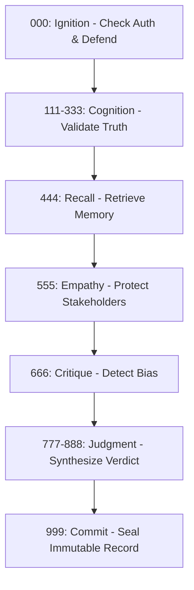

# arifOS - DITEMPA, BUKAN DIBERI

*The system that knows because it admits what it cannot know.*

If you're new here, think of arifOS as a **"lie detector and safety firewall"** for AI. It acts as a **Constitutional Kernel**—meaning it loads a strict set of ethical rules (the 13 Floors) into an AI before it's allowed to take any actions or talk to users.

*For experts: arifOS governs AI cognition by loading an entire runtime environment (000->999) between LLMs and real-world tools, featuring thermodynamic grounding via the Eureka-Atlas Embedding Engine.*

## The Execution Model

When you call `anchor_session`, arifOS does not just start a session; it **boots the constitutional kernel**. This process:
1.  **Injects System Prompts**: Loads a persistent set of 13-floor instructions and thermodynamic constraints into the agent's context.
2.  **Sets Governance State**: Transitions the environment from a passive oracle to a governed runtime.
3.  **Binds Tool Logic**: Ensures all subsequent tool calls (`reason_mind`, `forge_hand`, etc.) are intercepted by the loaded kernel.

## How arifOS Thinks (The Cognitive Cycle)

arifOS is not a simple filter; it's a careful step-by-step process. Every request flows through this cycle:



## Technical Glossary (Symbolic to Operational)

| Symbolic Name | Technical Alias | Operational Meaning |
| :--- | :--- | :--- |
| **13 Floors** | `governance_rules` | Invariant constraints enforced at L0. |
| **333 Axioms** | `reasoning_constraints` | Heuristics for AGI logic grounding. |
| **APEX Dials** | `decision_parameters` | Configurable thresholds for verdict synthesis. |
| **Eureka Forge** | `action_actuator` | The sandboxed execution environment. |
| **Vault999** | `immutable_ledger` | The hash-chained decision database. |

## Canonical runtime

- Python: `>=3.12`
- Module: `arifos_aaa_mcp`
- Transports: `stdio`, `sse`, `http`
- MCP surface: 13 tools, 2 resources, 1 prompt
- MCP protocol (current): `2025-11-25`
- Supported protocol versions: `2025-11-25`, `2025-03-26`

### Protocol version negotiation

During `initialize`, client and server must agree one protocol version for the session.
If the client asks for an unsupported version, the server returns a JSON-RPC error and does not open a session.

```json
{
  "jsonrpc": "2.0",
  "id": 1,
  "method": "initialize",
  "params": {
    "protocolVersion": "2025-11-25",
    "capabilities": {},
    "clientInfo": {"name": "client", "version": "1.0"}
  }
}
```

## MCP building blocks

- **Tools (13):** model-invoked governed actions
- **Resources (2):** app-driven context packs (`arifos://aaa/schemas`, `arifos://aaa/full-context-pack`)
- **Prompts (1):** user-invoked orchestration template (`arifos.prompt.aaa_chain`)

## Quick start

```bash
pip install arifos

# Local clients (Claude Desktop / Cursor)
python -m arifos_aaa_mcp stdio

# Remote SSE runtime
HOST=0.0.0.0 PORT=8080 python -m arifos_aaa_mcp sse

# HTTP MCP fallback
PORT=8089 python -m arifos_aaa_mcp http
```

Live endpoints:

- SSE: `https://arifosmcp.arif-fazil.com/sse`
- MCP HTTP: `https://arifosmcp.arif-fazil.com/mcp`
- Health: `https://arifosmcp.arif-fazil.com/health`

## Canonical tools (13)

1. `anchor_session`
2. `reason_mind`
3. `recall_memory`
4. `simulate_heart`
5. `critique_thought`
6. `apex_judge`
7. `eureka_forge`
8. `seal_vault`
9. `search_reality`
10. `fetch_content`
11. `inspect_file`
12. `audit_rules`
13. `check_vital`

## Resources and prompt

- `arifos://aaa/schemas`
- `arifos://aaa/full-context-pack`
- `arifos.prompt.aaa_chain`

## Governance verdicts (How safe is it?)

When arifOS finishes evaluating an AI's thought or action, it returns one of these verdicts. You can see these happening in real-time on our [Constitutional Audit Dashboard](https://arifosmcp-truth-claim.pages.dev/).

- **✅ `SEAL`** - Approved. The action passed all 13 constitutional tests.
- **🟡 `PARTIAL`** - Approved with constraints.
- **⚠️ `SABAR`** - Hold/Refine. The AI was hallucinating or taking risks; it must pause and retry. (Sabar means 'patience' in Malay).
- **❌ `VOID`** - Blocked. A hard rule (like factual truth or anti-hacking) was violated.
- **🛑 `888_HOLD`** - Mandatory human ratification. The AI is attempting a high-risk action and needs your cryptographic permission.

Continue with:

- [MCP Server](./mcp-server)
- [API Reference](./api)
- [Governance](./governance)
- [Deployment](./deployment)
